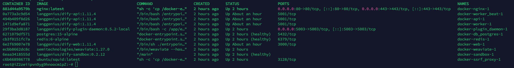
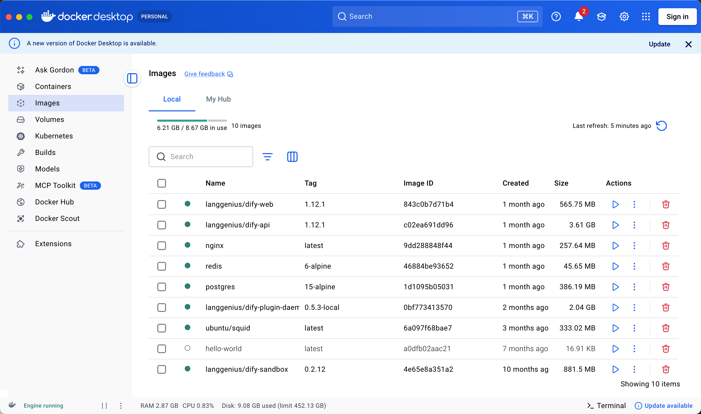
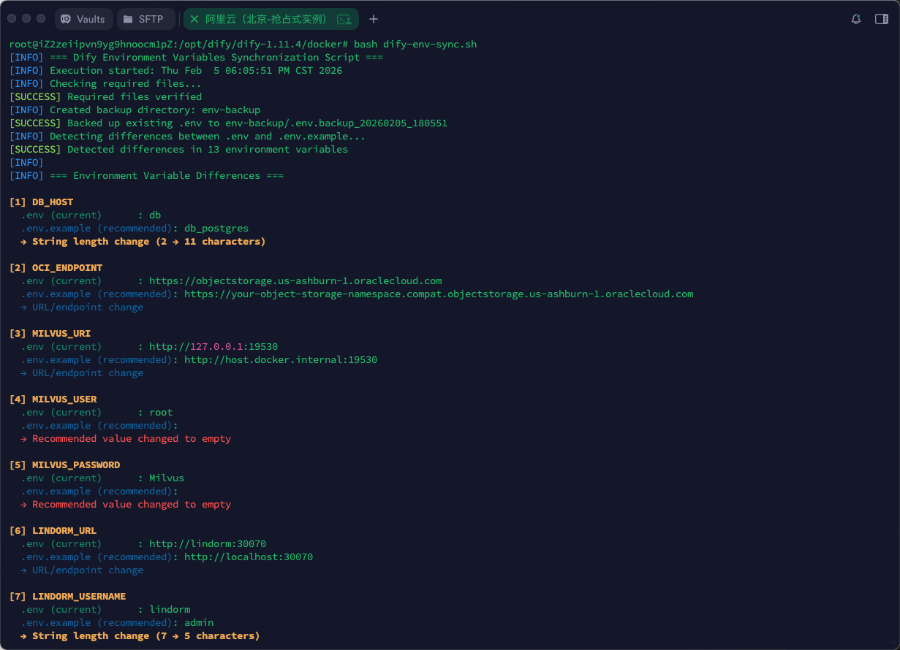
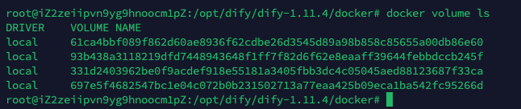
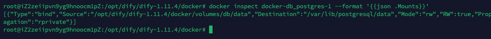
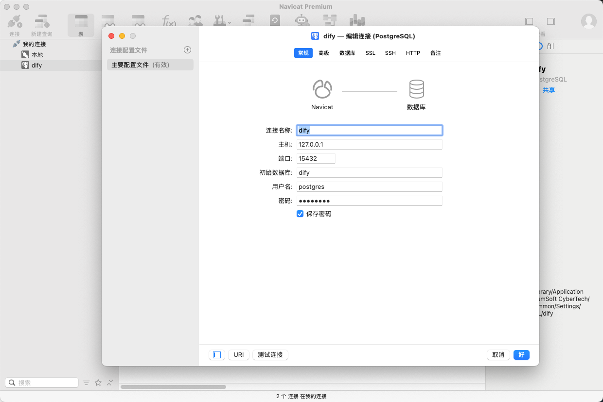
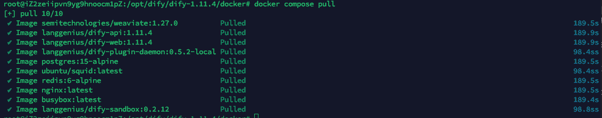
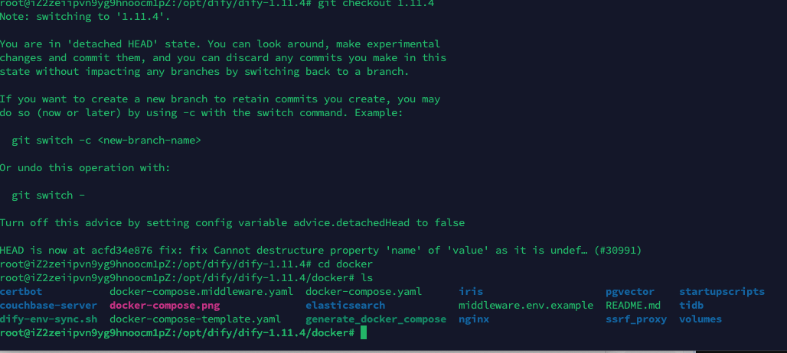

# 8.1 - Docker 入门与 Dify 部署排障

第 7 章已经带你把 Dify 跑起来了。本章接着解决部署后最容易卡住的几个问题：

- `docker compose up -d` 到底启动了什么？
- Dify 的数据到底存在容器里，还是存在宿主机上？
- 为什么删容器不一定丢数据？
- 升级 Dify 前为什么一定要备份？
- 页面打不开、数据库连不上、前端改了不生效时，该从哪里查？

如果你已经熟悉 Docker，可以直接跳到第 3 部分看 Dify 的部署结构；如果你刚接触 Docker，建议从第 1 部分开始读。后面学 Coze、企业部署、电商问数项目时，再遇到 Docker 问题，也可以回到这一章查。

**官方文档与资源**：详见 [工具导航与参考资料索引 - 部署与基础设施](工具导航与参考资料索引.md#部署与基础设施)。

---

## 阅读路径

| 现在遇到的问题                    | 建议先看                                                       |
| --------------------------------- | -------------------------------------------------------------- |
| 分不清镜像、容器、Compose、数据卷 | 第 1 部分：Docker 基础与命令速查                               |
| 第一次安装 Dify                   | [第 7 章 Dify 的 Windows 平台部署](7-Dify的Windows平台部署.md) |
| 想知道 Dify 到底跑了哪些容器      | 第 3 部分：Dify Docker 部署结构与数据位置                      |
| 担心数据存放位置或误删数据        | 第 2、3 部分                                                   |
| 页面打不开，容器状态不对          | 第 4 部分：Dify 排障与数据库连接                               |
| 想用 Navicat 连接 Dify 数据库     | 第 4.6 小节                                                    |
| 准备升级 Dify                     | 第 5 部分：升级与源码改造                                      |
| 改了 Dify 前端源码但没生效        | 第 5.2 小节                                                    |
| 只想查命令                        | 第 1.4 小节                                                    |

---

## 1、Docker 基础与命令速查

### 1.1 Docker 核心概念：镜像、容器、Compose 与数据卷

| 词             | 可以先这样理解                     | 常见位置                               |
| -------------- | ---------------------------------- | -------------------------------------- |
| Docker         | 运行容器的引擎                     | Docker Desktop、服务器 Docker 服务     |
| 镜像 Image     | 应用的运行模板，像安装包           | `postgres:15-alpine`、`redis:6-alpine` |
| 容器 Container | 镜像运行后的实例                   | `docker ps` 的 NAMES 列                |
| Compose        | 用一份 YAML 启动一组服务           | `docker-compose.yaml`                  |
| Volume / 挂载  | 把数据放到容器外，避免删容器丢数据 | `volumes:` 配置                        |

可以先建立一个基本判断：**镜像负责提供程序，容器负责把程序跑起来，Compose 负责把一组容器一起编排起来，volume 负责把关键数据留在容器外面。**

后续排障也会围绕这些对象展开。页面打不开时先看容器状态；升级前关注 volume 和备份；源码改动不生效时，检查当前运行的是官方镜像还是本地构建镜像。

### 1.2 镜像与容器的区别

#### 1.2.1 镜像与容器的关系

可以先用一句话理解：**镜像是应用的运行模板，容器是镜像运行后的实例。**

**镜像（Image）**可以理解为“安装包 / 模板 / 只读文件系统”。它本身不会运行，只负责提供程序文件、依赖环境、默认配置和启动命令。比如 `postgres:15-alpine` 这个镜像里包含 PostgreSQL 程序和运行 PostgreSQL 所需的基础环境。

**容器（Container）**则是镜像真正运行起来之后的实例。容器会有自己的进程、日志、端口、网络和可写层，也可以被启动、停止、重启或删除。

如果用更生活化的类比：镜像像手机 App 的安装包，容器像已经打开并正在运行的 App。安装包可以放着不动，只有运行起来以后，才会产生进程、日志、端口占用和运行状态。

所以后面看到：

- `postgres:15-alpine`、`redis:6-alpine`、`langgenius/dify-api:<version>`：通常是在说镜像。
- `docker-db_postgres-1`、`docker-api-1`、`docker-worker-1`：通常是在说容器。

#### 1.2.2 从 docker ps 输出区分镜像和容器

执行：

```bash
docker ps
```

命令行里看到的容器列表大致是这样的：



输出里常见两列：

| 列    | 含义   | 示例                                                  |
| ----- | ------ | ----------------------------------------------------- |
| IMAGE | 镜像名 | `postgres:15-alpine`、`langgenius/dify-api:<version>` |
| NAMES | 容器名 | `docker-db_postgres-1`、`docker-api-1`                |

看输出时可以先抓两个特征：

- 带 `:tag` 的通常是镜像，例如 `redis:6-alpine`。
- 像 `docker-api-1`、`mysql`、`qdrant` 这种运行中的名字通常是容器。

一个镜像可以启动多个容器。例如 Dify 的 `api`、`worker`、`worker_beat` 可能使用同一个后端镜像，只是启动命令或环境变量不同。

分清 IMAGE 和 NAMES 之后，后续查看日志、重启服务、检查挂载时，就不会把镜像名和容器名混在一起。

在 Docker Desktop 里，也可以直接从界面区分：


_图：Containers 列表里每一行是一个正在运行或曾经创建过的容器。_



_图：Images 列表里是本地镜像，它们是创建容器的模板。_

### 1.3 Docker Compose 的作用

很多部署文档都会让你进入 `docker` 目录，然后执行：

```bash
docker compose up -d
```

它会按 `docker-compose.yaml` 里的配置做几件事：

1. 拉取或构建镜像。
2. 创建容器。
3. 创建网络。
4. 挂载数据目录或 volume。
5. 后台启动服务。

所以这条命令不是“启动一个程序”，而是“把一组互相依赖的服务一起拉起来”。

常见服务可能包括：

- Web 前端。
- API 后端。
- Worker 后台任务。
- 数据库。
- Redis。
- 向量数据库。
- Nginx 入口。

在 Dify 部署中，`docker compose up -d` 启动的不是单个进程，而是 web、api、worker、数据库、Redis、向量库、nginx 等一组服务。排障时也要按服务分层检查，而不是只看浏览器页面。

### 1.4 常用命令与排障速查

下面命令默认在 Dify 的 `docker` 目录执行；如果是其他 Compose 项目，也要在对应 `docker-compose.yaml` 所在目录执行。

#### 1.4.1 Compose 基础命令

| 目的                         | 命令                              | 说明                   |
| ---------------------------- | --------------------------------- | ---------------------- |
| 检查 Docker 是否安装         | `docker --version`                | 能输出版本即可         |
| 检查 Compose 是否可用        | `docker compose version`          | 能输出版本即可         |
| 启动整套服务                 | `docker compose up -d`            | 不删除数据             |
| 查看服务状态                 | `docker compose ps`               | 不删除数据             |
| 查看服务日志                 | `docker compose logs -f <服务名>` | 不删除数据             |
| 临时停止服务                 | `docker compose stop`             | 不删除数据             |
| 启动已停止的服务             | `docker compose start`            | 不删除数据             |
| 停止并删除容器、网络         | `docker compose down`             | 默认不删 volume        |
| 停止并删除容器、网络、volume | `docker compose down -v`          | 会删除 volume，谨慎    |
| 查看本地镜像                 | `docker images`                   | 不删除数据             |
| 拉取镜像                     | `docker compose pull`             | 不删除数据             |
| 重新构建镜像                 | `docker compose build <服务名>`   | 不删除数据             |
| 查看最终配置                 | `docker compose config`           | 用于确认变量展开后配置 |

这里最容易混的是 `stop`、`down`、`down -v`：

- `stop`：只是暂停容器，容器还在。
- `down`：删除容器和网络，但默认保留 volume。
- `down -v`：连 volume 一起删，数据库、索引、向量库等数据可能随之消失。

日常排障优先用 `ps`、`logs`、`restart`、`up -d`。只有明确要停止整套服务时才用 `down`；除非准备清空测试环境，否则不要把 `-v` 当成习惯性参数。

#### 1.4.2 Dify 常用命令

| 目的             | 命令                                                                             |
| ---------------- | -------------------------------------------------------------------------------- |
| 查看服务清单     | `docker compose config --services`                                               |
| 查看全部容器     | `docker ps -a`                                                                   |
| 查看 API 日志    | `docker compose logs -f api`                                                     |
| 查看 worker 日志 | `docker compose logs -f worker`                                                  |
| 查看 nginx 日志  | `docker compose logs -f nginx`                                                   |
| 查看数据库日志   | `docker compose logs -f db_postgres`                                             |
| 进入数据库容器   | `docker exec -it docker-db_postgres-1 sh`                                        |
| 连接 PostgreSQL  | `docker exec -it docker-db_postgres-1 psql -U postgres -d dify`                  |
| 查看容器挂载     | `docker inspect <容器名> --format '{{json .Mounts}}'`                            |
| 查看 volume      | `docker volume ls`                                                               |
| 备份数据库       | `docker exec -t docker-db_postgres-1 pg_dump -U postgres dify > dify_backup.sql` |

容器名和服务名可能因 Dify 版本或 Compose 项目名不同而变化。命令执行失败时，先用 `docker compose ps` 或 `docker ps` 确认当前环境里的真实名称。

#### 1.4.3 基础排查顺序

排查时可以按这个顺序来：

1. 先确认 Docker Desktop / Docker 服务是否运行。
2. 再确认命令是否在正确的 `docker-compose.yaml` 目录执行。
3. 再看 `docker compose ps`，确认服务状态。
4. 再看关键服务日志，例如 `api`、`web`、`nginx`、`db_postgres`。
5. 最后再排查端口、防火墙、代理、`.env` 配置和数据挂载。

这组命令的价值在于形成固定排查节奏：**先看状态，再看日志，再看配置，再看数据挂载**。大多数 Docker 部署问题，都能在这个顺序里缩小范围。

---

## 2、Compose 配置与数据持久化

### 2.1 端口映射规则

Compose 中常见配置：

```yaml
ports:
  - "8080:80"
```

左边是宿主机端口，右边是容器内端口。

也就是：

- 浏览器访问：`http://localhost:8080`
- 请求进入容器后：访问容器内部的 `80` 端口

再看一个 Redis Stack 示例：

```bash
docker run -d --name redis-stack -p 26379:6379 -p 8001:8001 redis/redis-stack
```

含义是：

- 本机 `26379` -> 容器内 Redis `6379`
- 本机 `8001` -> 容器内 RedisInsight `8001`

如果代码里连接 `redis://localhost:26379`，连接的是宿主机映射端口，不是容器内部原始端口。

对 Dify 来说，浏览器访问的通常是 nginx 暴露出来的宿主机端口；而 `api` 访问 `db_postgres`、`redis` 这类依赖时，走的是 Docker 内部网络。外部访问和容器互访不是同一条路，排查时要分开看。

在 Dify 官方 compose 中，`nginx` 是对外入口，端口映射大致是：

```yaml
ports:
  - "${EXPOSE_NGINX_PORT:-80}:${NGINX_PORT:-80}"
  - "${EXPOSE_NGINX_SSL_PORT:-443}:${NGINX_SSL_PORT:-443}"
```

也就是说，浏览器默认访问的是宿主机的 80 / 443 端口；如果你在 `.env` 中改了 `EXPOSE_NGINX_PORT`，访问地址也要跟着改。页面打不开时，先确认 nginx 端口映射，再看 web 和 api 日志。

### 2.2 volume 和 bind mount

Compose 里最常见两种写法：

```yaml
volumes:
  - mysql_data:/var/lib/mysql
  - ./mysql:/docker-entrypoint-initdb.d
```

第一种是 **命名卷 named volume**。

```text
mysql_data:/var/lib/mysql
```

- 左边 `mysql_data` 是 Docker 管理的持久化存储。
- 右边 `/var/lib/mysql` 是容器内目录。
- 适合保存数据库这类运行后产生的数据。

第二种是 **目录挂载 bind mount**。

```text
./mysql:/docker-entrypoint-initdb.d
```

- 左边 `./mysql` 是宿主机当前目录下的真实文件夹。
- 右边 `/docker-entrypoint-initdb.d` 是容器内目录。
- 适合把项目里的配置、脚本、模型文件交给容器使用。

粗略判断可以这样看：

- 左边是 `./xxx`、`../xxx`、`/绝对路径/xxx`，通常是 bind mount。
- 左边只是 `mysql_data`、`qdrant_data` 这种名字，通常是 named volume。

在 Dify 里，PostgreSQL、Redis、向量库、上传文件、插件数据都会通过类似机制保存。理解挂载以后，才能解释“为什么容器删了还能恢复数据”，也能解释“为什么新版本启动后像新环境”。

### 2.3 容器生命周期与数据持久化

容器本来就是适合随时重建的东西，所以重要数据不应该只放在容器自己的临时文件系统里。

有 volume 或 bind mount 时：

```text
宿主机或 Docker volume
        |
        | 挂载
        v
容器内目录
```

程序看起来写入的是容器内目录，例如 `/var/lib/postgresql/data`，实际数据会落到外部 volume 或宿主机目录。

所以：

- 删除容器：通常不删除 volume 或宿主机挂载目录。
- 删除 volume：会删除 Docker 管理的数据。
- 手动删除宿主机挂载目录：也会删除数据。

这也是为什么 `docker compose down` 通常不丢数据，而 `docker compose down -v` 要特别谨慎。

不过“通常不丢”有前提：关键目录确实已经挂载到 volume 或宿主机目录。如果某个服务把数据写在容器自己的可写层里，删容器就会丢。这就是为什么排障时要用 `docker inspect` 看 Mounts，而不是只凭感觉判断。

### 2.4 需要备份的典型场景

“volume 不会被 down 删除”不等于“不需要备份”。

升级前仍要备份，因为真正出问题的往往不是“容器被删了”，而是下面这些情况：

- 数据库 migration 改表结构。
- 新旧版本服务不兼容。
- 升级中途失败，数据处于半升级状态。
- 误执行 `down -v`、`volume prune` 或手动删除目录。
- 磁盘、断电、数据库损坏等意外。

可以这样区分：

- Volume 是原始数据目录。
- 备份文件是可迁移、可恢复的逻辑副本。

所以数据库升级、Dify 升级、生产环境迁移前，备份永远放在第一步。

运维上要区分两件事：volume 适合让服务持续运行，备份适合在出错后重建环境。两者都重要，但用途不同。

### 2.5 Compose 配置文件的阅读顺序

读 compose 文件不要从第一行硬啃到最后一行。按下面这个顺序会轻松很多：

1. 看 `services`：这套项目启动哪些服务。
2. 看 `image` / `build`：服务是直接用镜像，还是本地构建。
3. 看 `ports`：哪些服务暴露给宿主机或浏览器。
4. 看 `volumes`：哪些数据、配置、模型目录会持久化或挂载。
5. 看 `environment`：服务启动依赖哪些环境变量。
6. 看 `depends_on`：服务之间的大致启动依赖。
7. 看 `networks`：哪些服务能互相访问，哪些被隔离。

常见字段速查：

| 字段             | 作用                       |
| ---------------- | -------------------------- |
| `image`          | 使用现成镜像               |
| `build`          | 从 Dockerfile 构建镜像     |
| `container_name` | 指定容器名                 |
| `restart`        | 容器异常停止后的重启策略   |
| `environment`    | 注入环境变量               |
| `ports`          | 宿主机端口到容器端口的映射 |
| `volumes`        | 数据持久化或目录挂载       |
| `depends_on`     | 启动顺序依赖               |
| `networks`       | 容器网络隔离与互通         |

读 Dify 的 compose 文件时，可以顺手画一条线：`nginx -> web/api -> db/redis/vector store`。先知道请求和数据大概怎么流动，再看具体变量，会比直接盯着几百行 YAML 更轻松。

### 2.6 网络慢或镜像拉取失败

镜像拉取失败通常不是代码问题，而是 Docker 访问镜像仓库不稳定。常见处理方式有两类：

- 配置 Docker Desktop 的镜像加速。
- 配置 Docker Desktop 的代理。

具体采用哪一种，取决于你的网络环境。这里了解一个常见坑：**浏览器能访问外网，不代表 Docker 引擎一定能拉镜像，Docker 有自己的网络配置。**

如果第 7 章安装 Dify 卡在拉镜像，优先回到本节；如果容器已经启动但页面报错，再进入第 4 部分看应用日志。这样能避免把网络问题误判成 Dify 配置问题。

#### 方式一：配置镜像加速

如果你使用的是 Docker Desktop，通常可以在设置中找到 Docker Engine 的配置区域，然后为 `registry-mirrors` 增加镜像地址。

这一点说白了就是：让 Docker 在拉取镜像时，不直接走默认源，而是优先从可用的镜像加速地址下载。


镜像源汇总参考 GitHub：[dongyubin/DockerHub 国内镜像加速列表](https://github.com/dongyubin/DockerHub)

#### 方式二：配置代理

如果你的网络环境本身已经有可用代理，也可以直接在 Docker Desktop 的代理配置里填写代理地址。

它做的事情就是：让 Docker 的网络请求通过代理转发出去。

---

## 3、Dify Docker 部署结构与数据位置

前两部分讲的是通用 Docker 语言。从这里开始，把这些词放回 Dify。所谓“Dify 部署”，本质上是一组容器、几类数据、几条内部访问链路共同组成的系统。

Dify 不是一个单进程应用。用 Compose 启动后，你看到的是一组容器在一起工作。

下面以 Dify 官方 [`docker/docker-compose.yaml`](https://github.com/langgenius/dify/blob/main/docker/docker-compose.yaml) 的当前结构为例说明。不同版本的 service 名、镜像 tag、可选组件可能变化，实际排查时以你本机的 `docker-compose.yaml`、`.env` 和 `docker ps` 输出为准。

读 Dify 的 compose 文件，不需要从第一行读到最后一行。先抓四类信息就够用：

1. **服务**：这套部署启动了哪些容器。
2. **镜像**：哪些服务使用官方镜像，哪些服务可能需要本地构建。
3. **挂载**：数据库、Redis、上传文件、插件、向量库数据保存在哪里。
4. **入口**：浏览器请求从哪个服务和端口进入。

### 3.1 典型容器分工

| 层次   | 常见服务                                | 主要职责                             |
| ------ | --------------------------------------- | ------------------------------------ |
| 入口层 | `nginx`                                 | 对外提供 80/443 入口，转发到 web/api |
| 应用层 | `web`                                   | Dify 控制台和应用页面                |
| 应用层 | `api`                                   | 后端接口、鉴权、工作流、应用配置等   |
| 任务层 | `worker`                                | 异步任务、知识库索引、队列消费       |
| 任务层 | `worker_beat`                           | 定时任务调度                         |
| 数据层 | `db_postgres` 或 `db`                   | PostgreSQL 主业务数据库              |
| 数据层 | `redis`                                 | 缓存、队列、任务中间状态             |
| 向量层 | `weaviate` / `milvus` / `opensearch` 等 | 知识库向量检索，取决于配置           |
| 安全层 | `sandbox`                               | 安全执行代码节点                     |
| 安全层 | `ssrf_proxy`                            | 代理外部访问，降低 SSRF 风险         |
| 插件层 | `plugin_daemon`                         | 插件、工具、模型供应商等扩展能力支撑 |

实际环境中可以用：

```bash
docker compose config --services
docker compose ps
docker ps
```

确认当前版本到底启动了哪些服务。

排障时可以把这些服务分成三层：入口层先决定页面能不能访问，应用层决定接口和任务能不能跑，数据层决定账号、应用、知识库能不能正常读写。

从官方 compose 中可以提炼出下面这张结构表：

| 服务                                  | 镜像或来源                                | 主要作用                       | 关键挂载 / 端口                                             |
| ------------------------------------- | ----------------------------------------- | ------------------------------ | ----------------------------------------------------------- |
| `nginx`                               | `nginx:latest`                            | 对外入口，转发到 web / api     | `${EXPOSE_NGINX_PORT:-80}`、`${EXPOSE_NGINX_SSL_PORT:-443}` |
| `web`                                 | `langgenius/dify-web:<version>`           | 前端页面                       | 主要依赖环境变量                                            |
| `api`                                 | `langgenius/dify-api:<version>`           | 后端接口                       | `./volumes/app/storage:/app/api/storage`                    |
| `worker`                              | `langgenius/dify-api:<version>`           | 后台任务、知识库索引、队列消费 | `./volumes/app/storage:/app/api/storage`                    |
| `worker_beat`                         | `langgenius/dify-api:<version>`           | 定时任务调度                   | 主要依赖数据库和 Redis                                      |
| `db_postgres`                         | `postgres:15-alpine`                      | 主业务数据库                   | `./volumes/db/data:/var/lib/postgresql/data`                |
| `redis`                               | `redis:6-alpine`                          | 缓存、队列、中间状态           | `./volumes/redis/data:/data`                                |
| `sandbox`                             | `langgenius/dify-sandbox:<version>`       | 代码节点隔离执行               | `./volumes/sandbox/...`                                     |
| `plugin_daemon`                       | `langgenius/dify-plugin-daemon:<version>` | 插件服务                       | `./volumes/plugin_daemon:/app/storage`                      |
| `ssrf_proxy`                          | `ubuntu/squid:latest`                     | 外部访问代理与 SSRF 防护       | `ssrf_proxy_network`                                        |
| `weaviate` / `qdrant` / `pgvector` 等 | 向量库镜像                                | 知识库向量检索                 | 对应 `./volumes/<向量库>` 目录                              |

真实 compose 文件的价值，不是让你记住每一行，而是让你能回答三个问题：**启动了哪些服务、数据挂载在哪里、外部请求从哪个端口进入。**

### 3.2 同一个镜像为什么会起多个容器

Dify 后端常见的 `api`、`worker`、`worker_beat` 可能使用同一个后端镜像，只是启动模式不同：

- `api`：对外提供后端接口。
- `worker`：消费队列并执行后台任务。
- `worker_beat`：负责定时调度。

在官方 compose 里，这三个服务都使用 `langgenius/dify-api:<version>`，但通过不同的 `MODE` 区分角色：

```yaml
api:
  image: langgenius/dify-api:<version>
  environment:
    MODE: api

worker:
  image: langgenius/dify-api:<version>
  environment:
    MODE: worker

worker_beat:
  image: langgenius/dify-api:<version>
  environment:
    MODE: beat
```

所以看到多个容器对应同一个镜像，不代表哪里配错了。判断职责时，要看 service 名、容器名、日志和环境变量，而不是只看镜像名。

### 3.3 docker 目录里放的是什么

Dify 仓库里的 `docker/` 目录主要是部署配置，不是业务源码本身。常见内容包括：

- `docker-compose.yaml`：服务清单。
- `.env`：部署参数、端口、密钥、数据库连接等。
- `envs/`：按核心服务、数据库、向量库、安全配置等拆分的环境变量文件。
- `nginx/`：入口代理配置模板。
- `volumes/`：部分部署方式下的运行数据和挂载目录。

官方 `docker-compose.yaml` 开头也明确提示：该文件由生成脚本生成，不建议直接手动大改。日常部署优先调整 `.env`；确实需要改 compose 行为时，再考虑 override 或模板层面的改造。

如果 Compose 里使用的是 `image: langgenius/dify-web:<version>` 或 `image: langgenius/dify-api:<version>`，实际运行的是官方已经构建好的镜像，不会自动读取你本地的 `web/` 或 `api/` 源码目录。

只有某个服务配置了 `build:`，例如：

```yaml
services:
  web:
    build:
      context: ../web
```

才表示 Compose 会从本地源码构建镜像。

因此，`docker/` 目录更像部署说明书，不是源码目录。后面第 5.2 小节讲“改前端不生效”，原因也在这里：你改了本地源码，但容器可能仍在运行官方镜像。

### 3.4 Dify 数据存储位置与挂载关系

看到这里，Docker 的关键问题已经从“容器怎么启动”变成了“数据在哪里”。Dify 是可以反复重建容器的，但数据库、向量库、上传文件不能随便丢。

确认 Dify 数据位置时，优先看 Compose 中的挂载配置，而不是直接进容器翻文件。

Dify 的关键数据通常包括：

| 数据类型                   | 常见服务                          | 常见位置                                                   |
| -------------------------- | --------------------------------- | ---------------------------------------------------------- |
| 账号、应用、工作流、配置   | PostgreSQL                        | `./volumes/db/data` 或 named volume                        |
| 缓存、队列状态             | Redis                             | `./volumes/redis/data` 或 named volume                     |
| 知识库向量数据             | Weaviate / Milvus / OpenSearch 等 | `./volumes/weaviate` 或对应 volume                         |
| 用户上传文件、应用运行文件 | API / Worker                      | `./volumes/app/storage`                                    |
| 插件数据                   | plugin_daemon                     | `./volumes/plugin_daemon`                                  |
| 代码节点依赖和配置         | sandbox                           | `./volumes/sandbox/dependencies`、`./volumes/sandbox/conf` |
| Nginx 运行配置或证书       | nginx                             | `./nginx`、`./volumes/nginx`                               |
| HTTPS 证书申请数据         | certbot                           | `./volumes/certbot/...`                                    |

具体路径以当前版本的 `docker-compose.yaml` 为准。要确认一个容器实际挂了什么目录，可以执行：

```bash
docker inspect <容器名> --format '{{json .Mounts}}'
```

例如查看 PostgreSQL：

```bash
docker inspect docker-db_postgres-1 --format '{{json .Mounts}}'
```

如果容器名不一致，先用 `docker ps` 看 NAMES 列，再替换命令里的容器名。

判断数据位置时，优先相信 `docker-compose.yaml` 和 `docker inspect`，不要只看文件夹名字。有些版本使用 `./volumes/...`，有些环境使用 Docker named volume，路径表现会不同。

#### 3.4.1 删除容器会不会丢数据

通常不会。前提是数据已经通过 volume 或宿主机目录挂载出来。

危险操作主要是这些：

```bash
docker compose down -v
docker volume rm <volume名>
docker volume prune
rm -rf ./volumes
```

这些操作可能删除真实数据。升级、迁移和清理环境前，先确认 volume 和挂载目录，再备份。

本地测试环境里，清空 volume 有时是为了重新来一遍；服务器或生产环境里，它通常就是高风险操作。看到 `-v`、`volume rm`、`prune`、`rm -rf`，都应该先停一下确认。

#### 3.4.2 为什么升级前仍然要备份

`docker compose down` 默认不删数据，但升级过程可能执行数据库 migration，改表结构或写入新数据。升级中途失败时，volume 可能还在，但里面的数据已经处于半升级状态。

所以升级前必须做逻辑备份，例如用 `pg_dump` 导出 PostgreSQL 数据。备份文件和 volume 不是一回事：

- Volume：数据库原始数据目录。
- `pg_dump`：可恢复、可迁移的 SQL 备份。

建议保留 volume，但不要只依赖 volume；先导出 SQL 备份，再启动新版本。这样即使 migration 失败，也还有一条可恢复路径。

## 4、Dify 排障与数据库连接

### 4.1 常见排障路径

遇到 Dify 无法访问时，建议按下面的链路排查：

```text
Docker 是否运行
  -> 是否在正确 docker 目录执行命令
  -> 容器是否启动
  -> 入口端口是否映射
  -> api / web / nginx 日志
  -> db / redis / 向量库日志
  -> .env 配置
```

这条链路用于分层定位：前两步排 Docker 和目录问题，中间几步排容器和网络问题，最后再进入 Dify 配置和数据问题。

### 4.2 Dify 页面无法访问

先执行：

```bash
docker compose ps
docker ps
docker compose logs -f nginx
docker compose logs -f web
docker compose logs -f api
```

这里重点看：

- `nginx` 是否运行。
- `web` 和 `api` 是否运行。
- `nginx` 是否映射了你访问的端口，例如 `80:80`、`8080:80`。
- `.env` 中端口、域名、URL 配置是否和访问地址一致。
- 本机防火墙、代理、端口占用是否影响访问。

如果 `nginx` 没起来，先看入口层；如果 `nginx` 正常但接口报错，继续看 `api`；如果 `api` 连不上依赖，再看数据库、Redis、向量库。`.env` 建议在日志已经指向配置问题时再修改。

### 4.3 容器启动失败或重启循环

先找具体失败服务：

```bash
docker compose ps
```

再看日志：

```bash
docker compose logs -f <服务名>
```

例如：

```bash
docker compose logs -f api
docker compose logs -f worker
docker compose logs -f db_postgres
docker compose logs -f redis
```

常见原因：

- `.env` 缺少变量或变量不兼容当前版本。
- 数据库、Redis、向量库还没准备好。
- 端口被占用。
- 镜像没拉完整。
- 旧版本数据和新版本 migration 不兼容。

日志里先找第一条真正的错误，不要只看最后一行。很多容器会因为前面的配置或连接错误反复重启，最后一行只是“进程退出”。

### 4.4 镜像拉取失败

镜像拉取失败通常不是 Dify 代码问题，而是 Docker 引擎访问镜像仓库不稳定。可以先确认：

```bash
docker compose pull
docker pull postgres:15-alpine
```

如果持续失败，回到第 2.6 小节检查镜像加速和代理思路。

### 4.5 升级后进入初始化页面

如果升级后页面进入初始化安装页，通常说明新环境没有读到旧数据库。

下面这类页面不是“正常升级完成”，而是新环境像第一次安装一样重新进入了初始化流程：


也可能在浏览器里看到安装/初始化入口：



先查 PostgreSQL 里是否有用户表数据：

```bash
docker exec -it docker-db_postgres-1 psql -U postgres -d dify -c "select count(*) as users_count from account;"
```


如果容器名或数据库名不同，以你的 `docker ps` 和 `\l` 输出为准。

继续查当前数据库容器挂载了哪个 volume：

```bash
docker inspect docker-db_postgres-1 --format '{{json .Mounts}}'
docker volume ls
```





常见原因：

- 新版本 Compose 创建了新的 volume。
- `.env` 中数据库 service 名或 profile 没同步。
- 旧数据还在旧目录或旧 volume，但新容器没有挂载到那里。
- 需要从升级前备份的 SQL 文件导入。

这一类问题的核心不是“页面坏了”，而是“新容器没有读到旧数据库”。所以排查重点放在数据库库名、volume 名、挂载路径和 `.env` 的数据库配置上。

### 4.6 用 Navicat 连接 Dify 数据库

不要直接修改数据库文件目录。`docker/volumes/db/data` 这类目录是 PostgreSQL 的底层数据文件，不是给 Navicat 直接打开的。

要管理数据库，应该通过 PostgreSQL 协议连接。

本节只讨论如何通过 PostgreSQL 协议安全连接数据库。生产环境中，改表、删数据、批量更新前都应先备份，并确认影响范围。

#### 4.6.1 本地开发环境：暴露端口

如果只是本地学习，可以在 Compose 中给 PostgreSQL 暴露端口，例如：

```yaml
services:
  db_postgres:
    ports:
      - "5432:5432"
```

然后重启数据库服务：

```bash
docker compose up -d db_postgres
```

Navicat 连接参数通常类似：

| 参数     | 示例                  |
| -------- | --------------------- |
| Host     | `127.0.0.1`           |
| Port     | `5432`                |
| User     | `.env` 中的数据库用户 |
| Password | `.env` 中的数据库密码 |
| Database | `dify`                |

注意：生产环境不要把 5432 直接暴露到公网。

本地学习时暴露 `5432:5432` 没问题，因为访问范围通常只在你自己的电脑上。服务器环境要多考虑安全组、防火墙、数据库弱口令和公网扫描。

#### 4.6.2 服务器环境：优先用 SSH 隧道

服务器环境里，更推荐让数据库只在服务器内部访问，然后用 SSH 隧道把本机端口转发过去。

思路是：

```text
Navicat 本机端口
  -> SSH 隧道
  -> 服务器
  -> PostgreSQL 容器或宿主机映射端口
```

示例：

```bash
ssh -L 15432:127.0.0.1:5432 user@your-server
```

然后 Navicat 连：

| 参数     | 示例                  |
| -------- | --------------------- |
| Host     | `127.0.0.1`           |
| Port     | `15432`               |
| User     | `.env` 中的数据库用户 |
| Password | `.env` 中的数据库密码 |
| Database | `dify`                |

如果数据库端口没有映射到宿主机，而只在容器网络里可见，需要先确认容器 IP 或临时使用跳板方式。生产环境建议由运维统一配置安全访问方式。

有些团队会用堡垒机、VPN、内网跳板或云厂商数据库访问策略来做这件事。课程里给的是通用思路，实际生产环境要服从团队的安全规范。

#### 4.6.3 Mac + SSH 隧道连接服务器 PostgreSQL

下面是一条更贴近实操的路径：本机用 Navicat，数据库仍留在服务器 Docker 内部网络里，不把 5432 暴露到公网。

先在服务器上确认 Postgres 容器 IP：

```bash
docker inspect -f '{{range .NetworkSettings.Networks}}{{.IPAddress}}{{end}}' docker-db_postgres-1
```

假设输出为 `172.20.0.4`，后面 SSH 隧道就转发到这个容器 IP。

在 Mac 本地保存服务器私钥，例如：


```bash
nano ~/.ssh/aliyun_navicat.pem
chmod 600 ~/.ssh/aliyun_navicat.pem
```

然后建立隧道：

```bash
ssh -i ~/.ssh/aliyun_navicat.pem \
  -N \
  -L 15432:172.20.0.4:5432 \
  root@your-server-ip
```

这个终端窗口需要保持打开。关闭窗口，隧道就断开。


Navicat 里不要再勾选 SSH 选项，因为隧道已经由命令行建好了。它只需要连接本机端口：



常见填写方式：

| 参数     | 示例                  |
| -------- | --------------------- |
| Host     | `127.0.0.1`           |
| Port     | `15432`               |
| User     | `.env` 中的数据库用户 |
| Password | `.env` 中的数据库密码 |
| Database | `dify`                |

连接成功后，就可以像普通 PostgreSQL 一样查看 Dify 表结构和数据：


---

## 5、Dify 升级与源码改造

### 5.1 Dify 版本升级流程

升级前的原则：**先备份，后停服务；先确认数据位置，再启动新版本。**

下面用“旧版本 -> 新版本”的通用流程说明。命令里的容器名、路径和版本号都要按你的环境替换。

Dify 升级不仅是拉取新镜像，还涉及镜像版本、`.env` 配置、数据库 migration、volume 挂载和前后端兼容。任何一个环节没对上，都可能表现为页面打不开、进入 `/install` 或后台任务异常。

#### 5.1.1 升级前检查

在旧版本 `docker` 目录执行：

```bash
docker compose ps
docker ps
docker compose logs --tail=100 api
```

先确认旧环境本身是可用的。不要在旧环境已经异常、数据状态不明时直接升级。

如果旧环境已经有报错，先记录当前状态和日志。否则升级失败后，很难判断问题是升级引入的，还是旧环境本来就已经异常。

#### 5.1.2 确认数据库名

```bash
docker exec -it docker-db_postgres-1 psql -U postgres -c "\l"
```

常见业务库名是 `dify`。如果你的数据库容器叫 `docker-db-1` 或其他名字，按 `docker ps` 结果替换。

#### 5.1.3 备份数据库

```bash
docker exec -t docker-db_postgres-1 pg_dump -U postgres dify > dify_backup.sql
```

建议把备份文件复制到安全位置，不要只放在即将改动的部署目录里。

备份完成后，最好至少确认文件不是 0 字节；重要环境还可以在测试库里试导入一次。没有验证过的备份，只能算“可能有用”。

#### 5.1.4 停旧版本

```bash
docker compose down
```

这一步会删除当前 Compose 项目创建的容器和网络，但默认不删除 volume。除非你明确要清空数据，否则不要使用 `docker compose down -v`。

这里用 `down` 是为了让旧容器退出，避免新旧版本同时占用端口或写同一份数据。它不是清库操作，也不应该顺手加 `-v`。

执行后，终端里通常会看到容器和网络被移除：


可以再看一眼 volume 是否仍然存在：


#### 5.1.5 准备新版本

常见方式是拉取或解压新版本 Dify，然后进入新版本的 `docker` 目录：

```bash
cd /opt/dify/dify-<new-version>/docker
```

如果使用 `git clone` 拉取新版本，网络不稳定时可能会中断，失败后可以重试或先处理代理/镜像源问题：


把旧版本 `.env` 复制过来，再按新版本 `.env.example` 补齐新增变量。若项目提供同步脚本，可以使用官方推荐脚本；如果没有，就逐项对照新旧 `.env`。

同步脚本或配置对比工具通常会提示哪些变量需要保留、补齐或调整：


实际改配置时，建议一项一项确认，不要整段盲贴：


重点检查：

- 数据库服务名，例如 `DB_HOST`。
- `COMPOSE_PROFILES`。
- 端口和域名。
- 密钥类配置。
- 向量库类型和对应连接配置。

`.env` 是升级里最容易被忽略的文件。旧版本能跑，不代表旧 `.env` 能完整满足新版本。新增变量可以用默认值起步，但数据库、密钥、URL、向量库类型这几类不能随便变。

改完后用 `grep` 之类的命令确认关键变量已经生效：


#### 5.1.6 拉取并启动新版本

```bash
docker compose pull
docker compose up -d
```

镜像拉取阶段会逐个下载服务镜像：



启动后可以用 `docker ps` 或 `docker compose ps` 查看容器状态：



启动后查看：

```bash
docker compose ps
docker compose logs -f api
docker compose logs -f worker
```

如果进入 `/install` 或没有旧数据，回到第 4.5 小节检查 volume 和数据库数据。

启动后先不要急着清理旧目录和旧备份。等登录、应用列表、知识库、工作流、文件上传、后台任务都确认正常后，再考虑归档旧版本。

#### 5.1.7 必要时导入旧备份

如果确认新环境是空库，且你已经决定用备份恢复，可以导入：

```bash
cat /path/to/dify_backup.sql | docker exec -i docker-db_postgres-1 psql -U postgres -d dify
```

如果新库已经初始化过，直接导入可能出现重复索引、重复约束等错误。更稳妥的做法是：确认没有新业务数据后，重建空库再导入。

这里的“确认没有新业务数据”很重要。如果新环境已经有人注册、创建应用或上传文件，直接重建数据库会覆盖这些新数据。生产环境恢复前应先停服务并保留当前状态备份。

如果看到大量 `already exists` 之类的错误，通常说明目标库不是干净空库：


```bash
docker exec -it docker-db_postgres-1 psql -U postgres -c "SELECT pg_terminate_backend(pid) FROM pg_stat_activity WHERE datname='dify' AND pid <> pg_backend_pid();"
docker exec -it docker-db_postgres-1 psql -U postgres -c "DROP DATABASE IF EXISTS dify;"
docker exec -it docker-db_postgres-1 psql -U postgres -c "CREATE DATABASE dify OWNER postgres;"
cat /path/to/dify_backup.sql | docker exec -i docker-db_postgres-1 psql -U postgres -d dify
```

重建空库并重新导入时，先确认你手里已经有可用备份：


完成后重启关键服务：

```bash
docker restart docker-api-1 docker-worker-1 docker-worker_beat-1 docker-web-1
```

### 5.2 修改 Dify 前端源码并让改动生效

如果 Compose 使用的是官方镜像：

```yaml
services:
  web:
    image: langgenius/dify-web:<version>
```

那么你修改本地 `web/` 目录不会自动生效。因为实际运行的是镜像里已经构建好的前端产物。

要让本地源码生效，需要改为构建自己的 web 镜像。

这一节解决的是开发改造问题，不是普通部署问题。如果只是安装或升级 Dify，不需要改这里；只有你真的要改前端代码、换交互、加页面，才需要走本地 build。

#### 5.2.1 推荐用 override，不直接改官方 compose

在 `docker` 目录新增 `docker-compose.override.yaml`：

```yaml
services:
  web:
    build:
      context: ../web
      dockerfile: Dockerfile
    image: my-dify-web:local
```

这样升级时更容易对比官方文件，不会把本地改动混进官方 `docker-compose.yaml`。

官方 compose 文件本身是生成文件，升级时也最容易变化。override 的好处是把“官方部署文件”和“本地改造”分开。以后升级 Dify 时，可以先更新官方 compose，再单独检查自己的 override 是否还适配。

#### 5.2.2 构建并重启 web

在 `docker` 目录执行：

```bash
docker compose build web
docker compose up -d web
```

如果前端依赖环境变量或构建参数，还要按当前 Dify 版本的 `web/Dockerfile` 和官方说明补齐。

#### 5.2.3 源码构建场景下是否需要 pull

- 改前端源码时：`web` 使用本地 build，不靠 `docker compose pull` 获取官方 web 镜像。
- 其他服务：`api`、`postgres`、`redis`、`weaviate` 等仍可按升级流程拉取官方镜像。

如果同时改了后端 `api/`，也要为 api 服务配置对应的 build 和镜像；只改 web，不会让后端代码变化生效。

**本章小结：**

- 镜像是模板，容器是运行实例。
- Compose 是多服务启动清单，不只是“一条命令”。
- `ports` 左边是宿主机端口，右边是容器端口。
- `volumes` 决定数据和文件从哪里来、落到哪里去。
- Dify 的 Docker 部署是一组服务协同，不是单个容器。
- 排障时先看容器状态和日志，再看端口、`.env`、数据库和向量库。
- 升级前先备份数据库，避免 migration 或误操作带来不可逆损失。
