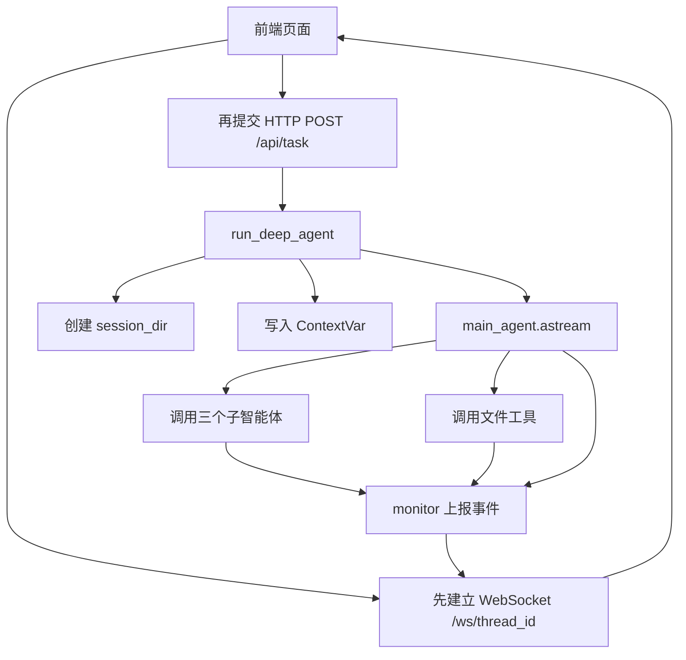
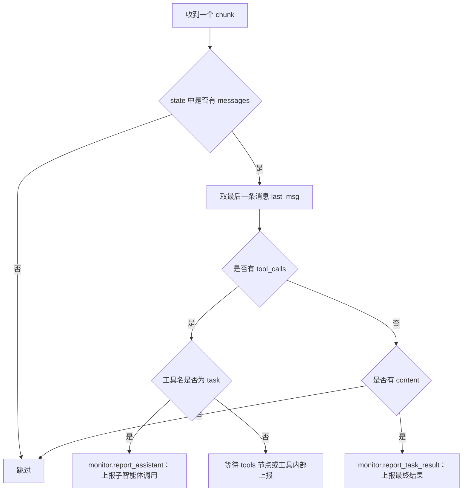

# 13 - 深度研搜：主智能体搭建与异步执行

---

**本章课程目标：**

- 理解主智能体和三个子智能体的分工关系。
- 明确为什么主智能体需要文件类工具：读取上传文件、生成 Markdown、转换 PDF。
- 完成 `main_agent.py` 的核心组装：模型、提示词、工具、子智能体、检查点。
- 读懂主智能体系统提示词中的任务边界和执行顺序要求。
- 理解为什么主智能体执行要选择 `astream()` 异步流式方式。
- 拆解 `run_deep_agent()`：会话目录、上传文件、`ContextVar`、流式执行、事件推送和上下文清理。
- 看清前端、FastAPI、主智能体、WebSocket、`monitor` 之间的协作关系，为接口层开发做准备。

**学习建议：** 这一章分两段看。前半先看主智能体的“创建态”：它是调度中心，负责理解任务、分派任务、汇总结果和生成文件；真正查网络、查数据库、查知识库的是子智能体和工具。后半再看主智能体的“运行态”：前端请求如何触发它，它如何用 `astream()` 流式执行，执行过程又如何通过 `monitor` 和 WebSocket 回到前端。把这两段连起来，下一章看 FastAPI 接口层就不会乱。

**对应代码分支：** `13-deepsearch-main-agent`

---

前面三章已经分别完成了三个专家助手：

| 子智能体       | 负责内容                   | 底层工具    |
| -------------- | -------------------------- | ----------- |
| 网络搜索助手   | 查询互联网公开信息         | Tavily      |
| 数据库查询助手 | 查询企业内部结构化数据     | MySQL       |
| RAGFlow 助手   | 查询企业内部非结构化知识库 | RAGFlow API |

现在要把它们交给一个“总负责人”统一调度，这个总负责人就是主智能体。

可以先用一句话理解本章：`主智能体 = 模型 + 主提示词 + 文件工具 + 三个子智能体 + 会话检查点 + 异步运行入口`

本章按这条路线展开：

```text
先区分主智能体和子智能体
  -> 再接入主智能体自己的文件工具
  -> 组装 main_agent
  -> 理解 run_deep_agent 的异步执行链路
  -> 最后做本地验证
```

主智能体接到用户问题后，会先判断任务需要哪些信息来源，再调用合适的子智能体。等信息拿回来以后，如果用户要求生成文件，主智能体再调用自己的文件工具，把最终结果写成 Markdown 或 PDF。

---

## 1、主智能体和子智能体有什么不同

### 1.1 子智能体只负责某一类专业任务

前面写子智能体时，每个子智能体的结构都比较固定：`子智能体 = name + description + system_prompt + tools`

比如网络搜索助手，它仅需知道：

- 自己什么时候应该被调用；
- 自己应该怎么搜索；
- 自己可以使用 `internet_search` 工具。

数据库助手也类似，它只负责按数据库查询流程做事：先看表、再看表结构和样例数据、最后执行 SQL。

这些子智能体都是“专家”，但它们不是最终交付者。

### 1.2 主智能体负责统筹和交付

主智能体不只是一个字典配置，它要通过 `create_deep_agent()` 创建出来，并且需要额外注册子智能体。

主智能体要负责几件事：

| 主智能体职责   | 说明                                                  |
| -------------- | ----------------------------------------------------- |
| 理解用户任务   | 判断用户到底要查资料、查数据、读文档，还是生成文件    |
| 调度子智能体   | 根据任务边界调用网络、数据库、RAGFlow 助手            |
| 汇总信息       | 把不同助手返回的信息整理成最终答案                    |
| 文件交付       | 根据用户要求生成 Markdown 或 PDF                      |
| 维持会话上下文 | 通过 `thread_id` 和 checkpointer 支持同一会话持续执行 |

所以主智能体比子智能体多了一个关键能力：**它能持有多个子智能体，并把任务分派给它们。**

---

## 2、主智能体为什么要有三个文件工具

### 2.1 三个工具分别解决什么问题

本项目的最终目标不是只回答一句话，而是完成“深度研搜”任务。用户可能会提出这样的需求：`从网络查询机器人相关信息，并生成 Markdown 和 PDF 文件。`

或者：`读取我上传的文档，结合数据库中的药品信息，整理成一份分析报告。`

这时主智能体就需要三个自己的工具：

| 工具                | 文件                                 | 作用                      |
| ------------------- | ------------------------------------ | ------------------------- |
| `read_file_content` | `app/tools/upload_file_read_tool.py` | 读取用户上传的附件内容    |
| `generate_markdown` | `app/tools/markdown_tools.py`        | 把最终内容写入 `.md` 文件 |
| `convert_md_to_pdf` | `app/tools/pdf_tools.py`             | 把 Markdown 转成 PDF      |

这三个工具都不是网络搜索、数据库查询、知识库问答，所以不应该放到某个子智能体里。它们属于最终交付环节，因此由主智能体直接掌握。

### 2.2 为什么读取上传文件也属于主智能体

上传文件是用户本次任务的补充上下文。比如用户上传了一份错误日志、产品说明、报告草稿，主智能体必须先读懂这个文件，才能决定下一步要不要查网络、查数据库或生成文档。

它不属于 RAGFlow，因为这是用户临时上传的会话文件，不是企业长期知识库。

它也不属于数据库助手，因为上传文件不是结构化业务表。

所以读取上传文件的工具应该交给主智能体。

### 2.3 文件工具都依赖当前会话目录

文件工具有一个共同点：它们不能随便读写系统任意位置，而是必须读写当前会话的工作目录。

这个目录会在本章后半的 `run_deep_agent()` 中创建：`output/session_{session_id}`

工具内部通过 `get_session_context()` 拿到当前会话目录，再通过 `resolve_path()` 把模型传入的相对路径解析成真实路径。

这背后有一个重要设计：

```text
模型只负责说“我要生成 report.md”
系统负责把它解析成当前会话目录下的真实文件路径
```

这样可以减少模型处理长路径时出错，也能避免多个用户的文件串到一起。

---

## 3、工具一：读取上传文件 read_file_content

项目对应文件路径：`deepsearch-agents/app/tools/upload_file_read_tool.py`

`read_file_content` 负责把用户本次上传的附件读出来，交给主智能体继续分析。它支持常见格式：

| 文件类型         | 处理方式                                                |
| ---------------- | ------------------------------------------------------- |
| `.md` / `.txt`   | 直接按 UTF-8 文本读取                                   |
| `.docx`          | 使用 `python-docx` 读取段落                             |
| `.pdf`           | 使用 `pypdf` 提取页面文本                               |
| `.xlsx` / `.xls` | 使用 `pandas` 读取，并输出行数、列名、前 5 行和统计描述 |
| 其他文本文件     | 尝试按 UTF-8 文本读取                                   |

核心代码可以这样看：

```python
@tool
def read_file_content(
    filename: Annotated[
        str, "要读取的文件名或路径（支持 .md, .docx, .pdf, .xlsx, .xls）"
    ],
    instruction: Annotated[
        str, "对提取内容的具体指令（例如：'提取摘要', '统计数据'）"
    ] = "提取全部内容",
) -> str:
    """
    读取当前会话目录中的指定文件内容

    对于 Excel 文件，会自动提供数据统计信息（head 和 describe）。
    :param filename: 文件名或相对路径，通常由主智能体从上传文件列表中选择
    :param instruction: 模型传入的读取意图，用于监控展示，不改变底层解析逻辑
    :return: 文件文本内容、表格摘要，或中文错误提示
    """
    monitor.report_tool(
        "文件内容读取工具", {"filename": filename, "instruction": instruction}
    )

    # 解析路径时优先约束在当前 session_dir 内，避免模型传入绝对路径导致越界读取
    session_dir = get_session_context()
    file_path = Path(resolve_path(filename, session_dir))

    if not file_path.exists():
        return f"错误：文件 '{filename}' 不存在 (解析路径: {file_path})。"

    # 根据文件后缀选择解析方式；未知后缀会先按 UTF-8 文本兜底读取
    ext = file_path.suffix.lower()
```

读这段代码时关注三点：

1. `@tool` 会把函数注册成主智能体可以调用的工具。
2. `monitor.report_tool(...)` 会把“正在读取文件”这类进度推给前端。
3. `resolve_path(filename, session_dir)` 会把模型给出的文件名限制到当前会话目录。

如果用户上传了 `开篇.txt`，提示词会告诉模型直接传入文件名：`read_file_content(filename="开篇.txt")`

工具会自动拼到当前会话目录下读取，不需要模型自己拼绝对路径。

在项目根目录，执行：`uv run python -m app.tools.upload_file_read_tool`

脚本里的测试入口会把 `get_session_context()` 临时固定为项目根目录下的 `examples/test_docs`，然后读取测试文件。


---

## 4、工具二：生成 Markdown 文件 generate_markdown

项目对应文件路径：`deepsearch-agents/app/tools/markdown_tools.py`

`generate_markdown` 负责把模型整理好的内容写成 Markdown 文件。

核心参数有三个：

| 参数       | 说明                                       |
| ---------- | ------------------------------------------ |
| `content`  | 要写入 Markdown 的正文                     |
| `filename` | 文件名，可以带 `.md`，也可以不带           |
| `path`     | 保存路径，通常由提示词约束在当前工作目录下 |

核心代码如下：

```python
@tool
def generate_markdown(
    content: Annotated[str, "要写入Markdown文档的文本内容"],
    filename: Annotated[str, "Markdown文档的文件名（不包含扩展名或包含.md）"],
    path: Annotated[str, "文件保存的绝对路径"] = "",
):
    """
    根据提供的文本内容生成 Markdown 文件

    :param content: 要写入 Markdown 文档的完整文本
    :param filename: 输出文件名，缺少 .md 后缀时会自动补全
    :param path: 可选保存路径；通常由运行时工作目录指令约束为相对路径
    :return: 文件生成结果说明
    """
    print(f"[MarkdownTool] 输入保存路径: {path or '当前会话目录'}")
    monitor.report_tool("Markdown文档生成工具", {"写入的文本内容": content})

    if not filename.endswith(".md"):
        filename += ".md"

    # session_dir 由 run_deep_agent 写入 ContextVar，保证文件写入当前会话工作目录
    session_dir = get_session_context()

    # 先把模型传入的 path/filename 合成一个逻辑路径，再交给 resolve_path 做统一清洗
    if path and path != ".":
        full_input_path = str(Path(path) / filename)
    else:
        full_input_path = filename

    full_path_str = resolve_path(full_input_path, session_dir)
    file_path = Path(full_path_str)
    parent_dir = file_path.parent

    # 允许模型指定 session_dir 下的子目录；不存在时自动创建
    if not parent_dir.exists():
        parent_dir.mkdir(parents=True, exist_ok=True)

    file_path.write_text(content, encoding="utf-8")
    return f"Markdown文件 '{file_path}' 已成功生成并保存。"
```

这段代码的重点不是写文件本身，而是路径处理：

```text
模型给出 path + filename
  -> 工具用 resolve_path 解析
  -> 最终写入当前会话 output/session_xxx 下
```

这样前端后续查询文件列表时，仅需看当前会话目录，就能看到生成的 `.md` 文件。

在项目根目录，执行：`uv run python -m app.tools.markdown_tools`

测试入口会创建类似 `examples/test_docs/sub_dir/测试文件.md` 这样的文件。

如果看到“已成功生成”，说明 Markdown 文件写入链路没问题。

---

## 5、工具三：Markdown 转 PDF convert_md_to_pdf

项目对应文件路径：`deepsearch-agents/app/tools/pdf_tools.py`

`convert_md_to_pdf` 负责把 Markdown 文件转换成 PDF。它不重新生成内容，只基于已经写好的 `.md` 文件做格式转换。

核心代码如下：

```python
@tool
def convert_md_to_pdf(
    md_filename: Annotated[str, "要转换的Markdown文档路径（包含.md后缀）"],
    pdf_filename: Annotated[
        Optional[str], "输出的PDF文件路径（可选，默认与源文件同名）"
    ] = None,
) -> str:
    """
    将当前会话目录中的 Markdown 文档转换为 PDF

    :param md_filename: Markdown 文件名或相对路径，缺少后缀时会自动补为 .md
    :param pdf_filename: 可选 PDF 输出文件名；不传时与 Markdown 同名
    :return: 转换结果说明
    """
    monitor.report_tool("Markdown转PDF工具")

    try:
        # 输入路径必须先落到当前会话目录，避免模型传入任意系统路径
        session_dir = get_session_context()
        md_path = Path(md_filename).with_suffix(".md")
        md_abs_path = Path(resolve_path(str(md_path), session_dir))

        if not md_abs_path.exists():
            return f"错误：文件不存在 {md_abs_path}"

        # 未指定 PDF 文件名时，默认与源 Markdown 同目录同名
        if pdf_filename:
            pdf_path = Path(pdf_filename).with_suffix(".pdf")
            pdf_abs_path = Path(resolve_path(str(pdf_path), session_dir))
        else:
            pdf_abs_path = md_abs_path.with_suffix(".pdf")

        # PDF 版式、中文字体和 Markdown 解析细节都封装在底层转换模块中
        return convert_md_to_pdf_via_word(md_abs_path, pdf_abs_path)

    except Exception as e:
        logging.error(f"转换失败: {e}", exc_info=True)
        return f"转换失败: {str(e)}"
```

它的工作流程是：

```text
确认 Markdown 文件存在
  -> 确定 PDF 输出路径
  -> 调用 convert_md_to_pdf_via_word
  -> 返回转换结果
```

在 `app/utils/word_converter.py` 中，底层会使用 ReportLab 生成 PDF：

```python
doc = SimpleDocTemplate(
    str(pdf_abs_path),
    pagesize=A4,
    leftMargin=2 * cm,
    rightMargin=2 * cm,
    topMargin=2 * cm,
    bottomMargin=2 * cm,
    title=md_abs_path.stem,
)
styles = _build_styles()
story = _markdown_to_story(md_content, styles)
doc.build(story)
```

在项目根目录，执行：`uv run python -m app.tools.pdf_tools`

测试入口会先创建一份示例 Markdown，再调用 `convert_md_to_pdf` 生成同名 PDF。这里主要验证两件事：Markdown 路径能被解析到当前会话目录下，ReportLab 转换链路也能正常生成中文 PDF。

---

## 6、创建 main_agent.py

项目对应文件路径：`deepsearch-agents/app/agent/main_agent.py`

主智能体文件先做导入：

```python
import shutil
from pathlib import Path

from deepagents import create_deep_agent
from langgraph.checkpoint.memory import InMemorySaver

from app.agent.llm import model
from app.agent.prompts import main_agent_content
from app.agent.subagents.database_query_agent import database_query_agent
from app.agent.subagents.knowledge_base_agent import knowledge_base_agent
from app.agent.subagents.network_search_agent import network_search_agent
from app.api.context import (
    reset_session_context,
    set_session_context,
    set_thread_context,
)
from app.api.monitor import monitor

# 文件类工具由主智能体直接掌握，负责读取上传附件和生成最终交付文档
from app.tools.markdown_tools import generate_markdown
from app.tools.pdf_tools import convert_md_to_pdf
from app.tools.upload_file_read_tool import read_file_content
```

这几组导入可以分成五类：

| 导入内容                                | 作用                                                |
| --------------------------------------- | --------------------------------------------------- |
| `shutil` / `Path`                       | 创建会话目录、复制上传文件                          |
| 三个子智能体                            | 让主智能体可以委派专业任务                          |
| 三个文件工具                            | 让主智能体可以读取上传文件、生成 Markdown、转换 PDF |
| `create_deep_agent` / `InMemorySaver`   | 创建 DeepAgents 主智能体并启用会话检查点            |
| `model` / `main_agent_content` / 上下文 | 注入模型、系统提示词、运行时会话上下文和监控上报    |

然后创建主智能体：

```python
# 主智能体是调度中心：
# 1. tools 只放最终交付相关的文件工具
# 2. subagents 放网络、数据库、RAGFlow 三类信息获取助手
# 3. checkpointer 通过 thread_id 保存同一会话中的执行上下文
main_agent = create_deep_agent(
    model=model,
    system_prompt=main_agent_content["system_prompt"],
    tools=[generate_markdown, convert_md_to_pdf, read_file_content],
    checkpointer=InMemorySaver(),
    subagents=[database_query_agent, network_search_agent, knowledge_base_agent],
)
```

这就是本章关键的代码。

### 6.1 create_deep_agent 参数说明

| 参数            | 作用                 | 本项目配置                                    |
| --------------- | -------------------- | --------------------------------------------- |
| `model`         | 主智能体使用的大模型 | 第 9 章配置好的 `model`                       |
| `system_prompt` | 主智能体行为约束     | `prompts.yml` 中的 `main_agent.system_prompt` |
| `tools`         | 主智能体自己的工具   | 文件读取、Markdown、PDF                       |
| `checkpointer`  | 会话状态检查点       | `InMemorySaver()`                             |
| `subagents`     | 可调度的子智能体     | 数据库、网络搜索、RAGFlow                     |

这里的 `checkpointer=InMemorySaver()` 是为了配合后续的 `thread_id`。同一个前端会话会带着同一个 `thread_id` 来调用，主智能体就可以在这个会话维度上维持状态。

### 6.2 子智能体注册顺序

当前代码里的注册顺序是：

```python
subagents=[
    database_query_agent,
    network_search_agent,
    knowledge_base_agent,
]
```

顺序不是最核心的问题，关键是每个子智能体的 `description` 写得足够清楚。主智能体会根据用户问题和子智能体描述来决定调用谁。

例如：

| 用户需求                     | 更可能调用                                           |
| ---------------------------- | ---------------------------------------------------- |
| 查询某个商品库存             | 数据库查询助手                                       |
| 查询机器人行业公开信息       | 网络搜索助手                                         |
| 查询企业内部制度或知识库文档 | RAGFlow 助手                                         |
| 查询资料并生成 PDF           | 先调用相关子智能体，再由主智能体生成 Markdown 和 PDF |

---

## 7、主智能体提示词要约束什么

项目对应文件路径：`deepsearch-agents/app/prompt/prompts.yml`

主智能体的提示词比较长，但核心不是“写得长”，而是要约束清楚几个关键点。

### 7.1 角色定位

提示词开头把主智能体定位成团队负责人：

```yaml
main_agent:
  system_prompt: |
    你是金融与电商研究团队负责人，负责协调三个专家助手完成复杂任务
    你的团队成员如下：
      1. **网络搜索助手**
      2. **数据库查询助手**
      3. **RAGFlow助手**
```

这里要和课程项目背景保持一致。当前主提示词把它设定成“金融与电商研究团队负责人”，文章后面的例子也沿用这个设定。不要被行业名称带偏，本章真正要抓住的是：**主智能体是团队负责人，不是某一个具体工具。**

同时要留意提示词和代码能力是否一致。当前 `main_agent` 注册的文件工具只有 `generate_markdown`、`convert_md_to_pdf` 和 `read_file_content`。如果提示词里还保留“Word 文件生成”或“交给文件生成助手”之类的说法，读者容易误以为项目里还有一个单独的文件生成子智能体。更稳妥的表述是：Markdown 由主智能体调用 `generate_markdown` 生成；PDF 先生成 Markdown，再调用 `convert_md_to_pdf` 转换。

### 7.2 信息来源分工

提示词里要告诉主智能体，三类信息分别找谁：

| 信息类型                             | 调用对象       |
| ------------------------------------ | -------------- |
| 背景知识、外部知识、最新公开资料     | 网络搜索助手   |
| 企业内部非公开文档知识               | RAGFlow 助手   |
| 企业内部商品、库存、销售等结构化数据 | 数据库查询助手 |

如果问题边界不清楚，可以让主智能体尝试多种方式获取信息。

这一点很重要。因为真实用户不会按你的系统边界来提问，用户只会说：`帮我整理一下某个产品的市场信息和内部库存情况，生成 PDF。`

这个任务同时涉及外部资料、内部数据库和文件生成。主智能体必须先拆任务，而不是直接生成文件。

### 7.3 文件生成顺序

提示词中关键的是执行顺序：

```text
1. 必须先调用子智能体获取信息。
2. 绝不允许在获取信息之前调用 generate_markdown。
3. 严禁使用“等待子任务完成”之类的占位符内容生成文件。
4. 如果需要先搜索再生成，请分两步进行。
```

为什么要把顺序写清楚？

因为模型在复杂任务里可能提前调用 `generate_markdown`，写入“等待搜索结果补充”这类占位内容。这样生成出来的文件看起来存在，但没有价值。

所以主智能体必须遵守：

```text
先拿信息
  -> 再组织内容
  -> 再生成 Markdown
  -> 如用户要求 PDF，再转换 PDF
```

---

到这里，`main_agent` 对象已经创建好了。但对象创建好并不等于用户已经能用。接下来还要解决三个运行时问题：

```text
前端用户点发送后，怎么触发 main_agent？
main_agent 执行过程中，怎么把工具调用、子智能体调用、最终结果推给前端？
多个用户同时请求时，怎么保证消息不串台？
```

这就是 `run_deep_agent()` 要负责的部分。

---

## 8、运行时先看全链路

上半部分解决的是“主智能体怎么创建”。从这里开始，看它在 Web 服务里怎么跑。

这一节先把 `astream()`、HTTP、WebSocket、`session_id` 和 `ContextVar` 放到一张图里。第 15 章会正式写 FastAPI 接口，本章只讲主智能体运行时必须提前理解的几件事。



按一条线读：HTTP 只负责启动任务，`run_deep_agent()` 负责准备会话环境，`main_agent.astream()` 负责异步执行，执行中的进度和最终结果再通过 `monitor -> WebSocket` 回到前端。

### 8.1 为什么主智能体要选 astream

DeepAgents 常见执行方式有三种：

| 执行方式    | 特点           | 本项目是否使用           |
| ----------- | -------------- | ------------------------ |
| `invoke()`  | 同步一次性返回 | 不适合多客户端长任务     |
| `stream()`  | 同步流式返回   | 仍然会阻塞当前同步调用链 |
| `astream()` | 异步流式返回   | 本项目使用               |

本项目是一个后端服务，而不是一个本地脚本。前端可能有多个会话同时提问：

```text
用户 A 正在查网络并生成 PDF
用户 B 正在查数据库
用户 C 正在读取上传文件
```

如果用同步方式，一个任务执行时间长，其他请求就容易排队等待。使用 `astream()` 可以把主智能体执行变成异步流式任务，让 FastAPI 服务更适合多客户端并发。

---

### 8.2 完整前后端通信流程

先看整体链路：

```text
前端页面打开
  -> 建立 WebSocket: /ws/{thread_id}
  -> 后端缓存 thread_id -> WebSocket

用户点击发送
  -> HTTP POST /api/task
  -> FastAPI 创建后台任务
  -> run_deep_agent(query, thread_id)
  -> main_agent.astream(...)
  -> 执行过程中调用 monitor
  -> monitor 根据 thread_id 找到 WebSocket
  -> WebSocket 推送进度和结果给前端
```

这条链路里有两个入口：

| 入口              | 作用                                 | 调用时机           |
| ----------------- | ------------------------------------ | ------------------ |
| `/ws/{thread_id}` | 建立长连接，缓存当前会话的 WebSocket | 页面打开时先调用   |
| `/api/task`       | 启动一次智能体任务                   | 用户点击发送时调用 |

注意顺序：**通常先建立 WebSocket，再发起任务。**

如果没有先建立 WebSocket，后端执行过程中就不知道把进度推给哪个前端。

---

### 8.3 为什么 HTTP 接口不能直接返回最终答案

用户发起任务时会调用 HTTP 接口，例如：`POST /api/task`

直觉上，好像可以直接在 HTTP response 中返回最终答案。但本项目不这么做。

原因是主智能体任务可能很长：

- 先调用网络搜索助手；
- 再调用数据库助手；
- 再调用 RAGFlow 助手；
- 再生成 Markdown；
- 再转换 PDF；
- 中间还要不断把状态展示给前端。

如果 HTTP 请求一直等最终结果，前端会长时间卡住，后端连接也会变得脆弱。

所以 `/api/task` 只做一件事：`告诉前端：任务已经开始`

真正的执行进度和最终结果，通过 WebSocket 推送。

这也是为什么接口响应通常是：

```json
{
  "status": "started",
  "thread_id": "custom-session-id-123"
}
```

而不是直接返回智能体最终答案。

---

### 8.4 WebSocket 在这里负责什么

WebSocket 负责实时推送主智能体执行过程中的事件。

这些事件大致有五类：

| 事件              | 触发时机                     | 前端展示                           |
| ----------------- | ---------------------------- | ---------------------------------- |
| `session_created` | 当前会话工作目录创建完成     | 前端记录文件目录，后续查询文件列表 |
| `assistant_call`  | 主智能体准备调用某个子智能体 | 展示“正在调用网络搜索助手”等       |
| `tool_start`      | 某个工具开始执行             | 展示工具名和参数                   |
| `task_result`     | 主智能体返回最终答案         | 展示 AI 回复                       |
| `error`           | 执行过程中出现异常           | 展示错误提示                       |

在代码里，业务层不用直接操作 WebSocket。业务层只调用：

```python
monitor.report_tool(...)
monitor.report_assistant(...)
monitor.report_task_result(...)
monitor.report_session_dir(...)
```

然后 `monitor` 再通过 `ConnectionManager` 找到对应的 WebSocket，把消息推给前端。

这样业务代码就不用关心 WebSocket 连接细节：

```text
工具 / 主智能体
  -> monitor
  -> ConnectionManager
  -> WebSocket
  -> 前端
```

---

### 8.5 session_id 如何避免多客户端串台

假设现在有三个前端会话：

```text
session_A -> websocket_A
session_B -> websocket_B
session_C -> websocket_C
```

后端会用一个字典保存它们：

```python
active_connections = {
    "session_A": websocket_A,
    "session_B": websocket_B,
    "session_C": websocket_C,
}
```

当 `session_A` 的任务执行到工具调用时，后端必须把消息发给 `websocket_A`，不能发给 `websocket_B`。

所以每次任务请求都要带上当前会话的 `session_id` 或 `thread_id`。

这个 ID 在项目里有三个作用：

| 作用         | 说明                                                    |
| ------------ | ------------------------------------------------------- |
| 找 WebSocket | `monitor` 根据 `thread_id` 找到当前前端连接             |
| 建工作目录   | 每个会话创建 `output/session_{thread_id}`，文件互不混淆 |
| 取检查点     | `InMemorySaver()` 按 `thread_id` 维持同一会话状态       |

这就是多客户端系统的基本设计：**前端每次请求都带同一个会话标识，后端根据标识找到该会话对应的资源。**

---

### 8.6 ContextVar：把会话信息传给深层工具

项目对应文件路径：`deepsearch-agents/app/api/context.py`

这里定义了两个上下文变量：

```python
from contextvars import ContextVar, Token
from typing import Optional

# ContextVar 是协程级上下文变量，适合 FastAPI 这类异步 Web 服务
# 它可以避免多个并发请求共用全局变量时出现 thread_id 或 session_dir 串台
_session_dir_ctx: ContextVar[Optional[str]] = ContextVar(
    "session_dir",
    default=None,
)
_thread_id_ctx: ContextVar[Optional[str]] = ContextVar(
    "thread_id",
    default=None,
)
```

它们分别保存：

| ContextVar         | 保存内容           | 谁会使用                      |
| ------------------ | ------------------ | ----------------------------- |
| `_session_dir_ctx` | 当前会话的工作目录 | 文件读取、Markdown、PDF 工具  |
| `_thread_id_ctx`   | 当前会话 ID        | `monitor` 推送 WebSocket 消息 |

设置和读取方法如下：

```python
def set_session_context(path: str) -> Token[Optional[str]]:
    """设置当前请求链路的会话目录，返回 reset 时需要使用的 token"""
    return _session_dir_ctx.set(path)

def get_session_context() -> Optional[str]:
    """获取当前请求链路的会话目录"""
    return _session_dir_ctx.get()

def set_thread_context(thread_id: str) -> Token[Optional[str]]:
    """设置当前请求链路的线程 ID"""
    return _thread_id_ctx.set(thread_id)

def get_thread_context() -> Optional[str]:
    """获取当前请求链路的线程 ID"""
    return _thread_id_ctx.get()

def reset_session_context(
    session_token: Token[Optional[str]],
    thread_token: Optional[Token[Optional[str]]] = None,
) -> None:
    """恢复请求上下文，避免本次任务信息残留到后续请求"""
    _session_dir_ctx.reset(session_token)
    if thread_token is not None:
        _thread_id_ctx.reset(thread_token)
```

为什么不用普通全局变量？

因为 FastAPI 是异步并发服务。多个用户的请求可能在同一个线程中交替执行，如果用全局变量，用户 A 的 `session_id` 可能被用户 B 覆盖，导致消息或文件串台。

`ContextVar` 是协程级上下文变量，更适合 asyncio 场景。只要在同一个任务调用链里，深层工具也能拿到当前会话自己的值。

---

## 9、run_deep_agent 的七步拆解

项目对应文件路径：`deepsearch-agents/app/agent/main_agent.py`

主智能体的执行方法是：

```python
async def run_deep_agent(task_query, session_id):
    """
    异步流式执行主智能体

    API 层会为每次任务传入用户问题和 session_id。本函数负责准备会话目录、
    复制上传文件、写入 ContextVar，并在流式执行过程中把关键事件上报给前端。
    :param task_query: 前端提交的原始任务问题
    :param session_id: 当前任务 ID，同时用于 thread_id、输出目录和 WebSocket 定向推送
    """
```

它做的事情可以拆成七步：

```text
1. 创建当前会话的 output/session_{session_id} 目录
2. 检查 updated/session_{session_id} 下是否有上传文件
3. 如果有上传文件，复制到 output/session_{session_id}
4. 把 session_dir 和 session_id 写入 ContextVar
5. 拼接工作目录提示词，调用 main_agent.astream(...)
6. 解析流式 chunk，向前端推送子智能体调用和最终结果
7. finally 中重置 ContextVar
```

---

### 9.1 第一步：创建当前会话输出目录

代码如下：

```python
# 当前文件位于 app/agent/main_agent.py，parents[1] 即 app 目录
project_root_path = Path(__file__).parents[1].resolve()

# 每个会话独立使用 output/session_{session_id}，避免不同用户的产物互相覆盖
session_dir = project_root_path / "output" / f"session_{session_id}"
session_dir.mkdir(parents=True, exist_ok=True)

# 前端和工具使用绝对路径；提示词里只给模型相对路径
session_dir_str = str(session_dir).replace("\\", "/")
relative_session_dir_str = str(session_dir.relative_to(project_root_path)).replace(
    "\\", "/"
)
```

这里生成了两个路径：

| 路径                       | 示例                          | 给谁用             |
| -------------------------- | ----------------------------- | ------------------ |
| `session_dir_str`          | `/.../app/output/session_xxx` | 给前端和工具使用   |
| `relative_session_dir_str` | `output/session_xxx`          | 给大模型提示词使用 |

为什么要有相对路径？

因为大模型不擅长处理很长的本机绝对路径。我们告诉它：`工作目录: output/session_xxx`

再通过工具内部的 `resolve_path()` 去拼真实绝对路径，这样更稳定。

---

### 9.2 第二步：处理上传文件

上传文件先进入：`updated/session_{session_id}`

执行任务时，代码会把它们复制到：`output/session_{session_id}`

核心代码如下：

```python
# 上传文件先落在 updated/session_{session_id}，执行前复制到本次 output 工作目录
# 这样读文件工具和生成文件工具都只需要围绕同一个 session_dir 工作
updated_dir_path = project_root_path / "updated" / f"session_{session_id}"
updated_info_prompt = ""

if updated_dir_path.exists():
    files = [f.name for f in updated_dir_path.iterdir() if f.is_file()]

    if files:
        for filename in files:
            # copy2 会保留上传文件的修改时间、权限等元数据，便于后续排查文件来源
            shutil.copy2(updated_dir_path / filename, session_dir / filename)

        # 把上传文件列表注入用户消息，提醒模型先调用 read_file_content 获取附件内容
        updated_info_prompt = (
            "\n    [已上传文件] 已加载到工作目录:\n"
            + "\n".join([f"    - {f}" for f in files])
            + "\n    请优先使用工具（read_file_content）读取并参考这些文件。"
        )
```

为什么要复制一份？

因为前端后续展示文件列表时，仅需读取一个目录：`output/session_{session_id}`

这个目录里既有用户上传文件，也有模型生成文件。前端不用分别查 `updated` 和 `output` 两个地方。

同时，提示词会告诉模型：

```text
[已上传文件] 已加载到工作目录:
- 开篇.txt
请优先使用 read_file_content 读取并参考这些文件。
```

这样用户上传文件就变成了本次任务的补充上下文。

---

### 9.3 第三步：绑定 ContextVar 并推送会话目录

准备好会话目录后，要把当前任务的上下文保存起来：

```python
session_dir_token = set_session_context(session_dir_str)
session_id_token = set_thread_context(session_id)

# 前端拿到工作目录后，可以展示本次任务生成的 Markdown/PDF 等产物
monitor.report_session_dir(session_dir_str)
```

这三行分别做三件事：

| 代码                                          | 作用                                      |
| --------------------------------------------- | ----------------------------------------- |
| `set_session_context(session_dir_str)`        | 让文件工具知道当前会话目录                |
| `set_thread_context(session_id)`              | 让 `monitor` 知道当前要发给哪个 WebSocket |
| `monitor.report_session_dir(session_dir_str)` | 把当前会话文件目录推给前端                |

前端拿到 `session_created` 事件后，就能记录这个目录。后续查询文件列表时，会把这个目录传给 `/api/files`。

---

### 9.4 第四步：构建工作目录提示词

主智能体真正执行前，会把工作目录约束拼到用户问题后面：

```python
path_instruction = f"""
【工作环境指令】
工作目录: {relative_session_dir_str}
{updated_info_prompt}

规则：
1. 新生成文件必须保存到工作目录：'{relative_session_dir_str}/filename'
2. 读取已上传的文件时，请直接将文件名（例如：'开篇.txt'）作为 filename 参数传入（read_file_content）读取工具，不要带上任何目录前缀。
3. 使用相对路径，禁止使用绝对路径
4. 若存在上传文件，请先分析内容
"""
```

这段提示词解决两个问题：

1. 生成文件要生成到哪里；
2. 读取上传文件时应该怎么传参。

尤其是第 2 条很关键。不要让模型把上传文件路径写成 `output/session_xxx/开篇.txt`，而是让它只传 `开篇.txt`。

因为路径拼接应该由工具处理，不应该交给模型猜。

---

### 9.5 第五步：使用 main_agent.astream 执行

主智能体执行代码如下：

```python
# checkpointer 依赖 thread_id 区分会话记忆；同一 session_id 会复用同一条执行上下文
config = {
    "configurable": {
        "thread_id": session_id
    }
}

# 工作环境指令是运行时动态补充的，约束模型只在当前会话目录读写文件
async for chunk in main_agent.astream(
    {"messages": [{"role": "user", "content": task_query + path_instruction}]},
    config=config,
):
    ...
```

这里有两个重点。

第一，`thread_id` 要放进 `configurable`：

```python
config = {"configurable": {"thread_id": session_id}}
```

它配合前面配置的 `InMemorySaver()`，让同一个会话拥有自己的检查点。

第二，传给模型的用户内容不是单纯的 `task_query`，而是：

```python
task_query + path_instruction
```

也就是说，用户问题后面会追加工作目录和文件规则。模型看见完整指令后，才知道该把文件生成到哪个目录、该如何读取上传文件。

---

### 9.6 第六步：解析流式 chunk

`main_agent.astream(...)` 会不断吐出 chunk。每个 chunk 大致长这样：

```python
{
    "model": {
        "messages": [...]
    }
}
```

代码会遍历 chunk 中每个节点的 state：

```python
async for chunk in main_agent.astream(...):
    # chunk 形如 {"model": {"messages": [...]}}，这里主要关心模型最新消息
    for node_name, state in chunk.items():
        if not state or "messages" not in state:
            continue

        messages = state["messages"]
        if messages and isinstance(messages, list):
            last_msg = messages[-1]
```

然后根据 `last_msg` 判断当前发生了什么。



这张图和第 2 章的 `chunk` 状态识别是一脉相承的，只是这里多了前端事件上报：识别到子智能体，就推 `assistant_call`；识别到最终内容，就推 `task_result`。

#### 9.6.1 情况一：调用子智能体

如果最后一条消息包含 `tool_calls`，并且工具名是 `task`，说明主智能体正在调用某个子智能体：

```python
if node_name == "model":
    if last_msg.tool_calls:
        # DeepAgents 调用子智能体时，本质上会产生名为 task 的工具调用
        for tool_call in last_msg.tool_calls:
            if tool_call["name"] == "task":
                # 子智能体调用单独上报，前端可以展示“正在调用哪个专家助手”
                monitor.report_assistant(
                    tool_call["args"]["subagent_type"],
                    {"description": tool_call["args"]["description"]},
                )
```

DeepAgents 内部会用一个特殊的 `task` 工具来委派子智能体。它的参数里通常会有：

| 字段            | 说明                   |
| --------------- | ---------------------- |
| `subagent_type` | 要调用哪个子智能体     |
| `description`   | 交给子智能体的任务描述 |

前端收到 `assistant_call` 事件后，就可以展示：`正在调用助手：网络搜索助手`

#### 9.6.2 情况二：主智能体返回最终结果

如果没有工具调用，但最后一条消息有 `content`，说明主智能体给出了最终答案：

```python
elif last_msg.content:
    # 模型没有继续调用工具时，最新文本内容就是本轮可反馈给前端的结果
    print(f"主智能体执行结果，最终结果：{last_msg.content[:100]}")
    monitor.report_task_result(last_msg.content)
```

这时通过 `monitor.report_task_result(...)` 推送给前端。

前端收到 `task_result` 后，就可以把最终回复显示在对话框中。

#### 9.6.3 工具调用进度在哪里推送

这里还有一个容易混的点：普通工具调用并不是都在 `run_deep_agent()` 里推送。

比如 `generate_markdown`、`internet_search`、`execute_sql_query` 这些工具，工具函数内部已经写了：

```python
monitor.report_tool(...)
```

所以工具级进度在工具内部上报。`run_deep_agent()` 主要补充四类事件：

| 事件         | 谁负责上报                                    |
| ------------ | --------------------------------------------- |
| 工具开始执行 | 工具内部的 `monitor.report_tool(...)`         |
| 调用子智能体 | `run_deep_agent()` 解析 `task` 工具调用后上报 |
| 最终结果     | `run_deep_agent()` 解析最终 `content` 后上报  |
| 会话目录     | `run_deep_agent()` 准备阶段上报               |

---

### 9.7 第七步：异常处理和上下文清理

执行过程外层有 `try / except / finally`：

```python
try:
    async for chunk in main_agent.astream(...):
        ...
except Exception as e:
    # 异步执行异常也走 monitor，保证前端能收到明确错误事件
    monitor._emit("error", f"执行主智能体发生异常信息：{str(e)}")
finally:
    # 任务结束后恢复 ContextVar，避免后续请求复用到本次会话目录或 thread_id
    reset_session_context(session_dir_token, session_id_token)
```

异常时通过 `monitor._emit("error", ...)` 通知前端。

`finally` 里必须重置上下文：

```python
reset_session_context(session_dir_token, session_id_token)
```

否则 Web 服务长期运行时，上一轮任务的 `session_id` 或 `session_dir` 可能残留，影响后续请求。

---

## 10、run_deep_agent 完整骨架

把上面的部分合起来，`run_deep_agent()` 的骨架如下：

```python
async def run_deep_agent(task_query, session_id):
    """
    异步流式执行主智能体

    API 层会为每次任务传入用户问题和 session_id。本函数负责准备会话目录、
    复制上传文件、写入 ContextVar，并在流式执行过程中把关键事件上报给前端。
    :param task_query: 前端提交的原始任务问题
    :param session_id: 当前任务 ID，同时用于 thread_id、输出目录和 WebSocket 定向推送
    """
    print(f"[MainAgent] 开始执行会话，session_id={session_id}")

    # 每个会话独立使用 output/session_{session_id}，避免不同用户的产物互相覆盖
    session_dir = project_root_path / "output" / f"session_{session_id}"
    session_dir.mkdir(parents=True, exist_ok=True)

    # 前端和工具使用绝对路径；提示词里只给模型相对路径，降低模型误用系统绝对路径的概率
    session_dir_str = str(session_dir).replace("\\", "/")
    relative_session_dir_str = str(session_dir.relative_to(project_root_path)).replace(
        "\\", "/"
    )

    # 上传文件先落在 updated/session_{session_id}，执行前复制到本次 output 工作目录
    # 这样读文件工具和生成文件工具都只需要围绕同一个 session_dir 工作
    updated_dir_path = project_root_path / "updated" / f"session_{session_id}"
    updated_info_prompt = ""
    if updated_dir_path.exists():
        files = [f.name for f in updated_dir_path.iterdir() if f.is_file()]
        if files:
            for filename in files:
                # copy2 会保留上传文件的修改时间、权限等元数据，便于后续排查文件来源
                shutil.copy2(updated_dir_path / filename, session_dir / filename)

            # 把上传文件列表注入用户消息，提醒模型先调用 read_file_content 获取附件内容
            updated_info_prompt = (
                "\n    [已上传文件] 已加载到工作目录:\n"
                + "\n".join([f"    - {f}" for f in files])
                + "\n    请优先使用工具（read_file_content）读取并参考这些文件。"
            )

    # ContextVar 让深层工具无需显式传参，也能拿到当前会话目录和 WebSocket thread_id
    session_dir_token = set_session_context(session_dir_str)
    session_id_token = set_thread_context(session_id)

    # 前端拿到工作目录后，可以展示本次任务生成的 Markdown/PDF 等产物
    monitor.report_session_dir(session_dir_str)

    # checkpointer 依赖 thread_id 区分会话记忆；同一 session_id 会复用同一条执行上下文
    config = {"configurable": {"thread_id": session_id}}

    # 工作环境指令是运行时动态补充的，约束模型只在当前会话目录读写文件
    path_instruction = f"""
    【工作环境指令】
    工作目录: {relative_session_dir_str}
    {updated_info_prompt}

    规则：
    1. 新生成文件必须保存到工作目录：'{relative_session_dir_str}/filename'
    2. 读取已上传的文件时，请直接将文件名作为 filename 参数传入，不要带目录前缀。
    3. 使用相对路径，禁止使用绝对路径
    4. 若存在上传文件，请先分析内容
    """

    try:
        # astream 会持续产出模型节点、工具节点和子智能体节点的状态片段
        async for chunk in main_agent.astream(
            {"messages": [{"role": "user", "content": task_query + path_instruction}]},
            config=config,
        ):
            # chunk 形如 {"model": {"messages": [...]}}，这里主要关心模型最新消息
            for node_name, state in chunk.items():
                if not state or "messages" not in state:
                    continue

                messages = state["messages"]
                if messages and isinstance(messages, list):
                    last_msg = messages[-1]
                    if node_name == "model":
                        if last_msg.tool_calls:
                            # DeepAgents 调用子智能体时，本质上会产生名为 task 的工具调用
                            for tool_call in last_msg.tool_calls:
                                if tool_call["name"] == "task":
                                    # 子智能体调用单独上报，前端可以展示“正在调用哪个专家助手”
                                    monitor.report_assistant(
                                        tool_call["args"]["subagent_type"],
                                        {
                                            "description": tool_call["args"][
                                                "description"
                                            ]
                                        },
                                    )
                        elif last_msg.content:
                            # 模型没有继续调用工具时，最新文本内容就是本轮可反馈给前端的结果
                            print(
                                f"主智能体执行结果，最终结果：{last_msg.content[:100]}"
                            )
                            monitor.report_task_result(last_msg.content)

    except Exception as e:
        # 异步执行异常也走 monitor，保证前端能收到明确错误事件
        monitor._emit("error", f"执行主智能体发生异常信息：{str(e)}")
    finally:
        # 任务结束后恢复 ContextVar，避免后续请求复用到本次会话目录或 thread_id
        reset_session_context(session_dir_token, session_id_token)
```

前面三个文件工具已经分别进行了本地验证。这里再进行主智能体层面验证，用来确认 `run_deep_agent()` 能把模型、子智能体、文件工具和会话目录串起来。

```python
if __name__ == "__main__":
    import asyncio

    asyncio.run(
        run_deep_agent(
            "从网络查询机器人信息，并生成Markdown文件",
            "test_session_001"
        )
    )
```

但要注意：这个测试入口只适合本地脚本验证。下一章接入 FastAPI 时，接口里不要用 `asyncio.run()`，而是用 `asyncio.create_task(...)` 把任务丢到 FastAPI 已有事件循环里。

在项目根目录下执行：`uv run python -m app.agent.main_agent`


---

**本章小结：**

本章把主智能体从“创建出来”推进到“能被异步执行”。你需要记住两条主线。

第一条是主智能体组装链路：

```text
模型 + 主提示词 + 文件工具 + 三个子智能体 + InMemorySaver
  -> create_deep_agent
  -> main_agent
```

第二条是主智能体运行链路：

```text
HTTP 启动任务
  -> run_deep_agent 异步执行
  -> main_agent.astream 流式输出
  -> monitor 上报关键事件
  -> WebSocket 推送给前端
```

最后再记住两个隔离点：

1. `thread_id` 隔离 WebSocket 消息和检查点，避免消息发错前端。
2. `session_dir` 隔离文件目录，避免上传文件和生成文件写错会话。

下一章会正式编写 FastAPI 接口，把本章的 `run_deep_agent()` 接到前端请求上，并解释 `/api/task`、`/api/upload`、`/api/files`、`/api/download`、`/ws/{thread_id}` 各自负责什么。
