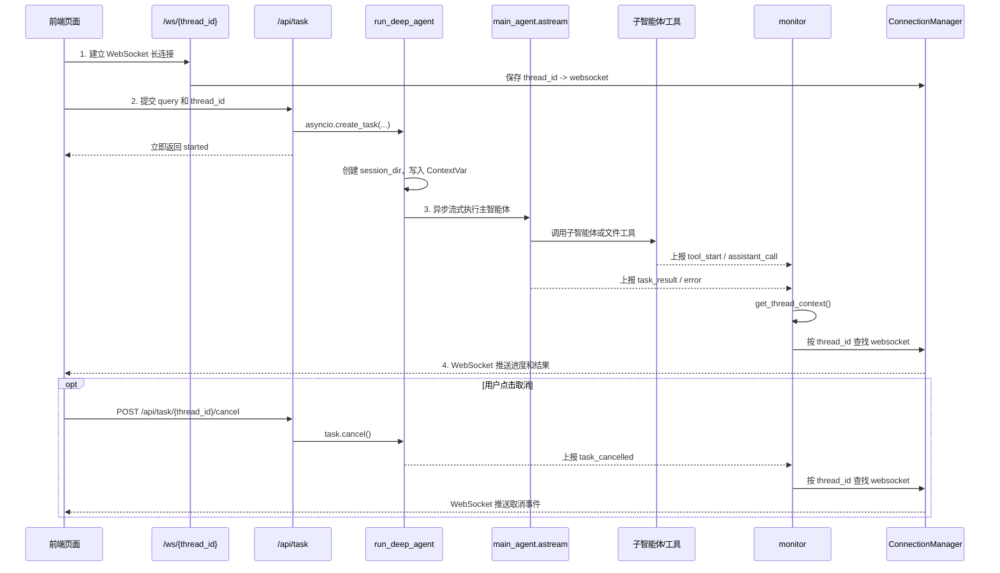
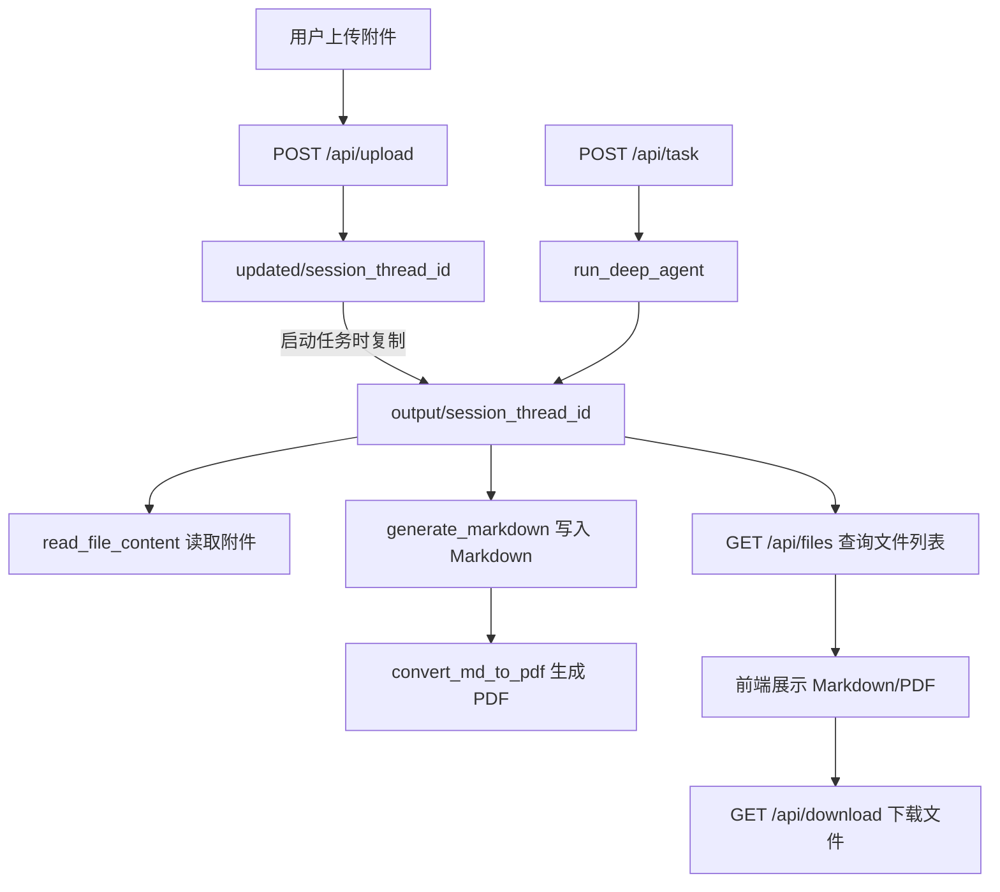
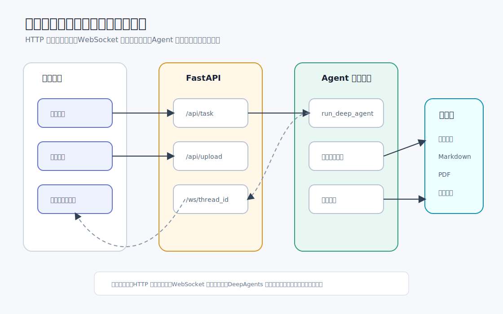

# 14 - 深度研搜：FastAPI 接口与项目闭环

---

**本章课程目标：**

- 完成 DeepAgents 多智能体系统的 FastAPI 接口层。
- 看懂 `/api/task`、`/api/task/{thread_id}/cancel`、`/api/upload`、`/api/files`、`/api/download`、`/ws/{thread_id}` 这六个入口分别接住前端哪一步动作。
- 理解为什么 `/api/task` 只负责启动后台任务，而不直接等待主智能体返回最终结果。
- 掌握 `asyncio.create_task()`、`active_tasks` 和任务取消之间的关系。
- 理解 WebSocket 为什么要绑定 FastAPI 的事件循环，以及 `run_coroutine_threadsafe()` 解决什么问题。
- 按课堂路径完成闭环验证：前端连接、上传文件、发起任务、查看进度、生成 Markdown/PDF、下载文件。

**学习建议：** 这一章不是又开一条新知识线，而是把前面几章串起来。读的时候可以把自己放在浏览器旁边：先看页面发了什么请求，再看 FastAPI 把任务交给谁，最后看 `monitor` 怎么把进度推回页面。只要能把一次任务从页面追到日志，再从日志追回页面，这个项目就真正跑通了。

**对应代码分支：** `14-deepsearch-api-websocket`

---

上一章已经完成了主智能体：`main_agent` 负责调度三个子智能体，`run_deep_agent()` 负责创建会话目录、复制上传文件、执行 `main_agent.astream()`，并通过 `monitor` 上报进度。

但主智能体本身还不是一个可以被前端直接调用的 Web 服务。前端还需要这些能力：

```text
建立实时连接
  -> 上传资料
  -> 提交任务
  -> 必要时取消任务
  -> 查看生成文件
  -> 下载 Markdown / PDF
```

这些入口统一放在 `deepsearch-agents/app/api/server.py`。

本章按这条路线展开：

```text
先把接口放到完整闭环里看
  -> 再看 server.py 的基础准备
  -> 拆解任务启动和任务取消
  -> 拆解上传、文件列表和下载
  -> 理解 WebSocket 与 monitor 的实时推送
  -> 最后用前端页面完成闭环验证
```

---

## 1、先把接口放到完整闭环里看

项目对应文件路径：`deepsearch-agents/app/api/server.py`

`server.py` 是整个项目的“接口层”。它不负责写搜索工具，也不负责设计主智能体提示词；它负责把浏览器里的动作翻译成后端能执行的任务，再把后端执行过程送回浏览器。

可以先把它理解成两条通道：

| 通道      | 负责什么                         | 本章对应接口                                                        |
| --------- | -------------------------------- | ------------------------------------------------------------------- |
| HTTP      | 发命令、传文件、查文件、下载文件 | `/api/task`、`/api/upload`、`/api/files`、`/api/download`、取消接口 |
| WebSocket | 回传实时进度和最终结果           | `/ws/{thread_id}`                                                   |

HTTP 更像“我现在要做什么”，WebSocket 更像“后端现在做到哪一步了”。

### 1.1 接口地图

先把六个入口放在一张表里：

| 前端动作         | 后端接口                            | 作用                           |
| ---------------- | ----------------------------------- | ------------------------------ |
| 页面打开或刷新   | `WebSocket /ws/{thread_id}`         | 建立长连接，实时接收执行进度   |
| 用户点击发送     | `POST /api/task`                    | 启动一次主智能体任务           |
| 用户点击取消     | `POST /api/task/{thread_id}/cancel` | 取消指定会话里正在执行的任务   |
| 用户上传附件     | `POST /api/upload`                  | 把一个或多个文件暂存到当前会话 |
| 前端刷新文件列表 | `GET /api/files`                    | 查询当前会话输出目录下的文件   |
| 用户点击下载     | `GET /api/download`                 | 下载指定输出文件               |

这里最容易误解的是 `/api/task`。它返回 `started` 并不代表任务已经执行完，只代表任务已经被交给后台协程。后续的工具调用、子智能体调用、最终回答和异常，都要看 WebSocket 推送。

### 1.2 图示：一次任务的完整时序

这张图按时间顺序看。前端先建立 WebSocket，再通过 HTTP 发起任务；任务执行期间，`monitor` 根据 `thread_id` 找到对应连接，把进度推回页面。取消任务是一条可选支线，它不会改变主流程的理解方式。



读图时抓住四个点进行了解：

| 编号 | 动作             | 要点                                                       |
| ---- | ---------------- | ---------------------------------------------------------- |
| 1    | 建立 WebSocket   | 先把当前会话的连接存起来                                   |
| 2    | 调用 `/api/task` | HTTP 只启动任务，不等最终结果                              |
| 3    | 后台执行主智能体 | `run_deep_agent()` 写入上下文并调用 `main_agent.astream()` |
| 4    | 推送实时事件     | 工具、子智能体、结果和异常都通过 WebSocket 回前端          |

### 1.3 thread_id 是整条链路的钥匙

本章里会反复看到 `thread_id`。它不是随便起的字符串，而是把几件事串在一起的同一个会话 ID：

| 用在什么地方                  | 作用                           |
| ----------------------------- | ------------------------------ |
| WebSocket                     | 找到当前页面的长连接           |
| `active_tasks`                | 找到当前会话正在执行的后台任务 |
| `output/session_{thread_id}`  | 隔离本次任务的输出目录         |
| `updated/session_{thread_id}` | 隔离本次任务上传的附件         |
| LangGraph checkpointer        | 区分同一会话的执行上下文       |

如果没有 `thread_id`，前端页面、后台任务、生成文件和 WebSocket 消息就很容易串台。

---

## 2、server.py 先准备什么

进入接口函数之前，`server.py` 先做几件基础准备：定义服务生命周期、创建 FastAPI 应用、准备两个文件目录、声明后台任务表、配置跨域。

### 2.1 应用对象、目录和后台任务表

核心代码如下：

```python
import asyncio
import shutil
import uuid
from contextlib import asynccontextmanager
from pathlib import Path
from typing import List

import uvicorn
from fastapi import (
    FastAPI,
    File,
    Form,
    HTTPException,
    UploadFile,
    WebSocket,
    WebSocketDisconnect,
)
from fastapi.middleware.cors import CORSMiddleware
from fastapi.responses import FileResponse
from pydantic import BaseModel

from app.agent.main_agent import run_deep_agent
from app.api.monitor import manager

@asynccontextmanager
async def lifespan(_app: FastAPI):
    """
    服务生命周期入口。

    启动时绑定当前事件循环到 WebSocket 管理器，确保后台 Agent 任务可以把
    monitor 事件投递回 FastAPI 所在的 loop。
    """
    loop = asyncio.get_running_loop()
    manager.set_loop(loop)
    print(f"[Server] WebSocket Manager bound to loop: {id(loop)}")
    yield


# 当前文件位于 app/api/server.py，运行时目录统一收敛到 app 目录
current_dir = Path(__file__).resolve().parent
project_root = current_dir.parent

app = FastAPI(title="DeepAgents API", lifespan=lifespan)

# 保存 thread_id -> 后台 Agent 任务，用于同一会话任务替换和主动取消
active_tasks: dict[str, asyncio.Task] = {}

# output 保存每个会话最终工作区，前端只允许从这里浏览和下载生成文件
output_dir = project_root / "output"
output_dir.mkdir(exist_ok=True)

# updated 暂存用户上传文件，run_deep_agent 启动时会复制到对应 output/session_xxx
updated_dir = project_root / "updated"
updated_dir.mkdir(exist_ok=True)
```

这一段里最重要的是四个对象：

| 对象           | 作用                                                               |
| -------------- | ------------------------------------------------------------------ |
| `lifespan`     | 服务生命周期入口，启动时把 FastAPI 事件循环绑定到 WebSocket 管理器 |
| `active_tasks` | 保存 `thread_id -> asyncio.Task`，后面取消任务要靠它找任务         |
| `updated/`     | 项目里的上传暂存目录，用户上传的附件先放这里                       |
| `output/`      | 每个会话最终工作区，生成的 Markdown、PDF 和复制后的附件都在这里    |

`updated` 这个名字容易让人以为是“更新后的文件”，在本项目里可以直接理解成“upload staging”，也就是上传文件的临时落点。真正给前端浏览和下载的是 `output`。

### 2.2 跨域配置

```python
# 教学项目通常前后端分别本地启动，这里放开跨域以便 Vite 页面直接调用 API
app.add_middleware(
    CORSMiddleware,
    allow_origins=["*"],
    allow_credentials=True,
    allow_methods=["*"],
    allow_headers=["*"],
)
```

课堂项目里，前端通常跑在 Vite 端口，后端跑在 `8000` 端口。两边不是同一个 origin，所以这里放开跨域，方便本地调试。

真实项目不要直接照搬 `allow_origins=["*"]`。上线时应该改成具体前端域名，比如公司内网域名或正式站点域名。

### 2.3 通过 lifespan 绑定事件循环

```python
@asynccontextmanager
async def lifespan(_app: FastAPI):
    """
    服务生命周期入口。

    启动时绑定当前事件循环到 WebSocket 管理器，确保后台 Agent 任务可以把
    monitor 事件投递回 FastAPI 所在的 loop。
    """
    loop = asyncio.get_running_loop()
    manager.set_loop(loop)
    print(f"[Server] WebSocket Manager bound to loop: {id(loop)}")
    yield
```

随后创建应用时，把它交给 FastAPI：

```python
app = FastAPI(title="DeepAgents API", lifespan=lifespan)
```

这一步是让 `ConnectionManager` 在服务启动阶段记住 FastAPI 当前的事件循环。

为什么要记住它？因为 WebSocket 对象是在这个事件循环里创建的。后面如果工具调用、DeepAgents 执行链或其他异步任务不在同一个执行环境里，发送 WebSocket 消息时就要把协程安全地投递回这个 loop。

`lifespan` 的写法把服务启动和关闭放到同一个上下文里：`yield` 前是启动阶段，`yield` 后可以放资源清理逻辑。当前代码只需要在启动时绑定 WebSocket loop，所以 `yield` 后面暂时没有额外清理动作。

---

## 3、任务接口：启动、替换与取消

任务接口负责两件事：

1. 用户发起任务时，把主智能体执行放到后台。
2. 用户取消任务时，找到对应后台任务并发送取消信号。

### 3.1 请求模型和任务清理函数

前端启动任务时会提交 `query` 和 `thread_id`：

```python
class TaskRequest(BaseModel):
    """前端启动任务时提交的请求体。"""

    query: str
    thread_id: str = None
```

启动接口下面还有一个小函数：

```python
def _forget_task(thread_id: str, task: asyncio.Task) -> None:
    """
    清理已结束任务的登记关系。

    done_callback 触发时，active_tasks 中可能已经被新任务替换；只有仍是同一个
    task 时才删除，避免误清理同 thread_id 下刚启动的新任务。
    """
    if active_tasks.get(thread_id) is task:
        active_tasks.pop(thread_id, None)
```

这个函数看起来不起眼，但它解决的是重入问题：同一个 `thread_id` 可能先后启动多次任务。旧任务结束时，不能把新任务在 `active_tasks` 里的登记误删掉，所以必须判断 `active_tasks.get(thread_id) is task`。

### 3.2 /api/task：只启动任务，不等待结果

```python
@app.post("/api/task")
async def run_task(request: TaskRequest):
    """
    启动一次 DeepAgents 后台任务。

    HTTP 请求只负责创建后台协程并立即返回，后续执行轨迹、子智能体调用和最终
    答案都会由 monitor 通过 `/ws/{thread_id}` 推送给同一会话的前端。
    """
    thread_id = request.thread_id or str(uuid.uuid4())

    # 同一个 thread_id 只保留一个活跃任务，新任务会先取消旧任务，避免并发写同一会话目录
    old_task = active_tasks.get(thread_id)
    if old_task and not old_task.done():
        old_task.cancel()

    # create_task 把长耗时 Agent 执行交给事件循环，接口本身不用等待最终结果
    task = asyncio.create_task(run_deep_agent(request.query, thread_id))
    active_tasks[thread_id] = task
    task.add_done_callback(lambda finished_task: _forget_task(thread_id, finished_task))

    return {"status": "started", "thread_id": thread_id}
```

这个接口可以拆成四步：

```text
拿到 query 和 thread_id
  -> 如果同一 thread_id 已经有旧任务，先取消旧任务
  -> 创建新的后台任务，并登记到 active_tasks
  -> 立即告诉前端：任务已启动
```

请求示例：

```json
{
  "query": "从网络查询机器人信息，并生成 Markdown 和 PDF 文件",
  "thread_id": "manual-test-001"
}
```

响应示例：

```json
{
  "status": "started",
  "thread_id": "manual-test-001"
}
```

注意，这个响应里没有最终答案。最终答案会通过 WebSocket 的 `task_result` 事件回来。

### 3.3 为什么这里用 create_task()

关键是这一行：

```python
task = asyncio.create_task(run_deep_agent(request.query, thread_id))
```

不要在 FastAPI 接口里写成：

```python
asyncio.run(run_deep_agent(request.query, thread_id))
```

原因很简单：FastAPI/uvicorn 已经在运行事件循环了。`asyncio.run()` 的职责是创建一个新的事件循环并运行协程，它适合脚本入口，不适合放在一个已经处于事件循环里的接口函数中。

| 写法                        | 做什么                         | 是否适合本接口              |
| --------------------------- | ------------------------------ | --------------------------- |
| `asyncio.run(coro)`         | 创建事件循环并跑完协程         | 不适合，FastAPI 已经有 loop |
| `asyncio.create_task(coro)` | 把协程放进当前事件循环后台执行 | 适合                        |

可以这样理解：

```text
FastAPI 已经有一个正在跑的大 loop
  -> /api/task 把 run_deep_agent 放进这个 loop
  -> HTTP 请求先返回
  -> 主智能体在后台继续跑
  -> monitor 通过 WebSocket 持续推送进度
```

这也是本章和上一章脚本测试的区别。上一章本地验证 `main_agent.py` 时可以用 `asyncio.run(...)`，因为那是脚本入口；本章进入 Web 服务后，要把长任务交给已有事件循环。

### 3.4 /api/task/{thread_id}/cancel：给后台任务发取消信号

```python
@app.post("/api/task/{thread_id}/cancel")
async def cancel_task(thread_id: str):
    """
    取消指定 thread_id 对应的后台 Agent 任务。

    注意：取消会向 asyncio.Task 注入 CancelledError。若底层第三方工具正在执行不可中断
    的同步阻塞调用，任务可能需要等该调用返回后才会真正结束。
    """
    task = active_tasks.get(thread_id)
    if not task or task.done():
        active_tasks.pop(thread_id, None)
        raise HTTPException(status_code=404, detail="任务不存在或已结束")

    # 先发出取消信号，再短暂等待协程响应；若底层阻塞中，则返回 cancelling 给前端继续展示状态
    task.cancel()
    try:
        await asyncio.wait_for(task, timeout=1.0)
    except asyncio.CancelledError:
        _forget_task(thread_id, task)
        return {"status": "cancelled", "thread_id": thread_id}
    except asyncio.TimeoutError:
        return {"status": "cancelling", "thread_id": thread_id}
    except Exception as e:
        _forget_task(thread_id, task)
        return {"status": "cancelled", "thread_id": thread_id, "message": str(e)}

    _forget_task(thread_id, task)
    return {"status": "cancelled", "thread_id": thread_id}
```

取消接口依赖前面的 `active_tasks`：

```text
按 thread_id 找到 asyncio.Task
  -> 调用 task.cancel()
  -> 最多等待 1 秒
  -> 如果任务响应取消，返回 cancelled
  -> 如果底层暂时没停下来，返回 cancelling
```

`cancelling` 不是失败。它只是告诉前端：取消信号已经发出，但底层可能正在等待外部接口、网络请求或同步阻塞工具返回。

### 3.5 主智能体如何配合取消

`app/agent/main_agent.py` 里也有对应处理：

```python
except asyncio.CancelledError:
    monitor.report_task_cancelled()
    raise
```

也就是说，取消信号进入 `run_deep_agent()` 后，会触发 `monitor.report_task_cancelled()`。前端收到 `task_cancelled` 事件，就可以把页面从“运行中”改成“已取消”。

这也是为什么取消不能只靠 HTTP 响应。HTTP 告诉前端“取消请求已处理”，WebSocket 才告诉前端“后台任务已经真正进入取消状态”。

---

## 4、文件接口：上传、列表和下载

文件接口负责把“用户上传的资料”和“主智能体生成的交付文件”接起来。

这里有两个目录：

| 目录                          | 什么时候写入             | 谁读取                              |
| ----------------------------- | ------------------------ | ----------------------------------- |
| `updated/session_{thread_id}` | 用户上传文件时写入       | `run_deep_agent()` 启动时读取并复制 |
| `output/session_{thread_id}`  | 主智能体执行时创建和写入 | 前端查询文件列表、浏览器下载文件    |

### 4.1 图示：文件从上传到下载

上传文件先暂存到 `updated`，任务启动后复制到 `output`，主智能体和文件工具都围绕 `output/session_xxx` 工作，前端也只允许从这个目录查看和下载。



这个设计有一个好处：前端只需要围绕 `output` 工作，不需要知道上传文件最初落在 `updated`。上传目录是后台内部细节，输出目录才是前端可见边界。

### 4.2 /api/upload：保存用户上传文件

```python
@app.post("/api/upload")
async def upload_files(files: List[UploadFile] = File(...), thread_id: str = Form(...)):
    """
    文件上传接口 (File Upload)。

    目标：
    1. 接收用户上传的一个或多个文件。
    2. 保存到 `updated/session_{thread_id}` 目录。
    3. 供 Agent 在后续任务中读取和分析。
    """
    # 上传文件先按会话隔离保存，避免不同任务读取到彼此的附件
    target_dir = updated_dir / f"session_{thread_id}"
    target_dir.mkdir(parents=True, exist_ok=True)

    saved_files = []
    for file in files:
        file_path = target_dir / file.filename
        # 直接复制文件流，避免大文件一次性读入内存
        with file_path.open("wb") as buffer:
            shutil.copyfileobj(file.file, buffer)
        saved_files.append(file.filename)

    return {"status": "uploaded", "files": saved_files}
```

请求参数很简单：

| 参数        | 类型     | 是否必填 | 说明               |
| ----------- | -------- | -------- | ------------------ |
| `files`     | `file[]` | 是       | 一个或多个上传文件 |
| `thread_id` | `string` | 是       | 当前会话 ID        |

上传完成后，文件先保存在：

```text
updated/session_{thread_id}
```

下一次用户发起任务时，`run_deep_agent()` 会检查这个目录。如果里面有文件，就复制到：

```text
output/session_{thread_id}
```

然后把文件名注入到任务提示里，提醒主智能体优先调用 `read_file_content` 读取这些附件。

### 4.3 /api/files：查询当前会话生成了哪些文件

```python
@app.get("/api/files")
async def list_files(path: str):
    """
    文件列表查询接口 (File Explorer)。

    目标：
    1. 列出指定目录下的所有生成文件。
    2. 提供文件元数据（大小、修改时间、下载所需路径）。
    3. 严格的安全检查，防止路径遍历攻击。
    """
    print(f"[DEBUG] 请求文件列表: {path}")

    try:
        # 和下载接口保持同一条安全边界：前端只能查看 output 目录内部内容
        abs_path = Path(path).resolve()
        output_abs = output_dir.resolve()

        if not abs_path.is_relative_to(output_abs):
            print(f"[ERROR] 拒绝访问: {abs_path} 不在 {output_abs} 目录下")
            return {"error": "拒绝访问: 只能访问输出目录下的文件"}

    except Exception as e:
        print(f"[ERROR] 路径解析失败: {e}")
        return {"error": f"路径无效: {e}"}

    if not abs_path.exists():
        return {"error": "目录不存在"}

    files = []
    try:
        # 递归返回文件元数据，前端据此渲染文件列表并发起下载请求
        for file_path in abs_path.rglob("*"):
            if file_path.is_file():
                stat = file_path.stat()
                files.append(
                    {
                        "name": file_path.name,
                        "type": "file",
                        "path": str(file_path),
                        "size": stat.st_size,
                        "mtime": stat.st_mtime,
                    }
                )

    except Exception as e:
        print(f"[ERROR] 遍历文件失败: {e}")
        return {"error": str(e)}

    # 最新生成的文件排在前面，方便用户优先看到本次任务产物
    files.sort(key=lambda x: x.get("mtime", 0), reverse=True)
    print(f"[DEBUG] 找到 {len(files)} 个文件")
    return {"files": files}
```

前端通常是在收到 `session_created` 事件后，拿到当前会话的 `output/session_xxx` 路径，再请求：

```text
GET /api/files?path=/.../output/session_xxx
```

返回的每个文件会带上：

| 字段    | 作用                          |
| ------- | ----------------------------- |
| `name`  | 文件名，例如 `机器人信息.pdf` |
| `path`  | 下载接口需要用到的真实路径    |
| `size`  | 文件大小                      |
| `mtime` | 修改时间，用于排序            |

### 4.4 路径安全检查为什么必须保留

文件列表和下载接口都有类似这段检查：

```python
abs_path = Path(path).resolve()
output_abs = output_dir.resolve()

if not abs_path.is_relative_to(output_abs):
    return {"error": "拒绝访问: 只能访问输出目录下的文件"}
```

这段逻辑只允许前端访问 `output` 目录内部的文件。

如果没有这层限制，用户可能把参数写成：

```text
../../some-private-file
```

甚至传入系统敏感路径。`resolve()` 会把路径规整成绝对路径，`is_relative_to(output_abs)` 再判断它是否仍然位于 `output` 内部。这是文件浏览和下载接口的安全边界。

### 4.5 /api/download：下载指定输出文件

```python
@app.get("/api/download")
async def download_file(path: str):
    """
    文件下载接口 (File Download)。

    目标：
    1. 根据绝对路径下载文件。
    2. 严格的安全检查，防止越权访问。
    """
    try:
        # resolve 后再做 is_relative_to，防止 `../` 之类的路径穿越到 output 之外
        abs_path = Path(path).resolve()
        output_abs = output_dir.resolve()

        if not abs_path.is_relative_to(output_abs):
            return {"error": "拒绝访问: 只能下载输出目录下的文件"}
    except Exception:
        return {"error": "无效的路径参数"}

    if not abs_path.exists():
        return {"error": "文件不存在"}

    # FileResponse 会以流式响应返回文件内容，并让浏览器使用原文件名下载
    return FileResponse(abs_path, filename=abs_path.name)
```

前端文件列表里每个文件都有一个 `path`。用户点击下载时，前端把这个路径交给 `/api/download`：

```text
GET /api/download?path=/.../output/session_manual-test-001/机器人信息.pdf
```

后端先做安全检查，再通过 `FileResponse` 把文件流返回给浏览器。浏览器会按 `filename=abs_path.name` 使用原文件名下载。

---

## 5、WebSocket 与 monitor：实时进度怎么回到页面

HTTP 接口负责“发起动作”，WebSocket 和 `monitor` 负责“回传过程”。

这一层的核心问题只有一个：主智能体、工具和子智能体都在比较深的调用链里，它们不应该直接操作前端 WebSocket。它们只需要上报事件，真正找连接和发送消息的事情交给 `monitor + ConnectionManager`。

### 5.1 /ws/{thread_id}：建立连接并维持心跳

```python
@app.websocket("/ws/{thread_id}")
async def websocket_endpoint(websocket: WebSocket, thread_id: str):
    """
    WebSocket 实时通讯核心接口 (Real-time Communication)。

    连接建立后，ConnectionManager 会用 thread_id 保存 WebSocket。monitor 后续
    发送事件时只需要按 thread_id 查找连接，就能把进度推给对应页面。循环中的
    receive_text 用于接收前端心跳，避免连接空闲断开。
    """
    print(f"会话向我们发起了请求，要求建立连接：{thread_id} 对应：{websocket}")

    # 连接建立后立即按 thread_id 注册，monitor 后续才能把事件定向推给当前页面
    await manager.connect(websocket, thread_id)

    try:
        while True:
            # 前端通常发送 ping 心跳；服务端回复 pong，顺便维持连接活跃
            data = await websocket.receive_text()
            await websocket.send_json(
                {"type": "pong", "message": f"服务端已收到: {data}"}
            )

    except WebSocketDisconnect:
        # 只移除当前 WebSocket 实例，避免旧连接断开时误删同 thread_id 的新连接
        manager.disconnect(websocket, thread_id)
        print(f"[WebSocket] 客户端已断开: {thread_id}")

    except Exception as e:
        print(f"[WebSocket] 连接异常: {e}")
        manager.disconnect(websocket, thread_id)
```

这个接口做三件事：

```text
接受 WebSocket 连接
  -> 用 thread_id 保存连接
  -> 在循环里接收 ping、返回 pong，维持连接活跃
```

连接保存的位置在 `ConnectionManager`：

```python
self.active_connections[thread_id] = websocket
```

之后只要 `monitor` 拿到当前任务的 `thread_id`，就能找到对应 WebSocket。

### 5.2 断开连接时为什么要判断 websocket 对象

`ConnectionManager.disconnect(...)` 里有一个细节：

```python
if self.active_connections.get(thread_id) is websocket:
    del self.active_connections[thread_id]
else:
    print(f"Stale websocket disconnected, current connection kept: {thread_id}")
```

这是为了处理重连。比如同一个 `thread_id` 下，前端因为刷新或网络波动建立了新连接。新 WebSocket 已经写进 `active_connections`，旧 WebSocket 过一会儿才触发断开。如果断开时只按 `thread_id` 删除，就会把新连接误删。

所以这里判断的是：现在断开的这个对象，是否就是当前登记的那个对象。只有是同一个对象，才删除。

### 5.3 WebSocket 推送的数据结构

服务端推给前端的消息统一是 JSON：

```json
{
  "type": "monitor_event",
  "event": "事件类型枚举",
  "message": "人类可读的提示信息",
  "data": {},
  "timestamp": "ISO-8601 时间字符串"
}
```

常见事件如下：

| event             | 触发时机             | data 示例                                           |
| ----------------- | -------------------- | --------------------------------------------------- |
| `session_created` | 工作目录创建成功     | `{"path": ".../output/session_xxx"}`                |
| `tool_start`      | 工具开始执行         | `{"tool_name": "网络搜索工具", "args": {...}}`      |
| `assistant_call`  | 主智能体调用子智能体 | `{"assistant_name": "网络搜索助手", "args": {...}}` |
| `task_result`     | 任务完成             | `{"result": "最终回答..."}`                         |
| `task_cancelled`  | 任务被用户取消       | `{}`                                                |
| `error`           | 执行异常             | `{}`                                                |

前端只需要根据 `event` 做不同展示：

```text
assistant_call -> 展示“正在调用某个专家助手”
tool_start     -> 展示“正在执行某个工具”
task_result    -> 展示最终回答
task_cancelled -> 退出运行态，展示“任务已取消”
error          -> 退出运行态，展示错误信息
```

`frontend/src/types.ts` 也按这个结构定义消息类型，所以后端事件名和前端判断逻辑要保持一致。

### 5.4 monitor 如何找到对应 WebSocket

项目对应文件路径：`deepsearch-agents/app/api/monitor.py`

`monitor._emit(...)` 会先组装统一消息：

```python
payload = {
    "type": "monitor_event",
    "event": event_type,
    "message": message,
    "data": data or {},
    "timestamp": datetime.datetime.now().isoformat(),
}
```

然后取当前任务的 `thread_id`：

```python
thread_id = get_thread_context()
```

再通过 WebSocket 管理器发送：

```python
manager_loop = self.websocket_manager.loop

if manager_loop and thread_id:
    self._send_to_websocket(payload, thread_id, manager_loop)
```

这里的关键是：`thread_id` 不是从每一个工具函数参数里传进来的，而是通过 `ContextVar` 读取。

上一章 `run_deep_agent()` 开始时会写入：

```python
session_dir_token = set_session_context(session_dir_str)
session_id_token = set_thread_context(session_id)
```

于是深层工具或 `monitor` 可以这样拿上下文：

```text
run_deep_agent 设置 thread_id 和 session_dir
  -> 工具 / monitor 在深层调用中读取 ContextVar
  -> monitor 根据 thread_id 找 WebSocket
  -> ConnectionManager 推送给正确前端
```

这层关系弄清楚后，就不会误以为工具函数要自己保存 WebSocket。工具只需要调用 `monitor.report_tool(...)`，子智能体调用只需要走 `monitor.report_assistant(...)`，最终结果走 `monitor.report_task_result(...)`。

### 5.5 为什么要判断当前事件循环

`monitor._send_to_websocket(...)` 里有一段代码很关键：

```python
try:
    current_loop = asyncio.get_running_loop()
except RuntimeError:
    current_loop = None

coroutine = self.websocket_manager.send_to_thread(payload, thread_id)
if current_loop and current_loop == manager_loop:
    current_loop.create_task(coroutine)
else:
    asyncio.run_coroutine_threadsafe(coroutine, manager_loop)
```

这段代码解决的是：调用 `monitor` 的地方，不一定和 WebSocket 创建时处于同一个事件循环。

在普通本地调试里，你可能感觉所有代码都跑在一个地方。但真实运行中，FastAPI、异步流式执行、工具调用、第三方库封装之间可能有不同的执行上下文。WebSocket 发送动作最好回到它创建时所在的 loop。

| 情况                                     | 做法                                                        |
| ---------------------------------------- | ----------------------------------------------------------- |
| 当前 loop 就是 WebSocket 所在 loop       | `current_loop.create_task(coroutine)`                       |
| 当前不在同一个 loop，或没有 running loop | `asyncio.run_coroutine_threadsafe(coroutine, manager_loop)` |

`run_coroutine_threadsafe()` 可以理解成：

```text
我现在可能不在 WebSocket 原来的 loop 里，
但我要把“发送这条消息”的协程安全地交回那个 loop 执行。
```

如果只为了写得短，也可以统一使用 `run_coroutine_threadsafe(...)`。本章代码保留判断，是为了让读者看清“同 loop”和“跨 loop”两种情况。

---

## 6、启动服务与完整联调

到这里，接口、任务、文件和 WebSocket 都讲完了。最后按一次真实操作走一遍。

### 6.1 启动后端服务

在项目根目录执行：

```bash
uvicorn app.api.server:app --host 0.0.0.0 --port 8000 --reload
```

启动成功后，应该能看到类似日志：

```text
[Server] WebSocket Manager bound to loop: 123456789
```

看到这行，说明 FastAPI 启动时已经把事件循环绑定到 WebSocket 管理器。

代码文件底部也保留了直接运行入口。课堂验证时建议优先使用上面的 `uvicorn app.api.server:app ...` 命令，因为模块路径和运行目录更清楚。

### 6.2 刷新前端，先建立 WebSocket

前端页面打开或刷新时，会先连接：

```text
ws://localhost:8000/ws/{thread_id}
```

后端控制台会打印类似：

```text
会话向我们发起了请求，要求建立连接：{thread_id} 对应：{websocket}
Client connected: {thread_id}
```

这说明：

```text
thread_id -> websocket
```

已经存进后端连接管理器。

### 6.3 观察子智能体和工具调用

任务执行过程中，前端会陆续看到类似事件：

```text
正在调用网络搜索助手
开始执行工具: 网络搜索工具
开始执行工具: Markdown 文档生成工具
开始执行工具: Markdown 转 PDF 工具
任务执行完成
```

如果你让它查网络，它可能会从多个角度搜索，例如：

```text
机器人定义
机器人分类
机器人应用
机器人发展历程
```

这些进度不是 `/api/task` 返回的，而是 `monitor` 通过 WebSocket 推给前端的。

### 6.4 查看文件列表并下载

主智能体生成文件后，前端会请求：

```text
GET /api/files?path=当前会话output目录
```

列表中应该能看到类似：

```text
机器人信息.md
机器人信息.pdf
```

点击 PDF 后，前端会调用：

```text
GET /api/download?path=.../机器人信息.pdf
```


浏览器触发下载。到这一步，前端、FastAPI、主智能体、文件工具和 WebSocket 推送就全部跑通了。

---

**本章小结：**

本章把 DeepAgents 多智能体系统包装成了可以被前端调用的 Web 服务。你需要重点记住七件事：

1. `/api/task` 只启动任务，不等待最终结果。
2. `active_tasks` 记录 `thread_id -> asyncio.Task`，让任务替换和主动取消成为可能。
3. `/api/task/{thread_id}/cancel` 通过 `task.cancel()` 发出取消信号，真正的取消状态还会通过 `task_cancelled` 事件通知前端。
4. 上传文件先进入 `updated/session_xxx`，任务启动后复制到 `output/session_xxx`。
5. 前端只允许查看和下载 `output` 目录下的文件，路径安全检查不能省。
6. 实时进度、取消状态、异常和最终结果都通过 WebSocket 推送。
7. `thread_id` 同时串起 WebSocket、后台任务、会话目录、检查点和前端文件列表。

---

## 项目总结

到这一章为止，「深度研搜」项目的主体内容就完整收尾了。回头看整套项目，它不是一个普通聊天机器人，也不是只把搜索接口、数据库接口和知识库接口简单拼在一起的 Demo，而是一套围绕“研究型任务”搭出来的多智能体最小闭环系统。

这里的“最小”不是功能很少，而是**只保留一条最关键、最必要的主链路**：用户提出研究任务，系统判断需要哪些信息来源，再把不同任务分派给对应助手，最后汇总答案并生成 Markdown 或 PDF 文件。整个过程既能在前端看到实时进度，也能在后端通过 `thread_id`、`session_dir` 和日志追踪到当前任务。



从实际代码看，这条主线最终落在 `app/agent/main_agent.py`：主智能体通过 `create_deep_agent()` 组装模型、主提示词、三个文件工具、三个专家子智能体和 `InMemorySaver` 检查点；`run_deep_agent()` 则负责创建会话目录、复制上传文件、写入 `ContextVar`、调用 `main_agent.astream()`，并把子智能体调用、工具调用、最终结果和异常通过 `monitor` 推给前端。

### 1、这个项目最终完成了什么

从用户视角看，系统最终提供的是一个“深度研究助手”：

用户可以输入一个相对复杂的研究任务，也可以上传本次任务相关的文件。后端主智能体会根据任务需要，去查互联网公开资料、查 MySQL 结构化数据、查 RAGFlow 私有知识库，必要时读取用户上传的附件，最后整理回答或生成 Markdown、PDF 等交付文件。

从工程视角看，项目已经形成了一条完整链路：

```text
前端页面
  -> FastAPI 接口
  -> run_deep_agent
  -> main_agent.astream
  -> 网络搜索助手 / 数据库助手 / RAGFlow 助手
  -> 文件读取 / Markdown 生成 / PDF 转换
  -> monitor WebSocket 推送
  -> 前端展示进度、结果和文件列表
```

这条链路里，每一层都有明确分工：

| 层次       | 主要内容                                                                            |
| ---------- | ----------------------------------------------------------------------------------- |
| 配置层     | `.env`、`prompts.yml`、`llm.py`、`prompts.py`，集中管理模型、提示词和外部服务配置   |
| 上下文层   | `context.py` 保存 `thread_id` 和 `session_dir`，让深层工具不用层层传参              |
| 监控层     | `monitor.py` 统一包装 `tool_start`、`assistant_call`、`task_result`、`error` 等事件 |
| 专家层     | 网络搜索助手、数据库查询助手、RAGFlow 知识库助手，各自只处理一种信息来源            |
| 工具层     | Tavily、MySQL、RAGFlow、文件读取、Markdown 生成、PDF 转换等真实能力                 |
| 主智能体层 | `main_agent.py` 负责统筹任务、选择助手、汇总信息和调用文件工具                      |
| API 层     | `server.py` 提供任务启动、取消、上传、文件列表、下载和 WebSocket 连接               |
| 前端层     | 发送任务、上传文件、展示实时事件、查看和下载最终产物                                |

这也是本项目和普通 RAG 示例最大的区别：它不是单一路径的“检索后回答”，而是把公开网络、结构化数据库、私有知识库和临时上传文件都放进了同一条可运行的研究链路里。

### 2、这套教程学到的不只是 DeepAgents

这套项目最重要的价值，不是记住某个工具函数怎么写，而是理解一个多智能体应用应该如何拆层。

前半部分解决“能力从哪里来”：模型配置、提示词配置、上下文管理、监控上报、路径工具和文件转换工具先搭好底座。没有这些基础模块，后面即使能调用模型，也很难支撑多任务、多文件、多来源的工程链路。

中间部分解决“专家助手怎么分工”：网络搜索助手只负责公开信息，数据库助手只负责结构化业务数据，RAGFlow 助手只负责内部非结构化知识库。每个子智能体都有自己的 `description`、`system_prompt` 和工具列表，主智能体根据任务判断该调用谁。

最后部分解决“能力怎么交付出去”：`server.py` 用 FastAPI 接住前端请求，用 `asyncio.create_task()` 把长耗时任务放到后台，用 WebSocket 推送实时进度，用 `/api/files` 和 `/api/download` 把最终产物交给用户。到这一步，项目才从“命令行能跑”变成“页面能用、过程可见、文件可下载”的应用。

所以，学完这套项目后，真正应该带走的是一套工程思路：

```text
先把能力拆清楚
  -> 再把上下文和文件边界管住
  -> 再让主智能体负责任务统筹
  -> 最后用 API 和前端把能力交付出去
```

### 3、几个值得记住的工程经验

第一，**主智能体不要什么都亲自做**。

`main_agent.py` 里主智能体直接掌握的是文件交付类工具：读取上传文件、生成 Markdown、转换 PDF。网络搜索、数据库查询、知识库问答都交给子智能体。这种分工能让主智能体更像调度中心，而不是一个塞满所有工具的巨大函数。

第二，**子智能体的边界要靠 description 和 system_prompt 写清楚**。

DeepAgents 会根据子智能体的描述决定是否调用它。网络搜索助手、数据库助手、RAGFlow 助手的职责越清楚，主智能体越不容易把任务分错。工具列表也要和职责匹配：网络助手只挂 Tavily，数据库助手按“列出表 -> 看样例 -> 执行 SQL”走，RAGFlow 助手按“查助手列表 -> 提问”走。

第三，**文件操作必须围绕当前会话目录**。

上传文件先进入 `updated/session_xxx`，任务启动后复制到 `output/session_xxx`。文件工具通过 `get_session_context()` 拿到当前会话目录，再用 `resolve_path()` 做路径约束。这样既能让模型生成文件，又能避免不同会话互相覆盖或越界读写。

第四，**长任务不要阻塞 HTTP 请求**。

深度研搜任务可能要搜索网页、查询数据库、调用知识库、生成文件和转 PDF。如果 `/api/task` 一直等最终结果，前端体验会很差，也不利于取消任务。所以本章用 `asyncio.create_task()` 启动后台任务，再通过 WebSocket 回传过程。

第五，**实时进度不是锦上添花，而是调试入口**。

`monitor.report_tool()`、`monitor.report_assistant()`、`monitor.report_task_result()` 和 `monitor.report_task_cancelled()` 把执行过程变成前端可见事件。用户能看到系统正在查网络、查数据库还是生成文件，开发者也能更快判断问题卡在哪一层。

第六，**thread_id 要贯穿整条链路**。

同一个 `thread_id` 同时关联 WebSocket 连接、后台任务、输出目录、上传目录和检查点。它看起来只是一个 ID，实际上是项目防止任务串台、消息发错、文件写错的关键。

### 4、当前项目还故意保留了哪些边界

按照生产级系统标准，当前项目还不是最终形态。它已经完成了教学项目最关键的主链路，但很多能力是有意留到后续扩展的。

比如数据库工具当前重点演示 Agent 查询链路，生产环境还应该增加更严格的 SQL 白名单、只读限制、超时控制和结果行数限制。文件上传也可以继续补充文件大小限制、文件类型白名单、病毒扫描、定期清理和对象存储。WebSocket 推送可以继续加入更完整的重连恢复、历史事件回放和任务队列。多用户场景下，还需要账号体系、权限控制、租户隔离和审计日志。

这些没有一次性塞进项目里，不是因为它们不重要，而是因为本项目的主线是让读者先掌握“多来源研究型智能体”如何从零跑通。如果第一版就把权限、队列、缓存、评测、部署治理全部放进来，学习路径会变得很重，主线反而不清楚。

当前项目更适合作为入门到进阶阶段的完整样板：它把主智能体、子智能体、工具、文件系统、API、WebSocket 和前端交付串成了一条能运行、能观察、能扩展的链路。

### 5、后续可以继续扩展什么

如果要继续把「深度研搜」往生产级方向推进，可以沿着这些方向加能力：

| 方向       | 可以继续补充的能力                                                         |
| ---------- | -------------------------------------------------------------------------- |
| 任务队列   | 把后台任务交给队列系统，支持排队、重试、超时和失败恢复                     |
| 权限控制   | 用户只能查看自己的任务、上传文件和生成文件                                 |
| 文件治理   | 增加大小限制、类型校验、对象存储、过期清理和下载鉴权                       |
| SQL 安全   | 限制只读查询、表名白名单、查询超时、结果行数上限                           |
| 事件持久化 | 保存 WebSocket 历史事件，前端刷新后可以恢复进度                            |
| 评测体系   | 构建任务集，评估搜索质量、数据库查询准确率、知识库回答质量和文件生成成功率 |
| 生产部署   | 容器化部署，接入日志平台、监控告警、链路追踪和配置中心                     |
| 前端体验   | 增加任务历史、文件预览、事件筛选、结果对比和报告编辑                       |

这些扩展都不是推翻当前架构，而是在当前架构上继续加层。只要 `thread_id`、`session_dir`、主从智能体分工、工具边界和事件协议这些基础设计保住，项目就有继续生长的空间。

### 6、最后再压缩成一句话

「深度研搜」最终完成的是一条从研究任务到可交付文件的工程闭环：用户在前端提出问题或上传资料，FastAPI 启动后台任务，主智能体调度网络、数据库和 RAGFlow 三类专家助手获取信息，再调用文件工具生成 Markdown 或 PDF，执行过程通过 WebSocket 实时回到页面，最终产物从 `output` 目录展示和下载。

如果你能把这条链路讲清楚、跑通、改得动，就已经不只是会调用模型，而是开始具备设计多智能体应用、拆分工程边界、处理前后端联调和交付完整项目的能力了。
