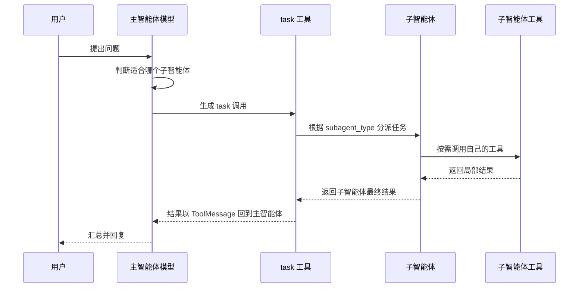

# 3 - 深度研搜：子智能体进阶与异步执行

---

**本章课程目标：**

- 掌握字典方式配置子智能体的基本写法。
- 能判断一个能力更适合做成普通工具，还是拆成子智能体。
- 理解同步流式执行和异步流式执行的区别，能使用 `astream()` + `asyncio.gather()` 并发处理多个任务。
- 了解 DeepAgents 子智能体嵌套的设计边界。

**学习建议：** 这一章重点不是“多建几个助手”，而是判断任务什么时候真的值得拆。读代码时按三步走：先看子智能体负责什么，再看它如何注册到主智能体，最后从 `stream()` 输出里观察主智能体有没有把任务交给它。异步部分先看调度结果，再回头看实现细节。

**对应代码分支：** `03-deepagents-subagents-async`

**参考资料：**
DeepAgents 子智能体：https://docs.langchain.com/oss/python/deepagents/subagents

---

前两章我们已经跑通了一个最小 DeepAgent：主智能体可以接收用户问题，调用 `internet_search` 工具，最后整理出结果。

第 1 章讲的是子智能体的概念和设计边界，第 2 章讲的是如何在 `stream()` 输出里识别工具调用，并预留 `task` 分支。从这一章开始，我们正式写子智能体配置和调度代码。

在真实项目里，一个复杂任务往往不只需要一个工具。以「深度研搜」为例，后面完整项目会涉及：联网搜索公开资料、查询业务数据库、检索企业私有知识库等能力。如果这些能力全部堆到一个主智能体里，主智能体会变得很重：工具多、提示词长、上下文混乱，模型也更容易在不同任务之间摇摆。

所以本章会把一些能力拆成几个简单助手：主智能体负责判断和分派，子智能体负责各自的小任务。


本章主要对应项目中的三个示例文件：

| 文件                             | 主题             | 解决的问题                                        |
| -------------------------------- | ---------------- | ------------------------------------------------- |
| `3-dict-subagents-routing.py`    | 字典式子智能体   | 如何用 `subagents=[...]` 注册多个助手             |
| `4-async-subagents-streaming.py` | 异步执行         | 如何用 `astream()` 和 `asyncio.gather()` 并发执行 |
| `5-subagent-nesting-limits.py`   | 子智能体嵌套边界 | 为什么普通字典子智能体不适合直接再套子智能体      |

---

## 1、先判断：该用工具还是子智能体

### 1.1 子智能体解决的核心问题

第 1 章已经讲过：子智能体主要解决上下文隔离、专业分工和可控并行的问题。本章不再重复展开概念，而是把这个判断落到代码设计上。


主智能体先通过 `task` 派活，子智能体拿到独立任务后自己完成推理和工具调用，最后只把结果交回主智能体。这样主智能体不用背着所有细节继续往下推理。

写子智能体之前，先问一个很实际的问题：

> 这件事是否值得单独拆出一个助手？

如果答案是“是”，才继续配置它的 `name`、`description`、`system_prompt` 和 `tools`。

### 1.2 适合拆成子智能体的任务

一般来说，下面几类任务适合拆成子智能体。

| 场景                 | 说明                                   | 示例                             |
| -------------------- | -------------------------------------- | -------------------------------- |
| 多步骤任务上下文很乱 | 中间过程多，主智能体容易被大量信息干扰 | 深度研究、多轮搜索、多源资料整合 |
| 存在不同专业领域     | 不同任务需要不同知识和工具             | 金融分析、法律检索、数据库查询   |
| 需要不同模型能力     | 某些任务可能需要多模态或更强模型       | 图片理解、长文档分析、代码生成   |
| 主智能体只做统筹     | 主智能体像项目经理，只负责分派和汇总   | 「深度研搜」的 Main Agent        |

本章的天气助手、数学助手、翻译助手是非常小的教学例子，真实项目里的子智能体通常会更像“网络搜索助手”“数据库查询助手”“知识库检索助手”。

### 1.3 普通工具和子智能体的选择边界

子智能体不是越多越好。可以先用下面这张表做一个粗略判断。

| 任务类型                     | 更适合的形式 | 原因                                 |
| ---------------------------- | ------------ | ------------------------------------ |
| 一次函数调用就能完成         | 普通工具     | 成本低、链路短、结果更稳定           |
| 查询天气、简单计算、格式转换 | 普通工具     | 逻辑边界清楚，不需要独立上下文       |
| 多步搜索、阅读、分析、归纳   | 子智能体     | 需要独立提示词、独立上下文和多步执行 |
| 带专属工具和复杂策略的任务   | 子智能体     | 方便限制工具权限，也方便单独调试     |

举个例子：用户给一篇英文文章，希望先翻译成中文，再总结中文内容。这个任务虽然可以拆成“翻译助手”和“总结助手”，但它的语义非常连续，第二步强依赖第一步输出。拆开以后，主智能体还要在中间重新接收、再分派，反而会增加成本。

所以写代码前，更准确的判断标准不是“步骤多不多”，而是下面三个问题：

- 这些步骤是否需要不同专业能力？
- 这些步骤之间是否可以隔离上下文？
- 拆开以后收益是否大于额外成本？

一句话总结：**工具适合做确定的小动作，子智能体适合做需要思考的一段小任务。**

---

## 2、字典方式配置子智能体

### 2.1 子智能体的基本字段

DeepAgents 支持用字典定义轻量级子智能体。对于更复杂的场景，也可以使用 `CompiledSubAgent` 封装已有的 LangGraph / LangChain 智能体流程。

- 字典子智能体：配置一个简单助手。
- `CompiledSubAgent`：把一个完整 Agent / Graph 封装成子智能体。

本章先讲最容易入门的字典方式，后面第 4 章再展开 `CompiledSubAgent`。

一个最小的字典子智能体通常包含下面几个字段：

| 字段            | 作用                                           | 是否必填 |
| --------------- | ---------------------------------------------- | -------- |
| `name`          | 子智能体名称，主智能体调用时会使用             | 必填     |
| `description`   | 子智能体职责描述，主智能体靠它判断是否调用     | 必填     |
| `system_prompt` | 子智能体自己的系统提示词                       | 常用     |
| `tools`         | 子智能体可使用的工具列表                       | 常用     |
| `model`         | 子智能体使用的模型，不填则通常继承主智能体模型 | 可选     |

其中最关键的是 `name` 和 `description`。

`name` 是子智能体的唯一标识。后面流式输出里看到 `task` 调用时，`subagent_type` 就会对应这个名称。

`description` 是主智能体判断任务归属的依据。如果描述写得模糊，主智能体就容易分派错。

### 2.2 三个助手示例

项目对应文件路径：`deepsearch-agents/examples/3-dict-subagents-routing.py`

本案例中定义了三个简单助手：天气助手、数学助手、翻译助手。

```python
# 字典式子智能体的核心字段：
# name 是子智能体唯一标识，流式输出里的 subagent_type 会对应它；
# description 主要给主智能体看，用来判断什么时候应该调用该助手；
# system_prompt 是子智能体自己的角色和行为约束；
# tools 是该子智能体可用的工具列表，不填 model 时通常继承主智能体模型。
weather_agent = {
    "name": "weather_helper",
    "description": "用于查询天气信息。当用户询问天气时，请调用此助手。",
    "system_prompt": """
    你是一个天气查询助手。
    无论用户查询哪个城市，请统一回复：今天天气晴朗，温度25度。
    """,
    "tools": [],
}

math_agent = {
    "name": "math_helper",
    "description": "用于处理数学计算问题。当用户询问加减乘除、数字计算、算数题时，请调用此助手。",
    "system_prompt": """
    你是一个严谨的数学助手。
    请帮助用户完成数学计算，并给出清晰、准确的答案。
    """,
    "tools": [],
}

translate_agent = {
    "name": "translate_helper",
    "description": "用于处理中英互译任务。当用户需要中文和英文之间的翻译时，请调用此助手。",
    "system_prompt": """
    你是一个中英翻译助手。
    如果输入是中文，请翻译成英文；如果输入是英文，请翻译成中文。
    """,
    "tools": [],
}
```

这个例子故意把三个助手设计得很简单，是为了让我们先看懂主智能体如何做调度。真实项目里，天气查询、简单计算、中英翻译不一定都要拆成子智能体；本章这样写，主要是为了演示下面几个知识点：

- 如何用字典定义子智能体；
- 如何通过 `subagents=[...]` 注册多个子智能体；
- 主智能体如何通过 `task` 工具选择不同子智能体；
- 如何在 `stream()` 输出中观察子智能体调度过程。

### 2.3 注册到主智能体

创建主智能体时，把这些字典放进 `subagents` 即可。

```python
# 主智能体自己不挂普通工具，重点负责根据用户问题分派给合适的子智能体
main_agent = create_deep_agent(
    model=llm,
    tools=[],
    subagents=[weather_agent, math_agent, translate_agent],
    system_prompt="""
    你是一个负责统筹任务的主智能体。
    请根据用户需求选择合适的子智能体完成任务。
    你不直接执行天气查询、数学计算或翻译任务，而是通过子智能体完成。
    """,
)
```

这里有两个细节。

**第一，**主智能体的 `tools=[]`，说明它自己不直接调用普通工具，而是主要负责分派任务。

**第二，**系统提示词要说清楚主智能体的边界：它不是天气助手、数学助手或翻译助手本身，而是负责把任务交给合适的子智能体。

---

## 3、观察主智能体如何调度子智能体

### 3.1 先看打印入口和输出效果

前面已经把子智能体注册到了 `subagents` 中。接下来不要急着分析内部原理，先看代码里是从哪里把调度过程打印出来的。

在 `3-dict-subagents-routing.py` 里，最后执行了两次 `test_stream()`：

```python
test_stream("北京今天的天气怎么样？")
test_stream("请将'你是最棒的'翻译成英文。")
```

也就是说，我们不是只看最终回答，而是通过 `test_stream()` 一边执行，一边把主智能体的关键动作打印出来。

执行文件验证，成功：

```text
uv run examples/3-dict-subagents-routing.py

【model】决定调用子智能体weather_helper
【agent】调用了具体的工具task,返回结果为：今天天气晴朗，温度25度。...
【model】返回最终结果：今天北京的天气晴朗，温度是25度。
【model】决定调用子智能体translate_helper
【agent】调用了具体的工具task,返回结果为：You are the best....
【model】返回最终结果："你是最棒的" 翻译成英文是 "You are the best."
```

以天气查询这组输出为例，三行日志分别对应三件事：

| 输出片段                                  | 代表的含义                                         |
| ----------------------------------------- | -------------------------------------------------- |
| `【model】决定调用子智能体weather_helper` | 主智能体判断这个问题应该交给天气助手处理           |
| `【agent】调用了具体的工具task`           | DeepAgents 执行 `task`，也就是实际去调用子智能体   |
| `【model】返回最终结果`                   | 主智能体拿到子智能体结果后，再整理成最终回复给用户 |

后面分析 `task` 工具调用时，心里先记住这条线就可以：

```text
用户问题 -> 主智能体选择子智能体 -> task 执行 -> 子智能体返回结果 -> 主智能体整理最终回复
```

### 3.2 子智能体调用本质上是 task 工具调用

现在再看一个关键点：主智能体并不是直接跳到某个子智能体里执行，而是先由模型做一次决策。

在 DeepAgents 中，主智能体调用子智能体时，通常会表现为一次特殊工具调用：

```python
tool_call["name"] == "task"
```

它的参数里会说明两件事：

- `subagent_type`：要调用哪个子智能体，对应前面配置里的 `name`。
- `description`：交给这个子智能体的具体任务。

```python
{
    "name": "task",
    "args": {
        "subagent_type": "weather_helper",
        "description": "查询北京今天的天气情况。"
    }
}
```

也就是说，从主智能体视角看，子智能体是一种可调度能力。它不是普通 Python 函数工具，而是一个拥有独立提示词、独立工具集和独立上下文的 Agent。



所以，子智能体并不是“凭空被调用”的。主智能体先请求模型判断下一步，模型返回 `task` 工具调用，DeepAgents 再根据 `subagent_type` 找到对应子智能体执行。

这里还要补一个容易混淆的细节：**子智能体不是普通工具，但它在主智能体眼里会像工具一样返回结果。**

原因是主智能体调用子智能体时，走的是 `task` 这个特殊工具。子智能体执行完以后，它的结果会回到主智能体这边，并且通常表现为一条 `ToolMessage`。

所以在流式输出里，经常会看到类似下面的三段过程：

```text
第 1 次 model 输出：主智能体决定调用 task，也就是决定分派子智能体
中间 tools 输出：task 执行完成，子智能体结果以 ToolMessage 形式返回
第 2 次 model 输出：主智能体基于子智能体结果，整理最终回复
```

如果把子智能体内部也算上，它自己执行任务时通常还会调用一次模型。也就是说，一个“主智能体调用子智能体再回答”的简单流程，常见链路是：

```text
主智能体模型：判断调用哪个子智能体
子智能体模型：完成被分派的局部任务
主智能体模型：整合子智能体结果并输出最终答案
```

这也是为什么子智能体比普通工具成本更高：普通工具通常只是一次函数或 API 调用，而子智能体本身还会走一段 Agent 执行过程。

### 3.3 如何在流式输出里识别 task

第 2 章已经讲过，`stream()` 会不断产出类似下面的 `chunk`：

```python
{
    "model": {
        "messages": [...]
    }
}
```

本章重点看 `model` 节点里最后一条消息的 `tool_calls`。普通工具调用和子智能体调用都会出现在这里，区别主要看工具名。

| 观察位置            | 普通工具调用                           | 子智能体调用                                     |
| ------------------- | -------------------------------------- | ------------------------------------------------ |
| `tool_call["name"]` | 工具自己的名字，例如 `internet_search` | 固定是 `task`                                    |
| `tool_call["args"]` | 普通工具的入参                         | 包含 `subagent_type` 和 `description`            |
| 返回结果所在节点    | `tools`                                | 也是 `tools`，因为 `task` 本身表现为一个工具结果 |

所以在流式解析代码里，只要判断工具名是不是 `task`，就能区分“调用普通工具”和“分派子智能体”：

```python
if tool_call["name"] == "task":
    print(f"调用子智能体：{tool_call['args']['subagent_type']}")
else:
    print(f"调用普通工具：{tool_call['name']}")
```

这也是第 2 章解析流式输出时提前保留 `task` 分支的原因。第 2 章的示例没有真正配置子智能体，所以它只是一个预留入口；本章配置了 `subagents` 以后，这个分支才会真正发挥作用。

### 3.4 用 stream 打印调度过程

项目对应文件路径：`deepsearch-agents/examples/3-dict-subagents-routing.py`

本案例中通过 `stream()` 观察主智能体的调度过程。

```python
def test_stream(query):
    """
    同步流式执行一次用户问题，并打印主智能体的调度过程。

    stream() 会持续产出图节点状态，常见节点包括：
    - model：模型做出下一步决策，或生成最终回复；
    - tools：工具执行完成，子智能体的 task 结果也会从这里返回。
    """
    stream = main_agent.stream(
        {"messages": [{"role": "user", "content": query}]}
    )

    for chunk in stream:
        # chunk 是按节点名组织的字典，例如 {"model": {"messages": [...]}}
        for node_name, state in chunk.items():
            # DeepAgents 内部可能产出空状态或非消息状态，这里只解析消息类状态
            if state is None or "messages" not in state:
                continue

            messages = state["messages"]
            if messages and isinstance(messages, list):
                # 每个节点本次产出的最后一条消息，通常就是最值得观察的信息
                last_msg = messages[-1]

                if node_name == "model":
                    # model 节点的 tool_calls 表示模型决定下一步调用工具或子智能体
                    if last_msg.tool_calls:
                        for tool_call in last_msg.tool_calls:
                            if tool_call["name"] == "task":
                                # DeepAgents 用内置 task 工具表示“分派给某个子智能体”
                                print(
                                    f"【model】决定调用子智能体{tool_call['args']['subagent_type']}"
                                )
                            else:
                                print(
                                    f"【model】决定调用普通工具{tool_call['name']},传入的参数为：{tool_call['args']}"
                                )
                    elif last_msg.content:
                        # 没有 tool_calls 且 content 非空，通常就是主智能体整理后的最终回复
                        print(f"【model】返回最终结果：{last_msg.content}")
                elif node_name == "tools":
                    # tools 节点返回普通工具结果；task 子智能体执行完后也会以工具消息形式返回
                    name = last_msg.name
                    content = last_msg.content
                    print(
                        f"【agent】调用了具体的工具{name},返回结果为：{content[:100] + '...'}"
                    )
```

这段代码和第 2 章的流式解析非常像，只是这里重点观察 `task`。`model` 节点用于观察主智能体的决策，`tools` 节点用于观察工具或子智能体执行后的返回结果。

当用户问“北京今天的天气怎么样？”时，主智能体应该选择 `weather_helper`。

当用户问“100 + 200 等于多少？”时，主智能体应该选择 `math_helper`。

当用户问“将 hello 翻译成中文”时，主智能体应该选择 `translate_helper`。

### 3.5 description 写不好会怎样

主智能体选择子智能体，主要依赖每个子智能体的 `description`。所以描述要尽量具体。

不太好的写法：

```python
"description": "这是一个助手。"
```

更好的写法：

```python
"description": "用于处理数学计算问题。当用户询问加减乘除、数字计算、算数题时，请调用此助手。"
```

后者明确说明了调用场景，主智能体更容易做出正确判断。

---

## 4、异步执行：astream 与并发处理

### 4.1 为什么需要异步

同步 `stream()` 一次只能处理一个任务。如果我们依次测试三个问题，就要等第一个完成后再执行第二个。

```text
任务 A 执行完成 -> 任务 B 执行完成 -> 任务 C 执行完成
```

真实 Web 服务中，多个用户可能同时发起请求。每个请求都可能等待模型、工具、网络搜索。如果全部串行处理，后端吞吐会很差。

这时就需要异步执行。DeepAgents 提供了 `astream()`，可以配合 Python 的 `asyncio` 使用。注意，异步不会让某一个任务“思考得更快”，它解决的是多个任务一起等待、一起推进的问题。

### 4.2 把 stream 改成 astream

项目对应文件路径：`deepsearch-agents/examples/4-async-subagents-streaming.py`

本案例中把同步函数改成了异步函数。

```python
async def test_stream(query):
    """
    异步流式执行一次用户问题，并打印主智能体的调度过程。

    和同步版相比，核心变化有三处：
    - def test_stream(...) 变为 async def test_stream(...)；
    - main_agent.stream(...) 变为 main_agent.astream(...)；
    - for chunk in stream 变为 async for chunk in stream。
    """
    # astream() 返回异步流对象，需要在 async 函数中用 async for 消费
    stream = main_agent.astream(
        {"messages": [{"role": "user", "content": query}]}
    )

    async for chunk in stream:
        # chunk 是按节点名组织的字典，例如 {"model": {"messages": [...]}}
        for node_name, state in chunk.items():
            # DeepAgents 内部可能产出空状态或非消息状态，这里只解析消息类状态
            if state is None or "messages" not in state:
                continue

            messages = state["messages"]
            if messages and isinstance(messages, list):
                # 每个节点本次产出的最后一条消息，通常就是最值得观察的信息
                last_msg = messages[-1]
                if node_name == "model" and last_msg.tool_calls:
                    # tool_calls 表示模型决定下一步调用工具或通过 task 分派子智能体
                    for tool_call in last_msg.tool_calls:
                        if tool_call["name"] == "task":
                            # task 是 DeepAgents 内置的子智能体分派入口
                            print(
                                f"【model】决定调用子智能体{tool_call['args']['subagent_type']}"
                            )
                        else:
                            print(
                                f"【model】决定调用普通工具{tool_call['name']},传入的参数为：{tool_call['args']}"
                            )
                elif node_name == "model" and last_msg.content:
                    # 没有 tool_calls 且 content 非空，通常就是主智能体整理后的最终回复
                    print(f"【model】返回最终结果：{last_msg.content}")
                elif node_name == "tools":
                    # tools 节点返回普通工具结果；task 子智能体执行完后也会以工具消息形式返回
                    name = last_msg.name
                    content = last_msg.content
                    print(
                        f"【agent】调用了具体的工具{name},返回结果为：{content[:100] + '...'}"
                    )
```

同步和异步的主要区别有三处：

| 同步写法                 | 异步写法                     |
| ------------------------ | ---------------------------- |
| `def test_stream(...)`   | `async def test_stream(...)` |
| `for chunk in stream`    | `async for chunk in stream`  |
| `main_agent.stream(...)` | `main_agent.astream(...)`    |

### 4.3 使用 asyncio.gather 并发执行

如果想同时发起多个任务，可以使用 `asyncio.gather()`。

```python
async def batch_run():
    # 这里得到的是协程对象；传给 gather 后，会由事件循环并发调度
    task1 = test_stream("北京今天的天气怎么样？")
    task2 = test_stream("请将'你是最棒的'翻译成英文。")

    # 打印类型只是为了让初学者看到：调用 async 函数不会立刻执行，而是先返回 coroutine
    print(type(task1))
    print(type(task2))

    # gather 会等待两个协程都完成；哪个请求先拿到结果，就会先输出自己的流式片段
    await asyncio.gather(task1, task2)

asyncio.run(batch_run())
```

执行文件验证，成功：

```text
uv run examples/4-async-subagents-streaming.py

LangChainPendingDeprecationWarning: The default value of `allowed_objects` will change in a future version.
<class 'coroutine'>
<class 'coroutine'>
【model】决定调用子智能体weather_helper
【agent】调用了具体的工具task,返回结果为：今天天气晴朗，温度25度。...
【model】决定调用子智能体translate_helper
【model】返回最终结果：今天北京的天气晴朗，温度是25度。
【agent】调用了具体的工具task,返回结果为：You are the best....
【model】返回最终结果："你是最棒的" 翻译成英文是 "You are the best."
```

这里的执行方式不再是“任务 1 完成后再开始任务 2”，而是两个任务一起推进。哪个任务先拿到模型或工具结果，哪个任务就先输出。

从这段输出也能看出两个细节：

- `test_stream(...)` 被调用后先返回的是 `<class 'coroutine'>`，说明异步函数不会立刻执行完整逻辑，而是先得到一个协程对象。
- 天气任务和翻译任务的日志是交错出现的。天气助手先返回了工具结果，但翻译助手的调度也已经开始了，这正是 `asyncio.gather()` 并发推进的效果。

在后面做 FastAPI 接口时，异步能力非常重要。因为 Web 服务本身就是多用户、多请求场景，不能让一个智能体任务阻塞整个服务。

### 4.4 补充：asyncio.create_task

除了直接把协程传给 `asyncio.gather()`，Python 里还有一种常见写法：`asyncio.create_task()`。

`create_task()` 的作用是把一个协程明确包装成任务，并提交给事件循环调度。

```python
async def batch_run():
    task1 = asyncio.create_task(test_stream("北京今天的天气怎么样？"))
    task2 = asyncio.create_task(test_stream("请将'你是最棒的'翻译成英文。"))

    await asyncio.gather(task1, task2)

asyncio.run(batch_run())
```

这段代码和前面的 `gather()` 示例效果很像，都是让两个任务并发执行。区别在于：

| 写法                          | 适合场景                                       |
| ----------------------------- | ---------------------------------------------- |
| 直接传协程给 `gather()`       | 一次性启动多个任务，并等待它们全部完成         |
| 先用 `create_task()` 创建任务 | 需要先启动任务，后面再等待、取消或管理任务状态 |

你可以先了解：**简单并发用 `gather()` 就够；需要更明确地管理任务时，再使用 `create_task()`。**

---

## 5、子智能体嵌套的边界

### 5.1 普通字典子智能体不适合继续嵌套

项目对应文件路径：`deepsearch-agents/examples/5-subagent-nesting-limits.py`

本案例演示了一个容易误解的点：我们可能想配置一个层级结构，比如 CEO 调 CTO，CTO 再调 Coder。

示例中大致是这样的结构：

```python
# 1. 底层 Coder：理想情况下，它应该只负责具体代码实现
coder_config = {
    "name": "Coder",
    "description": "高级 Python 工程师，负责接收具体的编码任务并实现代码。",
    "system_prompt": """
    你是一名高级 Python 工程师。
    你的职责是接收具体的编码任务，并给出对应的代码实现。
    """,
    "tools": [],
}

# 2. 中间层 CTO：理想情况下，它负责拆解任务，再委派给 Coder
cto_config = {
    "name": "CTO",
    "description": "技术总监，负责将战略需求转化为技术任务，并分配给工程师。",
    # system_prompt 可以约束 CTO 的角色，但不能让 dict 自动支持嵌套子智能体
    "system_prompt": """
    你是技术总监。
    你不直接编写代码。
    你的职责包括：
    1. 分析 CEO 的需求。
    2. 设计技术方案。
    3. 调用 Coder 子智能体完成具体的代码编写工作。
    """,
    "tools": [],
    # 关键边界：普通 dict 子智能体的标准字段里没有 subagents。
    # 这一行是“反例式演示”，用于观察底层是否忽略该字段，而不是推荐用法。
    "subagents": [coder_config],
}
```

但这里要注意：普通字典式子智能体的官方配置字段里，并不包含 `subagents`。也就是说，直接往字典里硬塞 `subagents`，并不是推荐写法，也不一定会被底层识别。

执行文件验证，输出节选如下：

```text
uv run examples/5-subagent-nesting-limits.py

LangChainPendingDeprecationWarning: The default value of `allowed_objects` will change in a future version.
>>> 开始执行任务链...

>>> 最终结果：
{'PatchToolCallsMiddleware.before_agent': None}
{'model': {'messages': [AIMessage(
    content='',
    name='CEO',
    tool_calls=[
        {
            'name': 'task',
            'args': {
                'description': '开发一个贪吃蛇游戏，使用 Python 实现。请直接提供完整的代码字符串。',
                'subagent_type': 'CTO'
            },
            'type': 'tool_call'
        }
    ]
)]}}
{'TodoListMiddleware.after_model': None}
{'tools': {'messages': [ToolMessage(
    name='task',
    content='为了开发一个简单的贪吃蛇游戏，我们可以使用 Python 的 curses 库...'
)]}}
{'model': {'messages': [AIMessage(
    name='CEO',
    content='代码已准备好，这是一个使用 Python 和 curses 库实现的基础贪吃蛇游戏...'
)]}}
{'TodoListMiddleware.after_model': None}
```

这段输出里有两个地方最值得看。

**第一，**顶层 CEO 确实调用了 `task`，并且 `subagent_type` 是 `CTO`：

```text
'name': 'task'
'subagent_type': 'CTO'
```

这说明 CEO -> CTO 这一层委派是生效的。

**第二，**后面的输出里没有继续出现 `subagent_type == "Coder"`。也就是说，虽然 `cto_config` 里写了 `"subagents": [coder_config]`，但普通字典式子智能体并没有稳定形成 CTO -> Coder 的二级委派。

这个示例的价值不是告诉你“应该这样嵌套”，而是提醒你：**字典式子智能体适合轻量分工，不适合承载复杂层级架构。**

### 5.2 如果需要复杂层级怎么办

如果确实要做更复杂的层级结构，建议使用后面第 4 章要讲的 `CompiledSubAgent`，或者把复杂逻辑封装成一个独立的 LangGraph 图，再作为子智能体挂到 DeepAgents 中。

也就是说：

- 简单子智能体：用字典配置。
- 复杂子智能体：用 CompiledSubAgent 封装。

本章先把字典式子智能体和异步执行掌握好。下一章我们再看如何把已有 LangGraph / LangChain 智能体接入 DeepAgents。

---

**本章小结：**

这一章我们从“该用工具还是子智能体”讲到了“怎么配置、观察和并发执行子智能体”。先明确了子智能体适合解决上下文膨胀和专业分工问题，但简单任务、语义连续任务、成本过高的任务不建议拆。

接着用 `3-dict-subagents-routing.py` 学习了字典式子智能体：每个子智能体通过 `name`、`description`、`system_prompt`、`tools` 描述自己的职责，主智能体通过 `subagents=[...]` 注册它们。

然后通过 `stream()` 观察了主智能体如何生成 `task` 调用，并根据 `subagent_type` 分派给对应助手。最后用 `4-async-subagents-streaming.py` 把同步执行改成 `astream()` 异步执行，并通过 `asyncio.gather()` 并发处理多个任务。

**请记住：** 子智能体不是为了把系统做复杂，而是为了让复杂任务的职责更清楚、上下文更干净、执行过程更容易观察。
