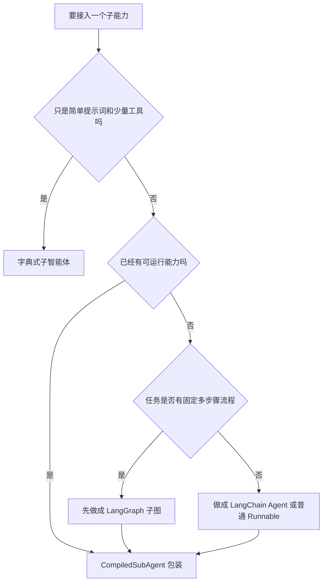

# 4 - 深度研搜：接入 LangGraph 与 LangChain

---

**本章课程目标：**

- 理解为什么 DeepAgents 需要复用已有 LangGraph / LangChain 能力。
- 掌握 `CompiledSubAgent` 的作用和基本配置方式。
- 理解 LangGraph 子智能体为什么必须包含可累加的 `messages` 状态字段。
- 能判断复杂子任务应该交给 LangGraph，还是交给 LangChain Agent。

**学习建议：** 这一章学的是“复用现成能力”，不是重新学 LangGraph 或 LangChain。读的时候重点看 `CompiledSubAgent` 如何把已有图、Agent 或 Runnable 包成 DeepAgents 能调度的子智能体。如果 `StateGraph`、`add_messages`、条件边、`@tool`、`create_agent()` 还不熟，先回看对应章节，否则这里会像在看一层薄薄的适配胶水。

**对应代码分支：** `04-deepagents-langgraph-langchain`

---

上一章我们学习了字典式子智能体。它适合定义简单、轻量、职责明确的助手，比如天气助手、数学助手、翻译助手。

但真实项目里，经常已经有一些现成能力：

- 前面用 LangGraph 写好的工作流；
- 前面用 LangChain `create_agent()` 创建的工具型 Agent；
- 已经封装好的 Runnable；
- 需要多节点状态流转、条件分支或工具选择的复杂子任务。

这些能力如果全部重写成字典式子智能体，成本很高，也没有必要。DeepAgents 提供了 `CompiledSubAgent`，它的作用就是把已有图、Agent 或 Runnable 封装成 DeepAgents 可以调度的子智能体。

本章对应两个示例文件：

| 文件                                    | 主题           | 本章示例的业务含义                                 |
| --------------------------------------- | -------------- | -------------------------------------------------- |
| `6-langgraph-subagent-wrapper.py`       | 兼容 LangGraph | 把“研究任务规划” LangGraph 工作流封装成子智能体    |
| `7-langchain-agent-subagent-wrapper.py` | 兼容 LangChain | 把“资料检索” LangChain 工具型 Agent 封装成子智能体 |

---

## 1、先看整体关系：DeepAgents 负责调度

学习这一章时，先不要把 LangGraph、LangChain 和 DeepAgents 混在一起看。它们在本章里的分工很清楚：

```text
用户问题
  -> DeepAgents 主智能体
      -> 字典子智能体：适合简单助手
      -> CompiledSubAgent：适合复用已有复杂能力
            -> LangGraph 子图：适合多节点流程和状态流转
            -> LangChain Agent：适合工具选择和资料检索
```

**图 4-1 说明：** DeepAgents 主智能体像一个调度层，它不需要关心 LangGraph 子图里有几个节点，也不需要知道 LangChain Agent 具体调用了哪个工具。它只要知道：某个子智能体能完成什么任务，以及应该在什么时候把任务交出去。

所以本章的主线其实只有一句话：

> 已经写好的 LangGraph 图或 LangChain Agent，不用推倒重写，可以通过 `CompiledSubAgent` 接到 DeepAgents 主智能体下面。

理解了这一点，再看后面的两个例子就会轻松很多。

---

## 2、CompiledSubAgent 是什么

### 2.1 字典子智能体和 CompiledSubAgent 的区别

DeepAgents 中常见的子智能体配置方式有两种。

| 方式               | 适合场景     | 特点                                          |
| ------------------ | ------------ | --------------------------------------------- |
| 字典配置           | 简单子智能体 | 写法简单，适合只配置提示词和工具              |
| `CompiledSubAgent` | 复杂子智能体 | 可以接入已有 LangGraph / LangChain / Runnable |

字典方式更像“直接声明一个助手”：

```python
weather_agent = {
    "name": "weather_helper",
    "description": "用于查询天气信息。",
    "system_prompt": "你是一个天气助手。",
    "tools": [],
}
```

`CompiledSubAgent` 更像“把已经写好的能力包一层，交给 DeepAgents 调度”：

```python
sub_agent = CompiledSubAgent(
    name="research_planner_graph",
    description="用于把开放研究问题拆解成可执行的研究计划。",
    runnable=compiled_graph,
)
```

### 2.2 三个核心参数

`CompiledSubAgent` 最核心的是三个参数：

| 参数          | 说明                                                              |
| ------------- | ----------------------------------------------------------------- |
| `name`        | 子智能体名称，主智能体通过它识别子智能体                          |
| `description` | 子智能体能力说明，主智能体靠它判断什么时候调用                    |
| `runnable`    | 真正执行任务的对象，可以是编译后的 LangGraph 图或 LangChain Agent |

也就是说，`CompiledSubAgent` 自己不负责写业务逻辑。业务逻辑在 `runnable` 里，它只负责把这个能力包装成 DeepAgents 能识别的子智能体。

---

## 3、接入 LangGraph：研究任务规划子图

### 3.1 这个例子解决什么问题

项目对应文件路径：`deepsearch-agents/examples/6-langgraph-subagent-wrapper.py`

这一节的 LangGraph 示例，是一个贴近「深度研搜」场景的子能力：**研究任务规划器**。

它不是简单返回一句“我处理完了”，而是模拟下面这条链路：

```text
用户提出研究问题
  -> DeepAgents 主智能体判断需要研究规划
  -> task 调用 research_planner_graph
  -> LangGraph 子图提取研究主题
  -> 条件边判断 quick / deep
  -> 生成普通计划或深度研究计划
  -> 汇总成最终规划结果
```

这一节会用到你前面已经学过的 LangGraph 知识点：

| 本章用法                  | 对应仓库案例                                                               |
| ------------------------- | -------------------------------------------------------------------------- |
| `messages + add_messages` | `案例与源码-3-LangGraph框架/03-state/reducers/StateReducer_AddMessages.py` |
| 条件边                    | `案例与源码-3-LangGraph框架/05-edge/Edge_Conditional.py`                   |
| 多节点业务流              | `案例与源码-3-LangGraph框架/01-helloworld/LangGraphBiz.py`                 |

### 3.2 State 为什么必须包含 messages

LangGraph 子图要接入 DeepAgents，最关键的要求是：**State 里必须包含 `messages` 字段。**

```python
class ResearchPlanState(TypedDict):
    messages: Annotated[list, add_messages]
    topic: str
    depth: Literal["quick", "deep"]
    plan: list[str]
```

这里有两个重点。

**第一，**DeepAgents 会通过 `messages` 把任务传给子图，也会从 `messages` 里读取子图返回结果。

**第二，**`messages` 要配合 `add_messages` 使用。这样节点返回的新消息会追加到原消息列表，而不是覆盖历史消息。

如果写成普通的：

```python
messages: list
```

后面的节点很容易只看到最后一次状态，前面的用户问题、模型调度和子图中间结果都会丢失。

所以接入 DeepAgents 的 LangGraph 子图，一般要保留这种写法：

```python
messages: Annotated[list, add_messages]
```

### 3.3 定义研究规划节点

第一个节点负责从任务中提取研究主题，并判断研究深度。

```python
def extract_topic(state: ResearchPlanState):
    """从用户任务中提取研究主题，并判断是否需要深度研究。"""
    task = state["messages"][-1].content
    depth = "deep" if any(word in task for word in ["深度", "报告", "系统", "趋势"]) else "quick"
    topic = (
        task.replace("请", "")
        .replace("帮我", "")
        .replace("生成", "")
        .replace("一份", "")
        .strip("。 ")
    )
    print(f"【LangGraph】提取研究主题：{topic}")
    print(f"【LangGraph】判断研究深度：{depth}")
    return {
        "topic": topic,
        "depth": depth,
        "messages": [AIMessage(content=f"已识别研究主题：{topic}；研究深度：{depth}")],
    }
```

这里故意没有调用大模型，而是用简单规则模拟主题提取和深度判断。这样你可以先看清楚 LangGraph 的状态流转，不会被模型输出的不确定性带偏。

### 3.4 使用条件边选择规划路径

如果任务是普通查询，就走 `quick_plan`；如果任务是深度研究，就走 `deep_plan`。

```python
def route_by_depth(state: ResearchPlanState):
    """条件边：根据研究深度选择普通规划或深度规划。"""
    return state["depth"]


workflow.add_conditional_edges(
    "extract_topic",
    route_by_depth,
    {
        "quick": "quick_plan",
        "deep": "deep_plan",
    },
)
```

这部分对应前面 LangGraph 教程中的条件边：节点执行完成后，由路由函数读取当前 `state`，再决定下一步走向。

在「深度研搜」项目里，这类条件边很常见。例如：

- 资料是否足够，不够就继续搜索；
- 用户问题是否需要数据库查询；
- 检索结果是否需要交叉验证；
- 报告是否需要补充案例。

### 3.5 生成计划并汇总结果

深度研究计划节点会生成更完整的执行步骤：

```python
def build_deep_plan(state: ResearchPlanState):
    """深度研究规划：适合报告、趋势分析、行业调研等长链路任务。"""
    topic = state["topic"]
    plan = [
        f"明确「{topic}」的研究范围、时间窗口和核心问题",
        "搜索公开资料，优先收集权威媒体、机构报告和官方信息",
        "拆分技术、产业、公司案例、风险四个方向分别整理证据",
        "对不同来源的信息做交叉验证，记录冲突和缺口",
        "输出结构化研究报告：背景、现状、趋势、案例、风险、结论",
    ]
    print("【LangGraph】进入 deep_plan 节点")
    return {
        "plan": plan,
        "messages": [AIMessage(content="已生成深度研究计划。")],
    }
```

最后由 `finalize_plan()` 把状态里的 `topic`、`depth`、`plan` 汇总成一条 `AIMessage`，返回给 DeepAgents 主智能体。

### 3.6 封装成 CompiledSubAgent

LangGraph 图编译完成后，就可以作为 `runnable` 传给 `CompiledSubAgent`。

```python
compiled_graph = workflow.compile()

research_planner_graph = CompiledSubAgent(
    name="research_planner_graph",
    description="用于把开放研究问题拆解成可执行的研究计划，适合行业趋势、技术调研、报告规划等任务。",
    runnable=compiled_graph,
)
```

最后注册到 DeepAgents 主智能体：

```python
main_agent = create_deep_agent(
    model=llm,
    tools=[],
    subagents=[research_planner_graph],
    system_prompt="""
    你是深度研搜系统的主智能体。
    当用户需要研究规划、报告大纲、趋势调研步骤时，必须调用 research_planner_graph。
    你不自己编造研究计划，而是根据子智能体返回的计划整理最终回复。
    """,
)
```

### 3.7 执行输出

执行文件验证，成功：

主智能体生成的 `tool_calls`、LangGraph 子图内部的打印、子图返回的 `ToolMessage`，以及主智能体最后整理出的 `AIMessage`。

```text
tools@ToolsMacBook-Pro deepsearch-agents % uv run examples/6-langgraph-subagent-wrapper.py

/Users/tools/Desktop/agent/data-agent-study/deepsearch-agents/.venv/lib/python3.12/site-packages/langgraph/checkpoint/serde/encrypted.py:5:
LangChainPendingDeprecationWarning: The default value of `allowed_objects` will change in a future version.

{'PatchToolCallsMiddleware.before_agent': None}
{'model': {'messages': [AIMessage(content='', tool_calls=[
  {
    'name': 'task',
    'args': {
      'subagent_type': 'research_planner_graph',
      'description': '请为用户创建一份关于人工智能与机器人行业趋势的深度研究计划。这份计划应该包括但不限于：1. 行业现状概述 2. 关键技术进展 3. 主要市场参与者 4. 应用案例分析 5. 面临的挑战与机遇 6. 未来发展方向预测...'
    }
  }
])]}}
{'TodoListMiddleware.after_model': None}

【LangGraph】提取研究主题：为用户创建关于人工智能与机器人行业趋势的深度研究计划。这份计划应该包括但不限于：1. 行业现状概述 2. 关键技术进展 3. 主要市场参与者 4. 应用案例分析 5. 面临的挑战与机遇 6. 未来发展方向预测...
【LangGraph】判断研究深度：deep
【LangGraph】进入 deep_plan 节点
【LangGraph】汇总研究计划

{'tools': {'messages': [ToolMessage(content='研究主题：为用户创建关于人工智能与机器人行业趋势的深度研究计划...\\n研究深度：deep\\n\\n执行计划：\\n1. 明确研究范围、时间窗口和核心问题\\n2. 搜索公开资料，优先收集权威媒体、机构报告和官方信息\\n3. 拆分技术、产业、公司案例、风险四个方向分别整理证据\\n4. 对不同来源的信息做交叉验证，记录冲突和缺口\\n5. 输出结构化研究报告：背景、现状、趋势、案例、风险、结论') ]}}

{'model': {'messages': [AIMessage(content='为了完成关于人工智能与机器人行业趋势的深度研究计划，我们将按照以下步骤进行：\\n\\n1. **明确研究范围、时间窗口和核心问题**...\\n2. **搜索公开资料**...\\n3. **整理证据**...\\n4. **交叉验证信息**...\\n5. **撰写结构化研究报告**...')]}}
{'TodoListMiddleware.after_model': None}
```

上面这段输出省略了 `token_usage`、`id` 等调试字段，保留的是最适合读者理解执行链路的部分。开头的 `LangChainPendingDeprecationWarning` 是依赖库提示，不影响本例运行。

这段输出可以按四个位置来看：

| 输出片段                               | 说明                                                |
| -------------------------------------- | --------------------------------------------------- |
| `tool_calls -> research_planner_graph` | 主智能体决定通过 `task` 调用 LangGraph 子智能体     |
| `【LangGraph】提取研究主题...`         | 子图内部节点正在执行，这是 LangGraph 自己的业务流程 |
| `ToolMessage(content='研究主题...')`   | 子图执行完成，结果作为 `task` 工具返回给主智能体    |
| 最后一条 `AIMessage(content=...)`      | 主智能体基于子图结果整理最终回复                    |

这里最重要的是：DeepAgents 主智能体不需要知道 LangGraph 子图内部有几个节点，它只需要知道有一个叫 `research_planner_graph` 的子智能体可以完成“研究规划”。

---

## 4、接入 LangChain：资料检索 Agent

### 4.1 这个例子解决什么问题

项目对应文件路径：`deepsearch-agents/examples/7-langchain-agent-subagent-wrapper.py`

这一节的 LangChain Agent 示例，是一个贴近「深度研搜」场景的子能力：**资料检索助手**。

它负责在自己的工具集中选择合适工具：

```text
用户问题
  -> DeepAgents 主智能体
  -> task 调用 research_retriever_agent
  -> LangChain Agent 判断该查公开资料还是内部知识库
  -> 调用 search_public_web / search_internal_knowledge_base
  -> 返回资料来源、关键发现和后续建议
```

这一节会用到你前面已经学过的 LangChain 知识点：

| 本章用法         | 对应仓库案例                                                         |
| ---------------- | -------------------------------------------------------------------- |
| `@tool` 工具封装 | `案例与源码-2-LangChain框架/08-tools/QueryWeatherTool.py`            |
| `create_agent()` | `案例与源码-2-LangChain框架/12-agent/AgentSmartSelectV1.0.py`        |
| 结构化结果意识   | `案例与源码-2-LangChain框架/05_parser/StructuredOutput_TypedDict.py` |

### 4.2 定义资料检索工具

示例里没有直接调用真实搜索引擎或企业知识库，而是先用两个模拟工具表达真实项目中的两类资料来源。

```python
@tool
def search_public_web(query: str) -> str:
    """
    检索公开网络资料。

    参数:
        query: 用户关注的研究主题或关键词。

    返回:
        模拟的公开资料摘要。真实项目中可以替换为 Tavily、搜索引擎 API 或爬虫服务。
    """
    print(f"【LangChain Tool】检索公开资料：{query}")
    return (
        "公开资料检索结果：\n"
        "1. 多家机构认为具身智能正在推动机器人从单点自动化走向通用任务执行。\n"
        "2. 机器人产业热点集中在大模型控制、灵巧手、低成本传感器和仿真训练。"
    )
```

另一个工具模拟企业内部知识库：

```python
@tool
def search_internal_knowledge_base(query: str) -> str:
    """检索企业内部知识库。"""
    print(f"【LangChain Tool】检索内部知识库：{query}")
    return (
        "内部知识库检索结果：\n"
        "1. 历史项目复盘显示，客户最关注机器人方案的稳定性、部署周期和维护成本。\n"
        "2. 销售材料中高频卖点包括：多模态感知、自动任务分解、远程运维和持续学习。"
    )
```

这里的关键不是模拟数据本身，而是工具边界：

- 公开资料工具负责外部趋势；
- 内部知识库工具负责企业经验；
- LangChain Agent 负责判断什么时候调用哪个工具。

### 4.3 创建 LangChain Agent

接下来用 `create_agent()` 创建一个普通 LangChain Agent。

```python
research_retriever_agent = create_agent(
    model=llm,
    tools=[search_public_web, search_internal_knowledge_base],
    system_prompt="""
    你是资料检索助手，负责为深度研究任务收集资料。
    当用户需要行业公开信息时，调用 search_public_web。
    当用户需要企业内部经验、项目复盘或知识库内容时，调用 search_internal_knowledge_base。
    如果问题同时涉及公开趋势和内部经验，可以两个工具都调用。
    最后请用中文输出：资料来源、关键发现、后续建议。
    """,
)
```

这个 Agent 本身已经能根据用户问题调用工具。DeepAgents 需要做的，不是重写它，而是把它包成子智能体。

### 4.4 封装成 DeepAgents 子智能体

```python
research_retriever_subagent = CompiledSubAgent(
    name="research_retriever_agent",
    description="用于检索公开资料和企业内部知识库，适合为深度研究报告收集证据和背景信息。",
    runnable=research_retriever_agent,
)
```

然后注册到 DeepAgents 主智能体：

```python
deep_agent = create_deep_agent(
    model=llm,
    tools=[],
    system_prompt="""
    你是深度研搜系统的主智能体。
    当用户需要查找资料、收集证据、检索公开信息或内部知识库时，必须调用 research_retriever_agent。
    你不直接检索资料，只负责分派任务并整理子智能体返回的结果。
    """,
    subagents=[research_retriever_subagent],
)
```

注意这里主智能体的 `tools=[]`。也就是说，公开搜索工具和内部知识库工具没有直接挂在 DeepAgents 主智能体上，而是挂在 LangChain 子 Agent 上。

这就形成了两层职责：

```text
DeepAgents 主智能体：决定是否需要资料检索
LangChain 子智能体：决定调用公开资料工具还是内部知识库工具
```

### 4.5 执行输出

执行文件验证，成功：

这段输出比 LangGraph 示例更能体现“工具型 Agent”的特点：主智能体一次派出两个 `task`，LangChain Agent 再分别调用公开资料工具和内部知识库工具。

```text
tools@ToolsMacBook-Pro deepsearch-agents % uv run examples/7-langchain-agent-subagent-wrapper.py

/Users/tools/Desktop/agent/data-agent-study/deepsearch-agents/.venv/lib/python3.12/site-packages/langgraph/checkpoint/serde/encrypted.py:5:
LangChainPendingDeprecationWarning: The default value of `allowed_objects` will change in a future version.

{'PatchToolCallsMiddleware.before_agent': None}
{'model': {'messages': [AIMessage(content='', tool_calls=[
  {
    'name': 'task',
    'args': {
      'subagent_type': 'research_retriever_agent',
      'description': '检索公开资料以了解人工智能机器人行业的最新趋势。请收集关于技术进步、市场增长、主要参与者和未来预测的信息。'
    }
  },
  {
    'name': 'task',
    'args': {
      'subagent_type': 'research_retriever_agent',
      'description': '从内部知识库中检索我们公司在人工智能机器人领域的项目经验。请查找相关案例研究、已完成的项目文档以及任何与客户合作的成功故事。'
    }
  }
])]}}
{'TodoListMiddleware.after_model': None}

【LangChain Tool】检索公开资料：人工智能机器人行业的最新趋势 技术进步 市场增长 主要参与者 未来预测
【LangChain Tool】检索内部知识库：人工智能机器人 项目经验 案例研究 成功故事

{'tools': {'messages': [ToolMessage(content='资料来源：企业内部知识库\\n\\n关键发现：\\n1. 从历史项目复盘中了解到，客户在选择人工智能机器人方案时最重视的是系统的稳定性、部署所需时间以及长期维护的成本。\\n2. 销售材料里高频提及的产品卖点包括多模态感知、自动任务分解、远程运维、自我学习和优化能力。\\n3. 准备研究报告时，建议单独列出落地风险和缓解措施，并强调数据闭环。') ]}}

{'tools': {'messages': [ToolMessage(content='资料来源：公开网络\\n\\n关键发现：\\n1. 当前人工智能机器人行业正受到具身智能技术推动，机器人正在从单一任务走向更广泛的通用任务。\\n2. 产业热点包括大模型控制、灵巧手、低成本传感器和仿真训练。\\n3. 领先企业正在布局工业制造、仓储物流及家庭服务等场景。') ]}}

{'model': {'messages': [AIMessage(content='### 公开趋势检索结果\\n\\n从公开资料中，我们了解到人工智能机器人行业正经历以下关键发展...\\n\\n### 内部知识库项目经验总结\\n\\n根据我们的内部记录，关于人工智能机器人项目的几个重要发现如下...\\n\\n### 后续建议...')]}}
{'TodoListMiddleware.after_model': None}
```

这段输出对应的含义是：

| 输出片段                              | 说明                                                 |
| ------------------------------------- | ---------------------------------------------------- |
| `task -> research_retriever_agent`    | DeepAgents 主智能体把检索任务交给 LangChain Agent    |
| `【LangChain Tool】检索公开资料...`   | LangChain Agent 调用了公开资料工具                   |
| `【LangChain Tool】检索内部知识库...` | LangChain Agent 调用了内部知识库工具                 |
| `ToolMessage(content=...)`            | LangChain Agent 的最终结果返回给 DeepAgents 主智能体 |
| 最后一条 `AIMessage(content=...)`     | 主智能体整理最终答复                                 |

这个例子里，主智能体一次生成了两个 `task` 调用：一个检索公开趋势，一个检索内部经验。真正选择并执行 `search_public_web`、`search_internal_knowledge_base` 的，是被封装进去的 LangChain Agent。

---

## 5、两种兼容方式怎么选

### 5.1 LangGraph 适合什么场景

如果子任务内部有明确的状态流转、多节点处理、条件判断，推荐用 LangGraph。

例如：

- 研究问题 -> 提取主题 -> 判断研究深度 -> 生成计划 -> 汇总；
- 数据库查询 -> SQL 生成 -> SQL 校验 -> 执行 -> 返回结果；
- 多路召回 -> 合并 -> 排序 -> 过滤；
- 报告生成 -> 反思缺口 -> 补充资料 -> 重新生成。

这类任务本身就是一张图，封装成 LangGraph 子智能体更自然。

### 5.2 LangChain Agent 适合什么场景

如果子任务更像“一个会自己选工具的 Agent”，可以用 LangChain Agent。

例如：

- 根据问题选择公开搜索工具或内部知识库工具；
- 根据用户输入选择不同 API；
- 已经写好的 ReAct / Tool Calling Agent 需要复用；
- 希望把工具选择细节隔离在子智能体内部。

它不一定需要复杂图结构，只要能作为 Runnable 执行，就可以通过 `CompiledSubAgent` 接入。

### 5.3 选择建议

可以用下面这张表快速判断。

| 问题                         | 推荐方式                             |
| ---------------------------- | ------------------------------------ |
| 子任务流程固定、有多个步骤   | LangGraph + `CompiledSubAgent`       |
| 子任务需要条件分支和状态流转 | LangGraph                            |
| 子任务是已有 LangChain Agent | LangChain Agent + `CompiledSubAgent` |
| 子任务核心是工具选择         | LangChain Agent                      |
| 子任务只是简单提示词和工具   | 字典式子智能体                       |



放到「深度研搜」项目里，可以这样分工：

```text
DeepAgents：总调度，决定下一步交给谁
LangGraph：承接流程型子任务，例如研究规划、报告生成流程、校验流程
LangChain Agent：承接工具型子任务，例如公开资料检索、知识库检索、API 查询
字典子智能体：承接简单、轻量、无需复杂流程的助手
```

### 5.4 容易踩坑的地方

| 问题                                  | 建议                                                                 |
| ------------------------------------- | -------------------------------------------------------------------- |
| LangGraph 子图没有 `messages` 字段    | 接入 DeepAgents 时必须保留 `messages: Annotated[list, add_messages]` |
| 主智能体和子智能体都挂同一批工具      | 尽量让工具归属于真正执行任务的那一层，主智能体保持调度职责           |
| `description` 写得太泛                | 写清楚“适合什么任务”，主智能体才更容易选对子智能体                   |
| 子任务只是一次确定函数调用            | 优先做成普通工具，不必为了拆分而拆分                                 |
| 已有 LangGraph / LangChain 能力能复用 | 优先用 `CompiledSubAgent` 包装，不要重复造一套                       |

---

**本章小结：**

这一章讲的是 DeepAgents 和已有生态的连接方式。

字典式子智能体适合简单任务，但如果你已经有 LangGraph 图或 LangChain Agent，就不应该重写一遍，而是用 `CompiledSubAgent` 封装。

兼容 LangGraph 时，要特别注意 State 中必须包含 `messages`，并且这个字段要能累加消息。因为 DeepAgents 通过 `messages` 给子智能体传任务，也通过它读取结果。

兼容 LangChain 时，思路更像“把已有工具型 Agent 接进来”：工具仍然挂在 LangChain Agent 上，DeepAgents 主智能体只负责通过 `task` 分派任务。

**请记住：** `CompiledSubAgent` 是 DeepAgents 连接外部 Agent 能力的适配器，它让已有 LangGraph / LangChain 能力可以继续复用。
