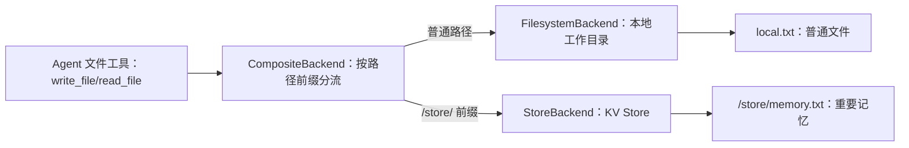

# 6 - 深度研搜：长期记忆与 Backend 存储

---

**本章课程目标：**

- 理解 DeepAgents 中 Backend 的定位：它是 Agent 文件系统和长期存储的连接层。
- 区分短期记忆和长期记忆，知道二者差异不在“保存多久”，而在“保存什么”。
- 区分 `checkpointer`、`StateBackend`、`FilesystemBackend`、`StoreBackend`、`CompositeBackend` 的作用。

**学习建议：** Backend 不只是“保存聊天记录”，更像给 Agent 准备的文件柜。读这一章时比较几种后端背后的取舍：状态里存、磁盘里存、KV Store 里存、按路径分流存。重点看 Agent 仍然用文件读写的方式工作，而 Backend 决定这些文件最终落到哪里、能不能跨会话复用。

**对应代码分支：** `06-deepagents-backends-memory`

**参考资料：**
DeepAgents 后端存储：https://docs.langchain.com/oss/python/deepagents/backends

---

## 1、记忆体系与 Backend 总览

### 1.1 从中断恢复到长期存储

上一章讲的人机协作中，我们用到了 `checkpointer`。它负责保存一次执行过程中的暂停状态，方便后续恢复执行。

但是 `checkpointer` 不是长期记忆。它关注的是：这次任务执行到哪一步了？中断后应该从哪里继续？

而 Backend 关注的是另一件事：Agent 写入的文件、生成的资料、长期需要保存的信息，最终存到哪里？比如用户让 Agent 生成一份报告，这份报告可以存到本地文件系统；用户让 Agent 记录长期偏好，这些偏好可以存到数据库或 KV Store；临时中间文件可以只存在内存中。

### 1.2 短期记忆与长期记忆的区别

短期记忆和长期记忆的核心区别，不是“一个保存时间短，一个保存时间长”，而是**保存的内容不同**。

| 类型     | 主要保存什么                             | 典型用途                   | 本章对应概念   |
| -------- | ---------------------------------------- | -------------------------- | -------------- |
| 短期记忆 | 一次调用的执行过程、节点状态、中断位置   | 人机协作中断恢复、流程续跑 | `checkpointer` |
| 长期记忆 | 一次或多次会话产生的结果、文件、用户偏好 | 跨线程、跨会话共享信息     | `Backend`      |

所以，即使把短期记忆存到 Redis 或数据库里，只要它保存的是“一次执行流程到哪一步了”，它仍然是短期记忆。反过来，`InMemoryStore` 虽然也存在内存里，但它保存的是 `user_profile.txt` 这类文件式结果，因此在语义上属于长期记忆的一种实现。

一句话记住：**短期记忆记过程，长期记忆记结果。**

### 1.3 Backend 在 DeepAgents 中的定位


gent 仍然通过文件系统工具读写文件，但文件不一定真的落在同一个地方。Backend 位于“文件工具”和“真实存储介质”之间，负责把虚拟文件路径映射到 State、本地磁盘、Store 或组合后端。

这里需要先明确一点：Backend 不是“自动保存所有聊天记录”。它通常是被文件工具触发的。

| Agent 行为                                                                   | Backend 是否参与     |
| ---------------------------------------------------------------------------- | -------------------- |
| 普通聊天回复                                                                 | 通常不参与           |
| 模型内部思考或规划                                                           | 不会自动写入 Backend |
| 调用 `ls`、`read_file`、`write_file`、`edit_file`、`glob`、`grep` 等文件工具 | 会由 Backend 处理    |

也就是说，只有当 Agent 显式进行文件读写时，Backend 才会决定这些虚拟文件最终落到哪里。普通问答如果没有触发文件工具，就不会自动沉淀成长期记忆。

本章主要关注下面四类 Backend：

| Backend             | 存储位置     | 生命周期                       | 适合场景                       |
| ------------------- | ------------ | ------------------------------ | ------------------------------ |
| `StateBackend`      | 当前运行状态 | 同一 `thread` 内可随检查点保留 | 默认临时文件、中间结果         |
| `FilesystemBackend` | 本地磁盘     | 文件长期存在于本机             | 本地调试、生成报告、查看文件   |
| `StoreBackend`      | KV Store     | 取决于 Store 实现              | 跨线程共享、长期记忆、生产存储 |
| `CompositeBackend`  | 混合路由     | 按路由决定                     | 不同路径走不同存储、生产项目   |

后面三个代码示例会分别演示 `FilesystemBackend`、`StoreBackend` 和 `CompositeBackend`。`StateBackend` 是默认临时后端，前面第 2 节会单独说明，不再写独立示例。

官网还提供了 `LocalShellBackend`、Sandbox、自定义 Backend 等能力，它们更偏向代码执行、隔离环境或企业扩展，本章只做必要提示，不展开讲解。

长期记忆最终也不是直接“长在模型脑子里”。更准确地说，是先把信息保存到 Backend，后续需要时再通过文件工具读出来，重新进入提示词或上下文，模型才表现得像“记得之前的信息”。

对应到代码，本章主要看三个示例：

| 文件                                       | 主题                | 说明                       |
| ------------------------------------------ | ------------------- | -------------------------- |
| `10-filesystem-backend-memory.py`          | `FilesystemBackend` | 把 Agent 文件写入本地目录  |
| `11-store-backend-cross-session-memory.py` | `StoreBackend`      | 把文件操作映射到 KV Store  |
| `12-composite-backend-routing.py`          | `CompositeBackend`  | 根据路径前缀路由到不同存储 |

---

## 2、核心概念辨析

### 2.1 checkpointer：保存短期执行状态

`checkpointer` 主要服务于 LangGraph / DeepAgents 的执行恢复。

它保存的是：

- 当前执行到哪个节点；
- 中断前的状态；
- 同一个 `thread_id` 下的临时执行上下文；
- 人机协作恢复时需要的状态。

典型场景是上一章的人机协作：

```text
第一次 invoke 命中高危工具
  -> checkpointer 保存暂停状态
  -> 人工审批
  -> 第二次 invoke 用相同 thread_id 恢复
```

### 2.2 InMemorySaver 与 InMemoryStore 的区别

第 5 章用过 `InMemorySaver`，本章会用到 `InMemoryStore`。它们名字很像，而且都可以把数据放在 Python 进程内存里，但语义完全不同。

| 对象            | 用在哪里       | 保存什么                           | 记忆类型           |
| --------------- | -------------- | ---------------------------------- | ------------------ |
| `InMemorySaver` | `checkpointer` | Agent 执行过程、中断位置、恢复状态 | 短期记忆           |
| `InMemoryStore` | `StoreBackend` | 文件式结果、用户信息、长期偏好     | 长期记忆的一种实现 |

所以判断一段“记忆”属于短期还是长期，不要只看它是不是存在内存里，而要看它保存的是什么。

### 2.3 Backend：管理文件与长期信息存储

Backend 关注的是 Agent 的文件读写结果。

它保存的是：

- Agent 生成的 Markdown；
- Agent 写入的记忆文件；
- 需要跨线程读取的信息；
- 可以落到本地、内存、数据库的文件内容。

可以这样区分：

| 对比项   | checkpointer           | Backend                      |
| -------- | ---------------------- | ---------------------------- |
| 主要作用 | 保存执行过程状态       | 保存文件和长期信息           |
| 生命周期 | 通常服务于一次线程恢复 | 可以跨线程、跨会话存在       |
| 典型用途 | 人机协作中断恢复       | 报告文件、用户画像、长期记忆 |
| 关注对象 | Agent 执行状态         | Agent 文件系统               |

### 2.4 StateBackend：默认的临时文件后端

`StateBackend` 可以理解成 DeepAgents 默认的文件存储方式。它把文件内容放在当前 Agent 的运行状态里，适合保存临时文件和中间过程。

它和 `StoreBackend` 都可能看起来像“内存里有东西”，但区别很关键：

- `StateBackend` 跟着当前 `thread` 的执行状态走，配合检查点时，可以在同一个 `thread` 的多轮调用中继续访问；
- `StateBackend` 不适合跨 `thread`、跨用户或跨服务共享长期记忆；
- `StoreBackend` 依赖外部 `store` 对象，只要这个 `store` 没释放，就可以跨 `thread_id` 读取；
- 如果 `store` 换成 Redis、Postgres 等持久化 Store，就可以进一步支持跨进程、跨服务的长期记忆。

所以 `StateBackend` 不适合保存用户画像、历史报告、长期偏好这类需要跨会话复用的信息。它更像同一条执行线程里的临时草稿纸，适合中间文件和阶段性结果。

这一节到这里先停一下：`checkpointer` 管流程恢复，`Backend` 管文件落点，`StateBackend` 是默认临时落点。后面的三个代码案例，就是把文件分别落到本地、Store，以及混合路由中。

---

## 3、FilesystemBackend：本地文件存储

### 3.1 使用场景

本地开发和调试时，我们常常希望 Agent 生成的文件真的出现在项目目录里。这样可以直接打开查看内容。

项目对应文件路径：`deepsearch-agents/examples/10-filesystem-backend-memory.py`

### 3.2 准备本地工作目录

示例中用 `Path` 创建一个工作目录：

```python
from pathlib import Path

# 准备本地工作目录
# Agent 写入的文件最终会落到这个目录中，便于本地调试和查看结果
workspace_dir = Path("./agent_workspace").resolve()
workspace_dir.mkdir(parents=True, exist_ok=True)
```

这个目录就是 Agent 文件系统映射到宿主机后的实际位置。

### 3.3 创建 FilesystemBackend

```python
from deepagents.backends import FilesystemBackend

# FilesystemBackend 把 DeepAgents 的文件系统操作映射到本地磁盘
# root_dir 是真实存储目录
# virtual_mode=True 表示开启虚拟沙箱，限制 Agent 只能在 root_dir 范围内读写
file_backend = FilesystemBackend(
    root_dir=workspace_dir,
    virtual_mode=True,
)
```

这里有两个关键参数：

| 参数                | 说明                                          |
| ------------------- | --------------------------------------------- |
| `root_dir`          | 本地文件实际存储目录                          |
| `virtual_mode=True` | 开启虚拟沙箱模式，限制 Agent 只能访问指定目录 |

`virtual_mode=True` 很重要。它可以避免 Agent 随意读写项目之外的文件。

### 3.4 注册到 DeepAgent

创建 Agent 时，把 Backend 传进去。

```python
# 这里把 backend 指定为 file_backend
# Agent 内置文件工具产生的文件读写，会交给 FilesystemBackend 处理
main_agent = create_deep_agent(
    model=llm,
    tools=[],
    backend=file_backend,
    system_prompt="""
    你是一个智能助手，可以使用文件工具进行文件读写
    只有在用户明确要求创建或写入文件时，才可以创建文件
    """,
)
```

这样，当用户明确要求创建文件时，Agent 内置的文件系统工具会把内容写到 `agent_workspace` 目录。

示例里还专门做了两次调用，用来观察提示词约束是否生效：

```python
# 第一次请求只是查询介绍，没有明确要求写文件
# 用来观察 Agent 是否会遵守提示词，不主动创建文件
result_1 = main_agent.invoke(
    {
        "messages": [
            {
                "role": "user",
                "content": "帮我查询下 Python 语言的介绍",
            }
        ]
    }
)

# 第二次请求明确要求把内容写入 java.txt
# 此时 Agent 可以调用文件工具，FilesystemBackend 会把文件保存到 agent_workspace
result_2 = main_agent.invoke(
    {
        "messages": [
            {
                "role": "user",
                "content": "帮我查询下 Java 语言的介绍，并写到 java.txt 文件中",
            }
        ]
    }
)
```

### 3.5 运行 FilesystemBackend 示例

执行文件验证，成功：

```text
uv run examples/10-filesystem-backend-memory.py

第 1 次调用：用户没有明确要求创建文件
最终结果：Python 是一种高级编程语言......广泛应用于 Web 开发、科学计算、数据分析、人工智能与机器学习等领域。

第 2 次调用：用户明确要求创建文件
最终结果：这是写入到 `java.txt` 文件中的 Java 语言简介内容：
Java 是一种广泛使用的面向对象的编程语言......适用于桌面、移动、Web 和企业级应用等。
```

看这段输出时，抓住下面几个现象就够了：

| 输出片段                                | 代表的含义                                                      |
| --------------------------------------- | --------------------------------------------------------------- |
| `第 1 次调用：用户没有明确要求创建文件` | 只是普通问答，Agent 不应该主动创建文件                          |
| `第 2 次调用：用户明确要求创建文件`     | 用户明确要求写入 `java.txt`，文件工具才会被使用                 |
| `这是写入到 java.txt 文件中的...`       | `FilesystemBackend` 已把 Agent 的文件写入动作映射到本地工作目录 |

### 3.6 适用场景与限制

适合使用 `FilesystemBackend` 的情况：

- 本地开发调试；
- 需要直接查看 Agent 生成的文件；
- 生成 Markdown、TXT、PDF 等交付物；
- 项目还没有接数据库或对象存储。

不适合的情况：

- 多机器部署；
- 多用户共享长期记忆；
- 文件需要高可靠持久化；
- 需要权限隔离和统一存储治理。

另外，`FilesystemBackend` 会让 Agent 读写真正的本地文件，生产环境要格外谨慎：

- 不要把 `.env`、API Key、凭证文件放进 Agent 可访问目录；
- 文件修改是持久的，误写误删后不一定容易恢复；
- Web 服务、多租户系统、处理不可信输入的场景，不建议直接开放宿主机文件系统；
- 高风险写入可以结合第 5 章的人机审批，先审核再执行。

---

## 4、StoreBackend：KV Store 存储

### 4.1 StoreBackend 解决的问题

`FilesystemBackend` 适合本地调试，但生产环境不一定适合把文件写在本机磁盘。比如服务部署在多台机器上，用户这次请求落到 A 机器，下次请求落到 B 机器，本地文件就不容易共享。

这时可以使用 `StoreBackend`。它会把 Agent 的文件操作映射成 Key-Value 存储。

这里的 `KV Store` 不是特指 Redis，也不是特指 MySQL，而是泛指“键值存储”：用一个 key 找到一份 value。

在 `StoreBackend` 里，可以这样理解：

```text
key   = 文件路径
value = 文件内容
```

比如 Agent 写入 `user_profile.txt`，底层可能保存成：

```text
key = /user_profile.txt
value = {'content': 'Name: 乌萨奇\nAge: 16', 'encoding': 'utf-8', ...}
```

`StoreBackend` 本身更像一个适配器：它负责把“读写文件”转换成“读写 Store”。真正存到哪里，取决于传进去的 `store` 是什么。

| Store 类型      | 实际保存位置         |
| --------------- | -------------------- |
| `InMemoryStore` | 当前 Python 进程内存 |
| Redis Store     | Redis                |
| Postgres Store  | Postgres 数据库      |
| 自定义 Store    | 企业自己的存储系统   |

本章示例使用的是 `InMemoryStore`，所以数据保存在当前 Python 进程内存中，程序退出后会丢失。生产环境如果需要真正持久化，可以替换成 Redis、Postgres 或其他支持的 Store 实现。

### 4.2 创建 Store

项目对应文件路径：`deepsearch-agents/examples/11-store-backend-cross-session-memory.py`

本案例中使用的是 LangGraph 的内存 Store。

```python
from langgraph.store.memory import InMemoryStore

# InMemoryStore 是教学用内存 Store，进程重启后数据会丢失
# 生产环境可以替换成 RedisStore、数据库 Store 或其他持久化 Store
store = InMemoryStore()
```

教学中用 `InMemoryStore` 比较方便，但它重启后会丢失。生产环境可以替换成 Redis、Postgres 等外部存储。

### 4.3 创建 Agent 时使用 StoreBackend

```python
from deepagents.backends import StoreBackend

# StoreBackend 会把文件路径映射成 Store 中的 key，把文件内容映射成 value
# 这里要求 Agent 把用户重要信息写入 user_profile.txt
# 底层实际不会写本地文件，而是写入上面的 store
main_agent = create_deep_agent(
    model=llm,
    backend=StoreBackend,
    store=store,
    system_prompt="""
    你是一个智能助手
    当用户提供重要个人信息时，请保存到 user_profile.txt
    当用户询问个人信息时，请从 user_profile.txt 中读取
    """,
)
```

这里的 `backend=StoreBackend` 表示文件系统操作走 Store。

`store=store` 表示具体存到哪个 Store 实例中。

### 4.4 namespace 控制记忆隔离范围

`StoreBackend` 可以跨 `thread_id` 共享信息，但生产环境不能让所有用户共用同一份记忆。真正落地时，需要用 `namespace` 控制隔离范围。

可以先这样理解：

| namespace 设计     | 记忆共享范围               | 适合场景           |
| ------------------ | -------------------------- | ------------------ |
| 按用户隔离         | 同一个用户的不同会话共享   | 用户偏好、个人资料 |
| 按助手隔离         | 同一个助手下的用户共享     | 公共说明、团队知识 |
| 按 thread 隔离     | 只在当前会话内共享         | 会话草稿、临时资料 |
| 用户 + thread 组合 | 同一用户的某个会话独立保存 | 更细粒度的会话记忆 |

本章示例为了演示方便，没有展开 `namespace` 配置。真实的多用户系统中，建议显式设置隔离范围，避免不同用户的记忆串在一起。

### 4.5 跨 thread_id 验证长期记忆

示例里使用两个不同的 `thread_id`，模拟两次不同线程或不同会话：

```python
# 使用两个不同 thread_id 模拟跨线程或跨会话
# Backend 保存的是长期文件数据，不依赖同一个 thread_id 才能读取
config_a = {"configurable": {"thread_id": "thread-a"}}
config_b = {"configurable": {"thread_id": "thread-b"}}
```

第一次执行时，线程 A 写入用户信息：

```python
result_a = main_agent.invoke(
    {
        "messages": [
            {
                "role": "user",
                "content": "我是乌萨奇，我今年 16 岁",
            }
        ]
    },
    config=config_a,
)
```

写入后，可以直接读取底层 Store，观察 `StoreBackend` 到底保存了什么：

```python
# 直接读取 Store，观察 StoreBackend 写入的底层数据
# DeepAgents 文件系统默认使用 filesystem 命名空间保存文件式内容
items = store.search(("filesystem",))
for item in items:
    print(f"key = {item.key}")
    print(f"value = {item.value}")
```

第二次执行时，线程 B 读取同一份用户信息：

```python
# 第二次执行：线程 B 读取同一份用户信息
# 这说明 Backend 存储和 checkpointer 的线程状态不是一回事
result_b = main_agent.invoke(
    {
        "messages": [
            {
                "role": "user",
                "content": "我叫什么，我的年龄是多少",
            }
        ]
    },
    config=config_b,
)
```

这个例子最重要的现象是：`thread-a` 写入的信息，`thread-b` 也能读到。说明 Backend 保存的是长期文件数据，不是上一章 `checkpointer` 保存的单线程暂停状态。

### 4.6 运行 StoreBackend 示例

执行文件验证，成功：

```text
uv run examples/11-store-backend-cross-session-memory.py

第一次回复结果：我已经记录了你的名字乌萨奇和年龄16岁。

读取 Store 中保存的用户信息
key = /user_profile.txt
value = {'content': 'Name: 乌萨奇\nAge: 16', 'encoding': 'utf-8', ...}

第二次回复结果：您的名字是乌萨奇，您的年龄是16岁。
```

这段输出对应的含义如下：

| 输出片段                              | 代表的含义                                                      |
| ------------------------------------- | --------------------------------------------------------------- |
| `第一次回复结果：我已经记录...`       | 线程 A 根据用户信息写入 `user_profile.txt`                      |
| `key = /user_profile.txt`             | `StoreBackend` 把文件路径映射成 Store 里的 key                  |
| `Name: 乌萨奇\nAge: 16`               | 文件内容被保存成 Store 里的 value                               |
| `第二次回复结果：您的名字是乌萨奇...` | 线程 B 能读到线程 A 写入的信息，说明记忆已经跨 `thread_id` 共享 |

### 4.7 为什么继续使用文件路径

你可能会疑惑：都存进 KV Store 了，为什么还要写 `user_profile.txt` 这种文件名？

原因是 DeepAgents 的文件系统抽象仍然使用“路径”作为统一标识。即使底层不是本地文件，路径也可以作为 Key。

例如：

```text
user_profile.txt
```

可以理解成 KV Store 中的 key；文件内容就是 value。

这种设计的好处是：无论底层是本地文件、内存还是数据库，Agent 操作时都可以保持“读文件、写文件”的统一体验。

---

## 5、CompositeBackend：混合存储策略

### 5.1 混合存储的使用场景

真实项目中，不同文件的存储需求不一样。

比如：

- 临时报告可以写到本地目录；
- 用户长期偏好应该写到 Store；
- 中间过程可以留在 State；
- 重要记忆需要跨会话保留。

如果所有内容都写到一个地方，就不够灵活。`CompositeBackend` 可以根据路径前缀，把不同文件路由到不同 Backend。

### 5.2 定义 CompositeBackend 工厂函数

项目对应文件路径：`deepsearch-agents/examples/12-composite-backend-routing.py`

本案例中定义了一个工厂函数：

```python
from pathlib import Path

from deepagents.backends import CompositeBackend, FilesystemBackend, StoreBackend
from langgraph.store.memory import InMemoryStore


# Store 用来保存 /store/ 路径下的重要记忆
# 这里使用 InMemoryStore 便于教学观察，生产环境可以替换成持久化 Store
store = InMemoryStore()


def create_composite_backend(runtime):
    """
    创建混合 Backend

    create_deep_agent 会把 runtime 传入这个工厂函数
    StoreBackend 需要 runtime 才能连接到 Agent 配置中的 store
    """
    workspace_dir = Path("./agent_workspace").resolve()
    workspace_dir.mkdir(parents=True, exist_ok=True)

    # 默认后端：普通文件写入本地工作目录
    fs_backend = FilesystemBackend(
        root_dir=workspace_dir,
        virtual_mode=True,
    )

    # Store 后端：重要记忆写入 Key-Value Store
    store_backend = StoreBackend(runtime)

    # 路由规则：
    # 普通路径，例如 local.txt，走 default 的 FilesystemBackend
    # /store/ 开头的路径，例如 /store/memory.txt，走 StoreBackend
    return CompositeBackend(
        default=fs_backend,
        routes={
            "/store/": store_backend,
        },
    )
```

这里有两个路由规则：

| 路径                 | 后端                |
| -------------------- | ------------------- |
| 普通路径             | `FilesystemBackend` |
| `/store/` 开头的路径 | `StoreBackend`      |

也就是说：

```text
local.txt              -> 写到本地文件系统
/store/memory.txt     -> 写到 Store
```

### 5.3 注册到 Agent

创建 Agent 时，把工厂函数传给 `backend`。

```python
agent = create_deep_agent(
    model=llm,
    store=store,
    backend=create_composite_backend,
    tools=[],
    system_prompt="""
    你是一个智能助手
    普通文件请直接写入文件名，例如 local.txt
    重要记忆请写入 /store/ 目录，例如 /store/memory.txt
    """,
)
```

注意，这里传的是函数 `create_composite_backend`，不是已经创建好的 Backend 对象。这是当前项目示例使用的写法，便于和前面的 `StoreBackend(runtime)` 路由代码对应起来。

### 5.4 路径前缀与路由剥离

`CompositeBackend` 会根据路由前缀选择后端，然后把前缀剥离。

比如 Agent 写入：

```text
/store/memory.txt
```

路由判断时会命中 `/store/`，因此内容会交给 `StoreBackend`。真正进入 Store 时，Key 可能会变成：

```text
/memory.txt
```

使用时只要记住：路径前缀用于路由，真正存储时 Backend 会处理映射。从 Agent 的虚拟文件系统视角看，仍然可以按 `/store/...` 这样的路径理解；但进入底层 Store 后，实际 key 可能已经去掉了路由前缀。



示例最后通过 `store.search(("filesystem",))` 打印 Store 内容，确认 `/store/` 路径下的重要记忆确实进入了 Store：

```python
# CompositeBackend 命中 /store/ 路由后，会把内容交给 StoreBackend
# 进入 Store 时，路由前缀可能会被剥离，因此可以直接打印 item 观察实际 key 和 value
items = store.search(("filesystem",))
for item in items:
    print(item)
```

### 5.5 运行 CompositeBackend 示例

执行文件验证，成功：

```text
uv run examples/12-composite-backend-routing.py

=== 测试混合存储 ===
用户指令：1 创建本地文件 local.txt，内容为 本地文件
2 创建记忆文件 /store/memory.txt，内容为 重要记忆

Agent 回复：已完成以下任务：
1. 创建了本地文件 `local.txt`，内容为“本地文件”。
2. 创建了记忆文件 `/store/memory.txt`，内容为“重要记忆”。

=== 验证 Store 存储 ===
Item(namespace=['filesystem'], key='/memory.txt', value={'content': '重要记忆', ...})
```

这段输出里，最关键的是最后一行：

| 输出片段                             | 代表的含义                                     |
| ------------------------------------ | ---------------------------------------------- |
| `local.txt`                          | 普通路径命中默认后端，写入 `FilesystemBackend` |
| `/store/memory.txt`                  | `/store/` 前缀命中 Store 路由                  |
| `key='/memory.txt'`                  | 进入 Store 时，路由前缀 `/store/` 被剥离       |
| `value={'content': '重要记忆', ...}` | 重要记忆确实保存到了 Store 中                  |

这个例子验证了 `CompositeBackend` 的核心价值：同一个 Agent 仍然用“写文件”的方式工作，但不同路径可以进入不同存储后端。普通交付物落本地，长期记忆进 Store。

---

**本章小结：**

到这里，本章最重要的几条线就串起来了。

`checkpointer` 负责短期执行恢复，Backend 负责文件和长期信息存储。两者解决的问题不一样，不能混在一起理解。短期记忆记的是一次执行过程，长期记忆记的是可以后续复用的结果。

Backend 也不会自动保存所有聊天内容。只有当 Agent 调用文件工具读写内容时，Backend 才会决定这些文件最终存到哪里。

`StateBackend` 是默认的临时文件后端，适合同一 `thread` 内的中间文件和临时结果，不适合做跨用户、跨线程的长期记忆。

`FilesystemBackend` 把 Agent 文件写到本地目录，适合调试和报告生成；使用时要控制可访问目录，避免暴露密钥、配置文件或其他敏感资料。

`StoreBackend` 把文件式操作映射到 KV Store，适合做跨线程共享和长期记忆；生产环境中要通过 `namespace` 控制用户、助手或会话之间的隔离范围。

`CompositeBackend` 通过路径前缀做路由，允许不同文件进入不同存储位置，是更接近生产项目的做法。

**一句话总结：** 短期记忆记过程，长期记忆记结果；Backend 让 Agent 继续用“文件”的方式工作，但文件最终可以灵活存到状态、本地磁盘、KV Store 或混合存储中。
