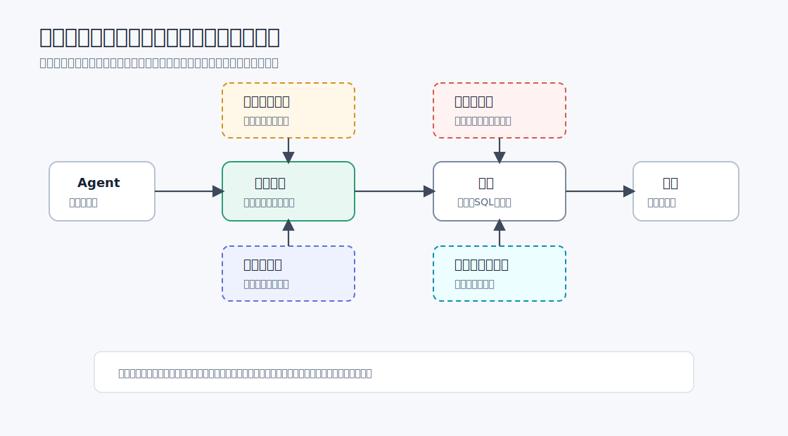
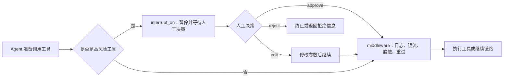

# 7 - 深度研搜：中间件机制与Skills配置

---

**本章课程目标：**

- 理解中间件在 Agent 执行链路中的位置：它不负责具体业务，而是负责链路治理。
- 掌握上下文摘要、模型调用限制、工具调用限制三类常用中间件。
- 区分 `thread_limit`、`run_limit`、`exit_behavior` 的作用。
- 知道中间件如何与 `interrupt_on`、子智能体、WebSocket 进度推送配合。

**学习建议：** 先把中间件理解成 Agent 执行链路上的检查口：模型调用前、工具调用前、上下文送入前，都可以在这里观察或改写。读代码时重点看它怎样做日志、参数调整、次数限制和风险拦截。Skills 部分先看它如何作为可复用说明被加载，不必和工具、子智能体混在一起。

**对应代码分支：** `07-deepagents-middleware-governance`

**参考资料：**
LangChain 内置中间件：https://docs.langchain.com/oss/python/langchain/middleware/built-in

---

## 1、中间件先解决什么问题

### 1.1 用一句话理解中间件

中间件的英文是 `Middleware`。它不是最终执行业务的对象，而是站在“调用方”和“被调用方”之间的一层处理逻辑。

在普通 Web 项目里，中间件可能站在：`客户端请求 -> 中间件 -> 接口函数`

在 Agent 项目里，它可能站在：

```text
Agent -> 中间件 -> 模型
Agent -> 中间件 -> 工具
Agent -> 中间件 -> 子智能体
```

所以，中间件不是 DeepAgents 独有的概念。DeepAgents 建立在 LangChain / LangGraph 之上，本章用到的很多能力也来自 LangChain 的 Agent Middleware 体系。一句话总结：**工具负责做事，中间件负责管事。**

### 1.2 它能拦在哪些位置

中间件不只是在“工具调用”这一处生效。LangChain 的 Agent Middleware 可以插入 Agent 执行的不同阶段。

| 阶段                 | 能做什么                               | 本章怎么处理 |
| -------------------- | -------------------------------------- | ------------ |
| 模型调用前后         | 限制调用次数、切换模型、重试、记录成本 | 重点讲       |
| 工具调用前后         | 记录日志、权限校验、改写参数、包装结果 | 重点讲       |
| 上下文送入模型之前   | 摘要压缩、敏感信息处理                 | 讲核心思路   |
| 最终回复生成前后     | 统一格式、收尾处理                     | 只做提示     |
| 子智能体自己的链路中 | 单独设置限制、日志或权限规则           | 讲配置方式   |



本章重点放在模型调用限制和工具调用中间件上，因为它们最容易观察，也最常用于控制成本、记录日志和治理工具执行链路。

### 1.3 常见能力

| 能力             | 说明                                           | 典型场景                       |
| ---------------- | ---------------------------------------------- | ------------------------------ |
| 日志追踪         | 记录模型、工具、子智能体什么时候被调用         | 排查 Agent 执行过程            |
| 参数改写         | 在真正调用工具前修改参数                       | 统一补默认值、参数脱敏         |
| 结果改写         | 在工具返回后统一包装结果                       | 统一输出格式、敏感内容过滤     |
| 调用限制         | 限制模型或工具调用次数                         | 防止死循环、节省 Token         |
| 上下文压缩       | 对过长的对话历史或中间过程进行摘要             | 防止撑爆上下文窗口             |
| 权限认证         | 在调用高风险工具前判断当前用户是否有权限       | 企业系统里的付费功能、敏感操作 |
| 提前终止或抛异常 | 达到阈值后主动停止执行，或交给上层统一异常处理 | 调用次数超限、流程异常         |

对企业级智能体来说，最常用的是三件事：

- **压缩上下文**：避免多轮对话和长链路任务把上下文窗口撑爆。
- **限制模型调用次数**：避免 Agent 不断思考、不断重试。
- **限制工具调用次数**：避免某个工具被反复调用，造成循环或成本失控。

### 1.4 为什么多智能体更需要中间件

前面几章讲过，多智能体系统能“分而治之”，但也会放大两个问题：

- 多个 Agent 互相调用，Token 成本更高；
- Agent 的决策有不确定性，容易陷入重复规划或循环调用。

比如主智能体发现信息不足，就调用网络助手；网络助手搜索后返回不完整；主智能体继续调用；如果提示词或工具设计不好，这条链路就可能一直绕圈。

中间件的价值，是给这类系统加上工程边界：

```text
可以调用模型，但要有次数上限；
可以调用工具，但某个工具不能无限调用；
上下文可以增长，但到阈值前要先摘要压缩；
达到限制后，要么正常结束，要么抛出异常交给业务层处理。
```

### 1.5 LangChain 内置中间件概览

| 工程问题       | 代表中间件                                                               | 解决什么                                         |
| -------------- | ------------------------------------------------------------------------ | ------------------------------------------------ |
| 上下文太长     | `SummarizationMiddleware`                                                | 自动摘要旧消息，保留关键上下文                   |
| 调用次数失控   | `ModelCallLimitMiddleware`、`ToolCallLimitMiddleware`                    | 限制模型或工具调用次数，防止循环和成本失控       |
| 高风险动作审批 | `HumanInTheLoopMiddleware`                                               | 在发邮件、删库、写文件等动作前暂停，等待人工确认 |
| 隐私与敏感信息 | `PIIMiddleware`                                                          | 对邮箱、手机号、信用卡等信息做脱敏、遮蔽或阻断   |
| 失败恢复       | `ModelRetryMiddleware`、`ModelFallbackMiddleware`、`ToolRetryMiddleware` | 模型或外部工具失败时重试，必要时切换备用模型     |
| 工具太多难选择 | `LLMToolSelectorMiddleware`                                              | 工具列表很长时，先筛出当前任务相关工具           |
| 任务规划辅助   | `TodoListMiddleware`                                                     | 给 Agent 增加待办清单能力，帮助处理多步骤任务    |

这里先知道名字和用途即可。本章会展开上下文摘要、模型调用限制、工具调用限制，以及如何用 `@wrap_tool_call` 自己包住一次工具调用。

---

## 2、DeepAgents 中的 middleware 配置

### 2.1 主智能体配置

创建 DeepAgent 时，可以通过 `middleware` 参数传入一个列表。

```python
from deepagents import create_deep_agent
from langchain.agents.middleware import ModelCallLimitMiddleware
from langgraph.checkpoint.memory import InMemorySaver

# checkpointer 用来记录同一条线程的执行状态
# thread_id 也是 thread_limit 判断“同一个会话线程”的依据
checkpointer = InMemorySaver()
thread_config = {"configurable": {"thread_id": "erdaye"}}

main_agent = create_deep_agent(
    model=llm,
    tools=[delete_database, delete_file, select_database],
    checkpointer=checkpointer,
    system_prompt="回答使用中文，调用对应的工具实现对应的功能！",
    middleware=[
        ModelCallLimitMiddleware(
            thread_limit=1,  # 同一个 thread_id 下累计最多调用 1 次模型
            run_limit=1,  # 当前这次 invoke 内最多调用 1 次模型
            exit_behavior="error",  # 超限后抛出异常，便于后端统一捕获处理
        )
    ],
    # 本章重点是 middleware 调用限制，因此这里关闭人工审批拦截
    interrupt_on={
        "delete_database": False,
        "delete_file": False,
        "select_database": False,
    },
)
```

这段代码的意思是：给主智能体加一个模型调用限制中间件。只要主智能体需要调用模型，就会先经过这个中间件。

`middleware` 是列表，因此可以同时配置多个中间件：

```python
main_agent = create_deep_agent(
    model=llm,
    tools=[...],
    middleware=[
        middleware_a,
        middleware_b,
        middleware_c,
    ],
)
```

不建议给同一种限制重复配置多个实例。比如同时放两个 `ModelCallLimitMiddleware`，后续排查时很难判断到底是哪条规则触发了限制。更清楚的做法是：一个类型只配一个实例，把阈值和超限行为写明白。

### 2.2 子智能体配置

子智能体本质上也是一个独立的 Agent 配置，因此也可以配置 `middleware`。

字典式子智能体常见字段如下：

```python
db_agent = {
    "name": "db_helper",
    "description": "负责数据库查询任务。",
    "system_prompt": "你是一个专业的数据库查询助手。",
    "tools": [query_table, query_schema],
    "middleware": [
        # 子智能体自己的中间件
    ],
}
```

这里要分清两层：

| 配置位置                                | 影响范围                   |
| --------------------------------------- | -------------------------- |
| `create_deep_agent(... middleware=...)` | 影响主智能体自己的执行链路 |
| 子智能体字典里的 `middleware`           | 影响该子智能体自己的链路   |

在「深度研搜」项目里，如果某个子智能体特别容易循环，例如数据库助手反复生成 SQL、反复查询，就可以只给数据库助手单独加工具或模型调用限制。

---

## 3、上下文摘要：SummarizationMiddleware

### 3.1 适用问题

模型的上下文窗口不是无限的。对话轮次很多，或者 Agent 执行过程很长时，`messages` 里会积累大量历史消息、工具结果和中间过程。最粗暴的处理方式是把旧消息丢掉，但这样容易丢失关键背景。

更合理的做法是：在上下文快要过长之前，把一部分历史消息交给模型总结成短摘要，再把摘要放回上下文。这就是摘要中间件的作用。

### 3.2 核心参数

摘要中间件通常要关心三个参数。

| 参数      | 说明                                                |
| --------- | --------------------------------------------------- |
| `model`   | 使用哪个模型做摘要压缩                              |
| `trigger` | 什么时候触发摘要，例如 Token 数、消息数、上下文比例 |
| `keep`    | 摘要后保留多少最近上下文，避免最新消息丢失          |

示意代码：

```python
from langchain.agents.middleware import SummarizationMiddleware

summary_middleware = SummarizationMiddleware(
    model=llm,
    trigger=("tokens", 4000),  # 消息累计到约 4000 token 时触发摘要
    keep=("messages", 20),  # 摘要后保留最近 20 条原始消息
)

main_agent = create_deep_agent(
    model=llm,
    tools=[...],
    middleware=[summary_middleware],
)
```

`trigger=("tokens", 4000)` 不应该等于模型最大上下文长度。比如模型最大支持 8000 Token，就不要设置成 8000 才压缩，因为真到极限时，可能已经来不及把内容发给摘要模型了。

更稳妥的做法是设置为最大上下文的三分之二或四分之三。

旧资料里可能会看到 `max_tokens_before_summary`、`messages_to_keep` 这类参数名。在 LangChain 1.x 中，更推荐使用 `trigger` 和 `keep`，表达会更统一。

### 3.3 放在哪些任务里

摘要中间件适合放在长任务里，例如：

- 多轮深度搜索；
- 多次网络检索；
- 多次数据库查询；
- 需要不断修订报告的任务；
- 子智能体返回内容比较长的任务。

它不是为了“让回答更好看”，而是为了让 Agent 在长链路中仍然保留关键上下文。短任务先不急着加摘要，长任务要提前考虑摘要。

---

## 4、模型调用限制：ModelCallLimitMiddleware

### 4.1 它限制的是什么

Agent 每次“思考下一步”都可能调用模型。一次正常任务里，模型调用几次是合理的：先理解任务，决定调用工具，看工具结果，再整理最终答案。

但如果提示词不清晰、工具结果不稳定，Agent 可能不断重复：

```text
调用模型 -> 决定调用工具 -> 工具结果不满意 -> 再调用模型 -> 再调用工具
```

模型调用限制就是给这条链路设置上限。

### 4.2 thread_limit 与 run_limit

示例代码里用了两个限制：

```python
ModelCallLimitMiddleware(
    thread_limit=1,  # 同一个 thread_id 下累计最多调用 1 次模型
    run_limit=1,  # 当前这次 invoke 内最多调用 1 次模型
    exit_behavior="error",  # 超限后抛出异常
)
```

它们的区别如下：

| 参数           | 含义                                        | 可以怎么理解                     |
| -------------- | ------------------------------------------- | -------------------------------- |
| `thread_limit` | 同一个 `thread_id` 下的累计模型调用次数限制 | 一个客户端或一条会话线程的总额度 |
| `run_limit`    | 单次执行里的模型调用次数限制                | 当前这次请求最多调用多少次模型   |

如果要使用 `thread_limit`，需要有稳定的 `thread_id`，通常还要配置 `checkpointer`。否则框架没有可靠位置记录“这条线程已经调用过几次模型”。

在 Web 项目里，一个浏览器会话通常会对应一个稳定的 `thread_id`。服务端既能把多轮任务归到同一条会话链路上，也能知道当前执行结果应该推送给哪个前端连接。

可以这样理解：

```text
thread_limit 管一整条会话线程；
run_limit 管这一次 invoke / stream。
```

教学示例里把两个值都设置为 `1`，是为了快速触发限制。真实项目不能机械照搬，要根据一次正常任务大概需要几次模型调用来设置。

比如深度搜索类任务通常要经历“理解问题 -> 搜索 -> 阅读结果 -> 再搜索 -> 汇总回答”。如果 `run_limit` 只给 1 或 2，很容易把正常任务误判成异常。

### 4.3 exit_behavior：end 还是 error

达到限制后，中间件需要决定怎么处理。常见取值有两个：

| 取值      | 行为                       | 适合场景                               |
| --------- | -------------------------- | -------------------------------------- |
| `"end"`   | 正常结束，返回一段限制提示 | 提示内容可以直接给用户看               |
| `"error"` | 抛出异常                   | 后端需要统一捕获异常，返回标准错误格式 |

在企业级后端里，更推荐使用 `"error"`。

原因是 `"end"` 属于“正常业务返回”，前端可能把它当成普通回答展示；而 `"error"` 可以交给接口层统一处理，返回固定格式：

```json
{
  "code": "MODEL_CALL_LIMIT",
  "message": "本次任务模型调用次数过多，请缩小问题范围后重试"
}
```

这样前后端协作会更清楚。

### 4.4 代码示例

下面是教学代码中模型调用限制的核心部分：

```python
import os

from deepagents import create_deep_agent
from dotenv import find_dotenv, load_dotenv
from langchain.agents.middleware import ModelCallLimitMiddleware
from langchain.chat_models import init_chat_model
from langgraph.checkpoint.memory import InMemorySaver

load_dotenv(find_dotenv())

llm = init_chat_model(
    model=os.getenv("LLM_QWEN_MAX"),
    model_provider="openai",
)

# checkpointer 用来记录同一条线程的执行状态
# thread_id 也是 thread_limit 判断“同一个会话线程”的依据
checkpointer = InMemorySaver()
thread_config = {"configurable": {"thread_id": "erdaye"}}

main_agent = create_deep_agent(
    model=llm,
    tools=[delete_database, delete_file, select_database],
    checkpointer=checkpointer,
    system_prompt="回答使用中文，调用对应的工具实现对应的功能！",
    middleware=[
        ModelCallLimitMiddleware(
            thread_limit=1,  # 同一个 thread_id 下累计最多调用 1 次模型
            run_limit=1,  # 当前这次 invoke 内最多调用 1 次模型
            exit_behavior="error",  # 超限后抛出异常，便于后端统一捕获处理
        )
    ],
    # 本章重点是 middleware 调用限制，因此这里关闭人工审批拦截
    # 如果要演示危险动作审批，可以把高风险工具配置为 True 或 allowed_decisions
    interrupt_on={
        "delete_database": False,
        "delete_file": False,
        "select_database": False,
    },
)

# 这个请求通常需要多次“模型规划 -> 工具调用 -> 模型整理结果”
# run_limit=1 会让示例更容易触发模型调用上限
result = main_agent.invoke(
    {
        "messages": [
            {
                "role": "user",
                "content": "先查询product表的数据！再删除user表，最后，删除zhaoweifeng.txt文件",
            }
        ]
    },
    config=thread_config,
)

print(f"最终结果{result['messages'][-1].content}")
```

`thread_config` 里的 `thread_id` 很关键。它让中间件知道当前调用属于哪条线程，也让检查点、人机协作、WebSocket 推送都能围绕同一条会话展开。

### 4.5 运行结果解析

运行 `13-model-call-limit-middleware.py` 时，可以重点观察两件事。

第一，工具确实被调用了：

```text
调用了select_database工具。查询了product表数据
调用了删除了delete_database工具。删除了user表
调用了删除了delete_file工具。删除了zhaoweifeng.txt文件
```

第二，工具调用结束后，Agent 还需要再次调用模型来整理下一步或生成最终回答。因为示例里把 `thread_limit` 和 `run_limit` 都设置成了 `1`，这次新的模型调用会在 `before_model` 阶段被中间件拦住：

```text
ModelCallLimitExceededError:
Model call limits exceeded: thread limit (1/1), run limit (1/1)
During task with name 'ModelCallLimitMiddleware.before_model'
```

这说明 `ModelCallLimitMiddleware` 管的是“模型调用次数”，不是“工具调用次数”。所以你会看到工具已经执行，但后续模型调用超限后仍然抛异常。

---

## 5、工具调用限制：ToolCallLimitMiddleware

### 5.1 和模型调用限制的区别

模型调用限制管“思考次数”，工具调用限制管“行动次数”。

比如一个数据库助手可以调用：

- 查询数据库表名工具；
- 查询表结构工具；
- 执行 SQL 工具。

如果工具没有限制，Agent 可能反复查表结构、反复执行相似 SQL。数据库、网络搜索、RAG 这类工具本身就有成本或性能压力，更需要限制。

### 5.2 全局限制和单工具限制

工具调用限制可以分成两类：

| 限制类型   | 说明                         |
| ---------- | ---------------------------- |
| 全局限制   | 所有工具加起来最多调用多少次 |
| 单工具限制 | 指定某个工具最多调用多少次   |

示意代码：

```python
from langchain.agents.middleware import ToolCallLimitMiddleware

global_tool_limit = ToolCallLimitMiddleware(
    thread_limit=10,  # 同一条会话线程里，所有工具累计最多调用 10 次
    run_limit=5,  # 当前这次 invoke 内，所有工具最多调用 5 次
)

search_tool_limit = ToolCallLimitMiddleware(
    tool_name="search_web",  # 只限制 search_web 这个工具
    run_limit=3,  # 当前这次 invoke 内最多搜索 3 次
    exit_behavior="error",  # 超限后直接抛异常，交给业务层处理
)

sql_tool_limit = ToolCallLimitMiddleware(
    tool_name="execute_sql",  # 只限制 execute_sql 这个工具
    run_limit=2,  # 当前这次 invoke 内最多执行 2 次 SQL
    exit_behavior="error",
)
```

这段配置可以读成：

- 同一个线程里，所有工具调用总次数最多 10 次；
- 单次执行里，所有工具调用总次数最多 5 次；
- 单次执行里，`search_web` 最多调用 3 次；
- 单次执行里，`execute_sql` 最多调用 2 次；
- 指定工具超限后抛异常。

和模型调用限制一样，只要用到 `thread_limit`，就要保证同一条会话有稳定的 `thread_id`，并配置能保存线程状态的检查点。

工具调用限制的 `exit_behavior` 比模型调用限制多一个常见选择：`"continue"`。

| 取值         | 行为                                             | 适合场景                       |
| ------------ | ------------------------------------------------ | ------------------------------ |
| `"continue"` | 阻止这次工具调用，把错误作为工具消息交回给 Agent | 希望 Agent 自己换一种方式处理  |
| `"error"`    | 立刻抛异常                                       | 后端统一捕获、统一返回错误结构 |
| `"end"`      | 直接结束当前执行                                 | 单工具场景下给出明确终止提示   |

然后把它们一起放进 `middleware` 列表：

```python
main_agent = create_deep_agent(
    model=llm,
    tools=[search_web, execute_sql],
    middleware=[
        global_tool_limit,
        search_tool_limit,
        sql_tool_limit,
    ],
)
```

这里是基于同一套中间件机制补充的工程示意。它的配置方式和 `ModelCallLimitMiddleware` 一样，都是放进 `middleware` 列表。

### 5.3 阈值怎么设置

阈值不能凭感觉乱写，建议先观察正常任务链路。

比如“查询数据库中的药品信息并生成 PDF”可能需要：

1. 查询有哪些表；
2. 查询目标表结构；
3. 执行 SQL；
4. 生成 Markdown；
5. 转成 PDF。

如果一次正常链路大概会调 5 个工具，那 `run_limit` 可以设置得稍微大一点，比如 8 或 10。设置太小，会误伤正常任务；设置太大，又拦不住循环。

工程上常用的思路是：`正常调用次数 + 适当冗余 = 限制阈值`。

---

## 6、自定义工具中间件：@wrap_tool_call

### 6.1 什么时候需要自定义

前面讲的摘要、模型调用限制、工具调用限制，都是现成中间件。它们可以直接配置，但逻辑是框架预设好的。

实际开发中，经常会遇到更细的需求：

- 调用某个工具前记录日志；
- 调用工具前检查用户权限；
- 调用工具前统一改写参数；
- 调用工具后过滤敏感结果；
- 调用工具后把结果包装成统一格式；
- 调用失败时改成业务可读的错误信息。

这些逻辑适合用自定义中间件。

在 LangChain Agent Middleware 里，工具调用中间件可以用 `@wrap_tool_call` 装饰器来定义。它的名字可以拆开理解：

```text
wrap_tool_call = 包住一次工具调用
```

也就是说，Agent 原本要直接调用工具，现在先把这次工具调用交给你的函数。你的函数可以在工具执行前做一些事，也可以在工具执行后做一些事。

### 6.2 最小示例

项目对应文件路径：`deepsearch-agents/examples/14-custom-tool-call-middleware.py`

```python
from langchain.agents.middleware import wrap_tool_call


@wrap_tool_call
def log_tool_call(request, handler):
    """
    工具调用中间件：在目标工具执行前后打印调用信息
    """
    print("--------进入了工具中间件----------")
    print(f"request : {request}")  # 本次工具调用请求，包含工具名、工具参数等信息
    print(f"handler : {handler}")  # 真正执行目标工具的调用器

    # 前置增强：这里可以记录日志、做权限校验，或者改写 request 中的工具参数
    # handler(request) 是真正执行目标工具的关键步骤；不调用它，工具就会被中间件拦住
    result = handler(request)

    # 后置增强：这里可以包装返回结果、做敏感信息过滤，或者记录工具耗时
    print("--------退出工具中间件----------")
    print(f"result:{result}")

    return result
```

这个函数有两个固定参数：

| 参数      | 作用                                             |
| --------- | ------------------------------------------------ |
| `request` | 本次工具调用请求，里面包含工具名、工具参数等信息 |
| `handler` | 真正执行目标工具的调用器                         |

最关键的一行是：

```python
result = handler(request)
```

它表示：继续执行原本要调用的那个工具。如果没有这一行，中间件就把工具调用拦住了，后面的工具不会真正执行。这个特性有时也有用。比如权限检查失败时，可以不调用真实工具，直接返回一条业务错误消息。但初学时先记住：想让工具照常执行，就必须调用 `handler(request)`。

### 6.3 request、handler 与 handler(request)

没有中间件时，Agent 调用工具可以抽象成：

```text
Agent -> 工具调用器(handler) + 工具参数(request) -> Tool -> 返回结果
```

有了中间件后，Agent 不再直接调用工具，而是把“调用器”和“参数”交给中间件：

```text
Agent -> 中间件(request, handler) -> handler(request) -> Tool -> result -> Agent
```

所以中间件既能看到调用前的参数，也能看到调用后的结果。

这带来两个扩展点：

| 位置                    | 可以做什么                               |
| ----------------------- | ---------------------------------------- |
| `handler(request)` 之前 | 前置增强：日志、权限、参数改写           |
| `handler(request)` 之后 | 后置增强：结果包装、敏感词过滤、格式转换 |

如果要看工具名和参数，通常会从 `request.tool_call` 中取：

```python
@wrap_tool_call
def monitor_tool(request, handler):
    tool_name = request.tool_call["name"]
    tool_args = request.tool_call["args"]

    print(f"准备调用工具: {tool_name}")
    print(f"工具参数: {tool_args}")

    result = handler(request)

    print(f"工具调用完成: {tool_name}")
    return result
```

这个结构和 Web 框架里的中间件、AOP 里的环绕增强很像：目标函数还在那里，只是调用路径先经过你写的这层逻辑。

### 6.4 配置到 DeepAgent

定义好中间件以后，还需要配置到 Agent 的 `middleware` 列表中。

```python
from deepagents import create_deep_agent
from langgraph.checkpoint.memory import InMemorySaver

# 自定义中间件和框架内置中间件一样，
# 都需要放到 middleware 列表里才会生效
deep_agent = create_deep_agent(
    model=llm,
    tools=[add_numbers],
    checkpointer=InMemorySaver(),
    middleware=[log_tool_call],
    system_prompt="你是一个计算器助手，使用add_numbers工具完成加法计算，回答仅返回计算结果。",
)
```

只要 Agent 调用了 `add_numbers`，就会经过 `log_tool_call`。

完整测试入口如下：

```python
if __name__ == "__main__":
    # 使用固定 thread_id，便于把一次测试调用归到同一个会话线程
    thread_config = {"configurable": {"thread_id": "middleware_test_1"}}

    result = deep_agent.invoke(
        {"messages": [{"role": "user", "content": "帮我计算 100 + 200 的结果"}]},
        config=thread_config,
    )

    print("\n=== 最终回复 ===")
    print(result["messages"][-1].content)
```

无论是 LangChain 提供好的中间件，还是用 `@wrap_tool_call` 自己写出来的中间件，都要放到 `middleware` 列表里才会生效。

### 6.5 运行结果解析

运行 `14-custom-tool-call-middleware.py` 时，输出很长，不需要逐字看完，重点抓住三类信息。

第一，`request` 是一个 `ToolCallRequest`，里面最关键的是 `tool_call`：

```text
ToolCallRequest(
  tool_call={
    'name': 'add_numbers',
    'args': {'a': 100, 'b': 200},
    'id': 'call_...',
    'type': 'tool_call'
  },
  ...
)
```

这说明中间件可以拿到工具名、工具参数和工具调用 ID。项目里做日志、权限、参数保护时，通常就是从这里取值。

第二，`handler` 是真正执行目标工具的调用器：

```text
handler : <function ToolNode._run_one.<locals>.execute at ...>
```

所以 `handler(request)` 不是普通打印语句，而是“继续执行 add_numbers 工具”的关键动作。输出中的工具日志也验证了这一点：

```text
[工具执行] 100 + 200 = 300
```

第三，`result` 通常会带有工具返回内容、工具名和 `tool_call_id`：

```text
result:content='300' name='add_numbers' tool_call_id='call_...'

=== 最终回复 ===
300
```

这就是为什么后置增强里经常会读取 `result.content`：它才是工具真正返回给 Agent 的内容。实际项目里可以把 `tool_call["name"]`、`tool_call["args"]`、`result.content`、耗时和异常信息统一交给监控模块。

### 6.6 工程使用场景

自定义工具中间件适合做“所有工具都要经过的统一逻辑”。

比如在「深度研搜」项目中，后续可以考虑这些场景：

| 场景         | 中间件可以做什么                           |
| ------------ | ------------------------------------------ |
| 工具调用日志 | 记录工具名、参数、耗时、返回摘要           |
| 权限控制     | 某些工具只有登录用户或企业用户可以调用     |
| 参数保护     | 禁止模型传入危险路径或危险 SQL             |
| 结果脱敏     | 数据库结果里隐藏手机号、身份证号等敏感字段 |
| 前端进度推送 | 工具开始和结束时向 WebSocket 推送状态      |

中间件的优势是集中处理。否则每个工具里都写一遍日志、权限、异常包装，代码会很散。

后续进入「深度研搜」项目实战后，前端需要实时看到任务进度，例如“正在搜索网页”“正在查询数据库”“正在生成报告”。这类状态不适合散落在每个工具里，更适合由工具中间件统一采集工具名、参数、开始时间、结束时间、异常信息，再交给后端的监控模块，通过 WebSocket 推送给前端。这样既能做实时进度展示，也能沉淀一条可排查的执行链路。

但也不要把所有业务逻辑都塞进中间件。可以按这个标准区分：

| 逻辑类型                                   | 更适合放在哪里   |
| ------------------------------------------ | ---------------- |
| 某个工具自己的核心业务                     | 工具函数内部     |
| 所有工具都需要的日志、权限、脱敏、异常包装 | 自定义工具中间件 |
| 是否允许执行高风险动作，需要人工确认       | `interrupt_on`   |
| 调用次数、上下文长度、成本边界             | 现成限制类中间件 |

这样分层后，工具负责业务动作，中间件负责执行链路治理，人机协作负责危险动作审批，职责会更清楚。

---

## 7、中间件与人机协作、进度推送

### 7.1 middleware 与 interrupt_on 的区别

上一章讲过 `interrupt_on`，它也是在工具执行前做拦截。但它和中间件的目标不同：

| 能力           | 关注点                     | 典型用途                         |
| -------------- | -------------------------- | -------------------------------- |
| `interrupt_on` | 某个工具是否需要人工审批   | 删除文件、删除表、发送邮件       |
| `middleware`   | 调用链路中统一加规则或限制 | 日志、限流、压缩、权限、结果处理 |

`interrupt_on` 更像“危险动作审批”。`middleware` 更像“执行链路治理”。



### 7.2 组合配置示例

在教学示例里，`create_deep_agent` 同时配置了 `checkpointer`、`middleware` 和 `interrupt_on`。

```python
main_agent = create_deep_agent(
    model=llm,
    tools=[delete_database, delete_file, select_database],
    checkpointer=checkpointer,
    middleware=[
        ModelCallLimitMiddleware(
            thread_limit=1,
            run_limit=1,
            exit_behavior="error",
        )
    ],
    interrupt_on={
        "delete_database": False,
        "delete_file": False,
        "select_database": False,
    },
)
```

这个示例里 `interrupt_on` 都设置为 `False`，表示暂时不做人工审批，重点测试模型调用限制。

真实项目里可以这样组合：

```python
main_agent = create_deep_agent(
    model=llm,
    tools=[delete_database, delete_file, select_database],
    checkpointer=checkpointer,
    middleware=[
        ModelCallLimitMiddleware(
            run_limit=8,
            exit_behavior="error",
        )
    ],
    interrupt_on={
        "delete_database": True,
        "delete_file": True,
    },
)
```

这样既能防止模型反复调用，又能拦住真正高风险的删除动作。

### 7.3 与 WebSocket 进度推送的关系

中间件本身不等于 WebSocket，但它很适合作为进度事件的采集点。

比如工具中间件可以在这几个时刻记录事件：

```text
准备调用工具 -> 推送 tool_started
工具返回结果 -> 推送 tool_finished
工具抛出异常 -> 推送 tool_failed
```

WebSocket 层负责把事件发给前端；中间件负责在 Agent 执行链路中找到这些事件。两者职责分开，后面项目实战会更容易维护。

这里还会再次用到稳定的 `thread_id`：HTTP 创建任务时返回 `thread_id`，前端再用这个 `thread_id` 建立 WebSocket 连接，服务端就能把同一条 Agent 链路里的进度推给对应用户。

---

## 8、工程使用建议

### 8.1 先观测，再设置限制

刚开始接入中间件时，不建议一上来就把限制设置得很死。

更稳妥的路径是：

1. 先用日志或监控观察正常任务会调用几次模型、几次工具；
2. 找出常见任务的调用次数区间；
3. 再设置 `run_limit` 和 `thread_limit`；
4. 对超过阈值的异常任务做统一提示。

否则很容易出现：用户问一个稍微复杂的问题，Agent 还没完成就被限制打断。

### 8.2 按子智能体分层设置限制

不要把所有 Agent 都用同一套限制。

| 智能体         | 推荐限制思路                       |
| -------------- | ---------------------------------- |
| 网络搜索助手   | 限制搜索工具次数，避免重复搜       |
| 数据库查询助手 | 限制 SQL 执行次数，避免反复试错    |
| RAG 助手       | 限制知识库问答次数，避免长链路循环 |
| 主智能体       | 限制整体模型调用次数，控制总成本   |

这也是多智能体项目要做“分层治理”的原因。

### 8.3 统一异常处理

如果后续项目对接前端，建议后端统一捕获中间件抛出的异常，再给前端返回标准结构。

这样前端能清楚区分：

- 正常回答；
- 模型调用次数超限；
- 工具调用次数超限；
- 人工审批拒绝；
- 业务工具异常。

否则所有内容都混在普通文本里，前端很难做稳定交互。

### 8.4 脱敏、重试与降级

本章重点讲“限制”，但真实项目不能只靠限制。参考官方内置中间件，生产环境通常还会补三类能力：

| 能力         | 可以考虑的中间件                                  | 使用场景                                           |
| ------------ | ------------------------------------------------- | -------------------------------------------------- |
| 敏感信息处理 | `PIIMiddleware`                                   | 对邮箱、手机号、身份证号等做遮蔽或阻断             |
| 模型失败恢复 | `ModelRetryMiddleware`、`ModelFallbackMiddleware` | 模型超时、限流、服务不可用时重试或切换备用模型     |
| 工具失败恢复 | `ToolRetryMiddleware`                             | 搜索、网页抓取、RAG 查询这类外部工具偶发失败时重试 |

这里要注意一个边界：不是所有工具都适合重试。搜索、读取网页这类“多调一次问题不大”的工具可以重试；删除文件、删除数据库、发送邮件、扣款这类有副作用的工具，不要轻易自动重试，更适合走人工审批或业务幂等设计。

---

## 9、DeepAgents 中的 Skill 配置

前面几章已经讲过工具、子智能体、Backend 和中间件。DeepAgents 里还有一个常用扩展能力：`skills`。

这里不再展开 Skill 的完整概念，完整基础知识放到 [第 27 章 Agent Skills 智能体技能与 AI 编程工具实践](../27-Skills技能与AI编程工具实践.md)。本节只解决一个工程问题：**在 DeepAgents 中，怎么把 Skill 目录挂到 Agent 上。**

### 9.1 FilesystemBackend 的作用

DeepAgents 读取 Skill 时，本质上要访问一个文件夹。

前面讲 Backend 时说过，`FilesystemBackend` 可以把 Agent 的文件系统映射到本地目录。配置 Skill 时，也要先告诉 Agent：技能文件夹在哪里。

这个示例的核心链路是：用户请求 -> Agent 读取 Skill 元数据 -> 按需加载 `SKILL.md` -> 根据技能规则生成回复。

示例开头先完成环境变量加载和模型初始化：

```python
from pathlib import Path

from deepagents import create_deep_agent
from deepagents.backends import FilesystemBackend
from dotenv import find_dotenv, load_dotenv
from langchain.chat_models import init_chat_model

load_dotenv(find_dotenv())

llm = init_chat_model(model="qwen-max", model_provider="openai")
```

### 9.2 创建 FilesystemBackend

Skill 文件需要通过 Backend 暴露给 Agent。示例中把当前 Python 文件所在目录作为根目录，后续 `skills` 路径都相对于它查找。

```python
# Skill 文件需要通过 Backend 暴露给 Agent
# 当前文件在 examples/ 下，所以 current_dir 指向 examples/
current_dir = Path(__file__).parent.resolve()

file_backend = FilesystemBackend(
    # Agent 能访问的文件系统根目录
    root_dir=current_dir,
    # 开启虚拟沙箱，限制 Agent 只能在这个根目录下访问文件
    virtual_mode=True,
)
```

这段代码表示：

| 配置                   | 含义                                                |
| ---------------------- | --------------------------------------------------- |
| `root_dir=current_dir` | 把当前示例文件所在目录作为文件系统根目录            |
| `virtual_mode=True`    | 开启虚拟沙箱，限制 Agent 只能在这个根目录下访问文件 |

### 9.3 注册 skills 参数

接着在 `create_deep_agent` 中同时配置 `backend` 和 `skills`。

```python
# skills=["skills"] 表示加载 current_dir/skills 目录下的技能包
# 每个技能包至少需要一个 SKILL.md，模型会先读取元数据，再按需读取完整技能说明
main_agent = create_deep_agent(
    model=llm,
    backend=file_backend,
    skills=[
        "skills",
    ],
    system_prompt="你是一个智能助手，可以使用 SKILL 技能",
)
```

这里的 `"skills"` 是相对于 `file_backend.root_dir` 的目录名。

如果本地结构是：

```text
examples/
  15-skills-from-filesystem.py
  skills/
    emoji-translator/
      SKILL.md
    code-reviewer/
      SKILL.md
```

那么 `skills=["skills"]` 就表示：去 `examples/skills` 目录下找技能。

这里要分清三个路径概念：

| 概念           | 示例                | 说明                                         |
| -------------- | ------------------- | -------------------------------------------- |
| 物理路径       | `examples/skills/`  | 本地磁盘上真正存放 Skill 的目录              |
| Backend 根目录 | `examples/`         | `FilesystemBackend(root_dir=...)` 指向的位置 |
| Agent 配置路径 | `skills=["skills"]` | 相对于 Backend 根目录的 Skill 目录           |

也就是说，`skills=["skills"]` 不是随便写一个字符串，而是让 Agent 通过 Backend 去它能访问的文件系统中查找 `skills/` 目录。

以 `emoji-translator/SKILL.md` 为例，文件开头的元数据大致是这样：

```markdown
---
name: emoji-translator
description: 当用户明确要求把自然语言翻译成 Emoji、把 Emoji 解释成文字，或要求“表情翻译/emoji 翻译”时使用。
---
```

这里的 `description` 很关键。DeepAgents 会先根据 Skill 元数据判断是否需要加载完整的 `SKILL.md`，所以描述越清楚，模型越容易在合适的场景触发正确技能。

### 9.4 执行调用示例

```python
# 这句话明确要求使用“表情翻译技能”，便于触发 emoji-translator/SKILL.md。
query = "我早上起床晚了，赶公交车差点摔倒，还好最后到了公司。请你只用表情翻译技能。"

# DeepAgents 沿用 messages 输入结构，最终回复在 messages 最后一条。
result = main_agent.invoke(
    {
        "messages": [
            {
                "role": "user",
                "content": query,
            }
        ]
    }
)

print(f"最终输出结果：{result['messages'][-1].content}")
```

如果 `emoji-translator` 的 `description` 写得清楚，模型会根据 `emoji-translator/SKILL.md` 里的规则输出表情组合。

在示例代码仓库根目录运行：

```bash
uv run examples/15-skills-from-filesystem.py
```

关键输出大致是：

```text
最终输出结果：🛌⏰🏃‍♀️🚌💨🏢
```

这个结果说明 `emoji-translator` 技能已经被触发：用户输入的“起晚、赶公交、到公司”被转换成了对应的 Emoji 序列。

### 9.5 配置注意事项

使用 DeepAgents Skills 时重点记住这些点：

| 注意事项               | 说明                                                 |
| ---------------------- | ---------------------------------------------------- |
| 先配置 `backend`       | 没有文件系统 Backend，Agent 不知道去哪里找 Skill     |
| `skills` 写目录名      | 写的是相对于 `FilesystemBackend.root_dir` 的技能目录 |
| 文件夹名和 `name` 对齐 | 技能文件夹名建议等于 `SKILL.md` 中的 `name`          |
| `description` 要清晰   | 它决定模型什么时候加载该 Skill                       |
| 采用渐进式加载         | 先看 YAML 元数据，再按需读取完整 `SKILL.md`          |
| Skill 不是越多越好     | 技能过多、功能重复，会降低触发稳定性                 |

教学里给出的经验是：不要一次塞太多 Skill，尤其不要塞功能重复的 Skill。模型不是人类的插件管理器，技能太多时，它也会难以选择。

### 9.6 常见问题排查

如果 Skill 没有按预期触发，可以按下面几个方向检查：

| 问题现象                    | 排查方向                                              |
| --------------------------- | ----------------------------------------------------- |
| Agent 完全不知道 Skill 存在 | 是否配置了 `FilesystemBackend`，`skills` 路径是否写对 |
| Skill 目录存在但没有触发    | `description` 是否明确写出触发场景                    |
| 触发了错误的 Skill          | 多个 Skill 的描述是否过于接近，职责是否重叠           |
| 找不到资源或脚本            | `SKILL.md` 中的相对路径是否和 Skill 目录结构一致      |
| 输出格式不稳定              | `SKILL.md` 是否写清楚输入边界、执行步骤和最终输出格式 |

这里要记住一句话：Skill 不是自动插件系统，它主要靠元数据和提示词让模型判断“什么时候该用哪项能力”。

---

**本章小结：**

中间件是 Agent 工程化里很重要的一层。它不直接完成业务任务，而是统一治理执行链路。

本章要掌握的重点有这些：

| 知识点             | 结论                                                 |
| ------------------ | ---------------------------------------------------- |
| 中间件的位置       | 位于 Agent 与模型、工具、子智能体之间                |
| 常用现成中间件     | 本章重点讲摘要压缩、模型调用限制、工具调用限制       |
| 官方扩展方向       | 还包括脱敏、重试、降级、人工审批、工具筛选等         |
| 自定义工具中间件   | 使用 `@wrap_tool_call` 包住工具调用                  |
| `handler(request)` | 在自定义中间件里继续执行目标工具                     |
| `thread_limit`     | 限制同一个 `thread_id` 下的累计调用                  |
| `run_limit`        | 限制单次执行里的调用                                 |
| `exit_behavior`    | 超限后选择继续、正常结束或抛异常                     |
| 配置位置           | 主智能体和子智能体都可以配置                         |
| Skills 配置        | 通过 Backend 暴露 Skill 目录，再用 `skills` 参数注册 |

从下一章开始，会正式进入「深度研搜」项目实战，把前面学过的子智能体、工具、Backend、中间件和 Skill 配置组合起来，搭建一个完整的企业级多智能体应用。
