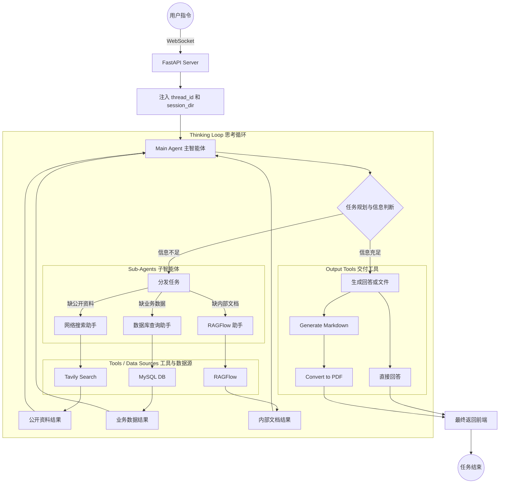
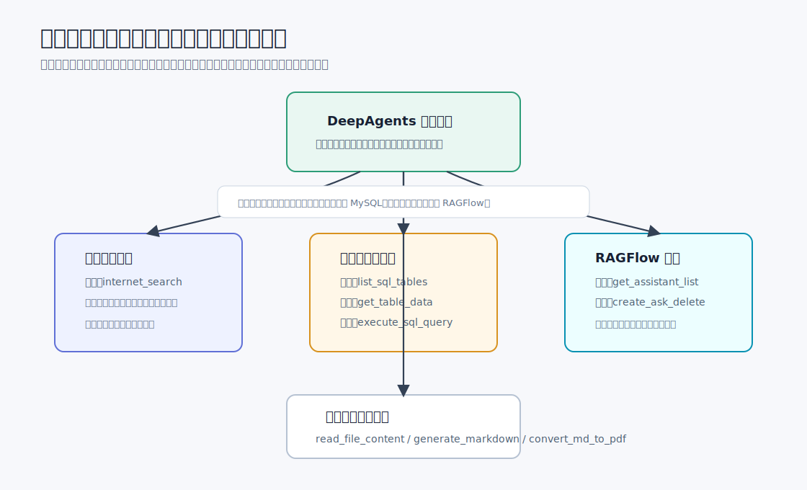
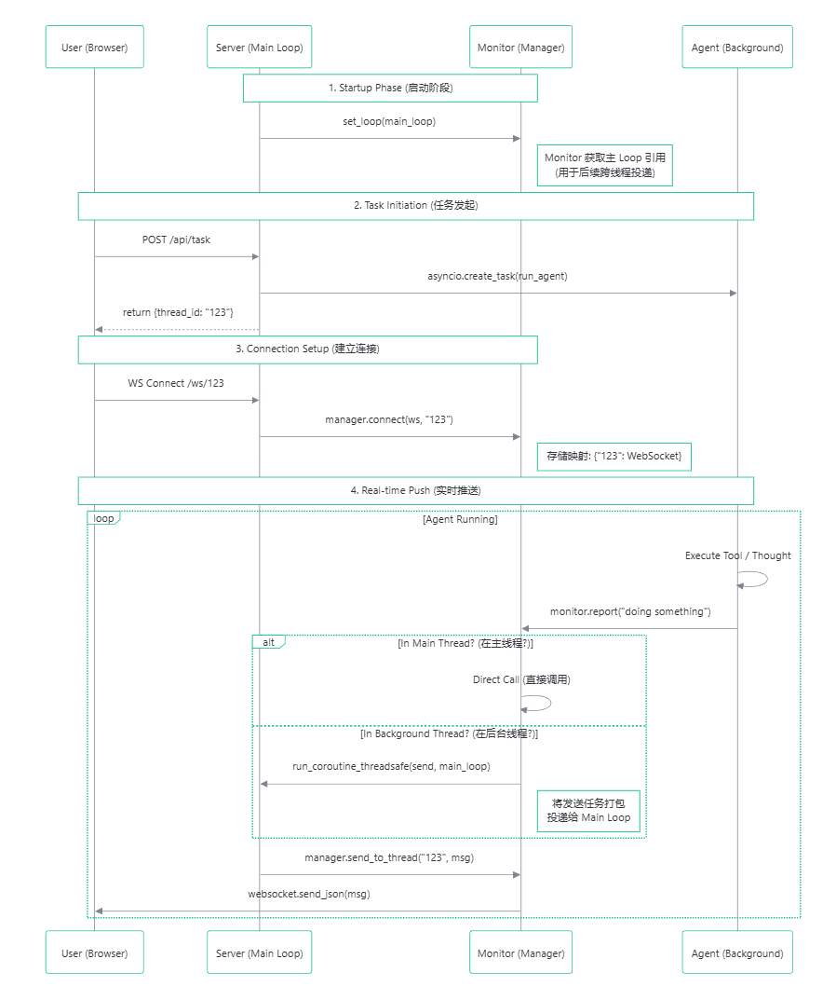

# 8 - 深度研搜：项目总览与工程初始化

---

**本章课程目标：**

- 理解「深度研搜」项目要解决什么问题，以及它和普通问答、普通 RAG 的区别。
- 建立对项目整体架构的第一印象：1 个主智能体、3 个专家子智能体、9 个核心工具。
- 理解 `thread_id`、`session_dir` 和 WebSocket 在前后端联动中的位置。

**学习建议：** 这章是深度研搜项目的工程地图。建议边读边画一条链路：前端发起任务，主智能体拆分和调度，网络搜索、数据库、RAGFlow 等助手各做一部分，进度再推回前端。工程初始化部分不用死记目录，先知道每类文件支撑链路上的哪一段。

**对应代码分支：** `09-deepsearch-core-config`

---

## 1、本章导读

### 1.1 先看最终要做成什么样

「深度研搜」项目会提供一个类似研究助手的页面。用户可以输入研究任务，也可以上传文件，后端智能体会根据任务需要去查网络、查数据库、查私有知识库，最后整理回答或生成文件。


先看两个入口：一个是文本输入，一个是附件上传。这也提醒我们，后端不能只处理一句 prompt，还要能处理上传文件、会话目录、执行进度和最终产物。

### 1.2 本章先做什么，不做什么

本章属于项目初始化，要完成的是：

1. 看懂项目目标和整体架构。
2. 打开 [deepsearch-agents](https://github.com/didilili/deepsearch-agents) 仓库，并通过 `uv` 同步依赖。
3. 理解前端任务、后端服务、WebSocket 进度推送之间的关系。
4. 看懂项目目录结构，知道后续代码应该放在哪里。

主智能体、子智能体和具体工具会在后续章节继续推进。本章先把项目地图看清楚。

---

## 2、项目要解决什么问题

### 2.1 普通问答为什么不够

普通大模型问答的链路很简单：`用户提问 -> 模型根据已有知识回答`

这种方式适合常识问答、文本改写、简单总结。但企业里的“搜索”和“研究”通常没有这么简单，因为很多信息不在模型参数里。

比如：

- 公司数据库里的药品信息、销售数据、库存数据；
- 企业内部制度、产品说明、培训文档；
- 最新新闻、政策、网页资料；
- 用户这次临时上传的文件；
- 最终还要生成 Markdown 或 PDF 报告。

如果只靠模型自己回答，它很容易遇到两个问题：**不知道最新信息**，或者**编出看似合理但没有依据的内容**。所以这个项目要做的不是“让模型多想一会儿”，而是让模型有能力去不同地方查资料。

### 2.2 “深度”到底深在哪里

这里的“深度”，不是界面更复杂，也不是提示词写得更长，而是**信息来源更多，查找过程可以反复迭代**。

本项目主要接入五类信息来源：

| 信息来源     | 适合解决什么问题                        | 在项目中的承接方式                         |
| ------------ | --------------------------------------- | ------------------------------------------ |
| 模型自身知识 | 通用知识、简单解释、已有常识            | 主智能体直接回答或参与综合分析             |
| 网络搜索     | 最新公开资料、网页内容、外部信息        | 网络搜索助手，底层使用 Tavily              |
| 数据库       | 企业业务数据，如药品表、销售表          | 数据库查询助手，负责查表、查结构、执行 SQL |
| RAG 知识库   | 企业内部文档、制度、私有知识库          | RAGFlow 助手，负责和知识库助手交互         |
| 上传文件     | 用户本次上传的 PDF、Word、Excel、文本等 | 主智能体通过文件读取工具读取               |

这里有两个容易混的点：

- 模型不是一个子智能体。它是主智能体和子智能体共同使用的基础能力。
- 上传文件也不是一个子智能体。它更像主智能体手里的一个工具，用来读取本次会话中的材料。

### 2.3 可以把它理解成“深度搜索研究员”

这个项目不是一个会聊天的搜索框，更像一个基于 DeepAgents 的“深度搜索研究员”。

它模拟的是人做研究时的过程：

```text
先理解问题
  -> 判断还缺哪些信息
  -> 去不同来源搜索或查询
  -> 阅读返回结果
  -> 判断信息是否足够
  -> 不够就继续查
  -> 足够后整理回答或生成文件
```

举个例子，用户问：

```text
从数据库中查询药品信息，并生成 PDF 文件。
```

这句话背后可能会发生下面这些动作：

1. 主智能体判断这是一个数据库查询任务，而且最终要生成文件。
2. 主智能体调用数据库查询助手。
3. 数据库助手先看有哪些表，再看药品表结构和数据预览。
4. 数据库助手执行合适的 SQL，返回药品信息。
5. 主智能体把结果整理成 Markdown。
6. 主智能体再调用 Markdown 转 PDF 工具。
7. 前端持续显示“正在查表、正在生成 Markdown、正在转 PDF”等进度。

这就是「深度研搜」和一次普通问答的区别：它不是只回答一句话，而是围绕目标组织一串可观察、可复用的任务步骤。

---

## 3、整体架构：一主三从

### 3.1 主智能体负责统筹

项目采用 DeepAgents 很典型的层级式多智能体架构，也就是前面讲过的 Orchestrator-Workers 模式。

主智能体像团队负责人，负责：

- 理解用户到底想要什么；
- 拆分任务，判断需要哪些资料；
- 决定是否调用网络搜索助手；
- 决定是否调用数据库查询助手；
- 决定是否调用 RAGFlow 助手；
- 必要时读取上传文件；
- 汇总结果，生成最终回答、Markdown 或 PDF。

它不应该把所有事情都自己做完。主智能体越像“什么都亲自干的人”，整个系统越难维护；它越像“会分配任务的负责人”，项目结构越清楚。

### 3.2 三个专家子智能体

本项目先规划 3 个子智能体：

| 子智能体       | 负责内容                                                 | 典型工具               |
| -------------- | -------------------------------------------------------- | ---------------------- |
| 网络搜索助手   | 查询公开网络资料，适合最新信息、公开网页、外部知识       | Tavily 搜索工具        |
| 数据库查询助手 | 查询企业业务数据库，读取表名、表结构、数据预览并执行 SQL | 查表、查结构、执行 SQL |
| RAGFlow 助手   | 查询企业内部知识库，先获取可用助手，再向知识库提问       | 创建会话、向知识库提问 |

主智能体和子智能体之间的关系可以这样理解：

```text
用户问题
  -> 主智能体分析任务
  -> 分派给网络 / 数据库 / RAGFlow 子智能体
  -> 子智能体返回结果
  -> 主智能体继续判断是否还要查
  -> 信息足够后生成最终结果
```

### 3.3 思考循环：规划、分发、回收、再判断

这个项目的核心不是“写死一个固定流程”，而是让主智能体在执行中不断判断信息是否足够。



这张图要抓住三个关键点：

- FastAPI 负责接入 WebSocket 请求，并把 `thread_id`、`session_dir` 这类上下文注入到后续执行中；
- 主智能体运行在一个思考循环里，先规划任务，再判断信息是否充足，不足时才分发给对应子智能体；
- 子智能体的结果会回到主智能体，主智能体再决定下一步，所以它不是“查一次就结束”，而是可以搜索、阅读、反思、再搜索，最后再生成回答、Markdown 或 PDF。

### 3.4 4 个智能体和 9 个工具

可以把整个项目记成一句话：**4 个智能体，9 个工具。**

4 个智能体分别是：

| 类型     | 名称           | 作用                                               |
| -------- | -------------- | -------------------------------------------------- |
| 主智能体 | Main Agent     | 理解任务、规划步骤、调度助手、汇总结果、生成交付物 |
| 子智能体 | 网络搜索助手   | 查询公开网络资料                                   |
| 子智能体 | 数据库查询助手 | 查询业务数据库                                     |
| 子智能体 | RAGFlow 助手   | 查询企业内部知识库                                 |

9 个工具按归属拆开看：

| 归属           | 工具数量 | 工具内容                                     |
| -------------- | -------- | -------------------------------------------- |
| 主智能体       | 3 个     | 读取上传文件、生成 Markdown、Markdown 转 PDF |
| 网络搜索助手   | 1 个     | Tavily 网络搜索                              |
| 数据库查询助手 | 3 个     | 获取表名、获取表结构和数据预览、执行 SQL     |
| RAGFlow 助手   | 2 个     | 获取可用助手或会话、向知识库助手提问         |

这里先建立分工，不需要马上记住每个工具的具体代码。后面章节真正写工具时，再回到这张表里找它属于谁、解决什么问题。



### 3.5 项目的工具体系

如果再往代码层看，工具不仅要知道“属于谁”，还要知道它们后面大概会叫什么、负责什么。这样后续看到工具函数名时，不会觉得突然。

主智能体常用工具：

| 工具名                  | 作用                             |
| ----------------------- | -------------------------------- |
| `upload_file_read_tool` | 读取用户本次上传的文件内容       |
| `generate_markdown`     | 把最终结果写成标准 Markdown 文档 |
| `convert_md_to_pdf`     | 将 Markdown 文件转换为 PDF       |

网络搜索助手工具：

| 工具名            | 作用                                                     |
| ----------------- | -------------------------------------------------------- |
| `internet_search` | 基于 Tavily 查询互联网公开信息，适合最新资料和多角度检索 |

数据库查询助手工具：

| 工具名              | 作用                                             |
| ------------------- | ------------------------------------------------ |
| `list_sql_tables`   | 列出数据库中的可用表                             |
| `get_table_data`    | 读取表结构和部分数据预览，帮助模型理解表里有什么 |
| `execute_sql_query` | 执行模型生成或整理后的 SQL 查询                  |

RAGFlow 知识库助手工具：

| 工具名               | 作用                                       |
| -------------------- | ------------------------------------------ |
| `get_assistant_list` | 获取 RAGFlow 中可用的知识库助手            |
| `create_ask_delete`  | 创建会话、向知识库提问，并在完成后清理会话 |

这些名字现在只需要先有印象。后面写到具体工具文件时，再逐个看函数入参、返回值和异常处理。

### 3.6 技术栈速览

这个项目涉及的技术比较多，可以按“智能体、接口、数据源、文件处理、工程辅助”五层理解。

| 层次       | 技术                                               | 在项目中的作用                                       |
| ---------- | -------------------------------------------------- | ---------------------------------------------------- |
| 智能体框架 | DeepAgents、LangChain、LangGraph、`langchain-core` | 组织主智能体、子智能体、工具调用和思考循环           |
| 模型接口   | OpenAI 兼容接口、`init_chat_model`                 | 统一创建大模型对象，供所有智能体使用                 |
| Web 服务   | FastAPI、Uvicorn                                   | 提供任务提交、文件上传、下载等后端接口               |
| 实时通信   | WebSocket                                          | 将 Agent 执行过程实时推送给前端                      |
| 参数校验   | Pydantic、`typing-extensions`                      | 定义请求参数、状态结构或工具入参，并提供类型兼容能力 |
| 网络搜索   | Tavily Search API                                  | 查询互联网公开信息，并返回结构化搜索结果             |
| 私有知识库 | RAGFlow、`ragflow_sdk`                             | 连接企业内部知识库，查询私有文档内容                 |
| 数据库     | MySQL、`mysql-connector-python`                    | 查询业务数据、表结构和 SQL 结果                      |
| 文件处理   | File IO、python-docx、pypdf、pandas、ReportLab     | 生成报告、读取上传文件或解析文档内容                 |
| 环境配置   | `python-dotenv`                                    | 从 `.env` 读取模型、搜索、数据库和 RAGFlow 连接配置  |
| HTTP 请求  | `requests`                                         | 做外部服务连通性检查，或在需要时直接访问 HTTP 接口   |
| 异步执行   | `asyncio`、`ContextVar`                            | 支持并发请求隔离和跨步骤传递上下文                   |
| 路径管理   | `pathlib`、`shutil`                                | 处理路径拼接、文件移动、上传文件归档                 |

当前阶段最重要的是三件事：DeepAgents 负责“智能体怎么组织”，FastAPI + WebSocket 负责“前后端怎么通信”，`ContextVar` + 会话目录负责“多用户任务怎么不串台”。

---

## 4、前后端交互与实时进度

### 4.1 为什么不能只用普通 HTTP

普通 HTTP 更像这样：

```text
客户端请求一次 -> 服务端处理完 -> 返回一次响应
```

但智能体任务经常不是一步完成的。比如一次“查数据库并生成 PDF”的任务，可能要经历：

1. 创建本次会话目录；
2. 调用数据库助手；
3. 查询表名；
4. 查询表结构和样例数据；
5. 执行 SQL；
6. 生成 Markdown；
7. 转成 PDF；
8. 返回最终文件。

如果前端一直没有任何反馈，用户会以为系统卡住了。更合理的体验是：后端每完成一个阶段，就把进度推给前端。

所以本项目需要 WebSocket。

### 4.2 thread_id 和 session_dir

从前端到后端，有两个值非常关键：

| 名称          | 解决的问题                         | 可以怎么理解          |
| ------------- | ---------------------------------- | --------------------- |
| `thread_id`   | 当前任务的进度应该推给哪个前端连接 | 本次对话任务的身份 ID |
| `session_dir` | 当前任务生成的文件应该放在哪个目录 | 本次任务的工作文件夹  |

完整链路可以这样看：

```text
前端发起任务
  -> 后端创建 thread_id 和 session_dir
  -> 把它们写入当前请求上下文
  -> Agent 和工具执行时随时读取上下文
  -> monitor 根据 thread_id 把进度推给对应前端
  -> 文件工具根据 session_dir 写入当前会话目录
```

这两个值如果处理不好，就会出现“串台”：A 用户的任务进度推给了 B 用户，或者 A 用户生成的文件写到了 B 用户目录里。

### 4.3 WebSocket 负责实时推送

WebSocket 的大致流程是：

```text
前端提交任务 -> 后端返回 thread_id
前端用 thread_id 建立 WebSocket 连接
Agent 执行过程中不断 report
monitor 根据 thread_id 找到对应 WebSocket
把执行进度推送给对应前端
```



重点看四条泳道：浏览器、Server 主事件循环、Monitor 管理器、后台 Agent。前端不是等 Agent 完整结束才收到消息，而是在 Agent 执行工具或调用助手时，就会收到一条条监控事件。

### 4.4 context.py 和 monitor.py 分别管什么

这两个文件很容易混在一起，可以先这样分：

| 文件                 | 负责什么                                       | 一句话记忆             |
| -------------------- | ---------------------------------------------- | ---------------------- |
| `app/api/context.py` | 保存当前任务的 `thread_id` 和 `session_dir`    | 我是谁，我的文件夹在哪 |
| `app/api/monitor.py` | 把工具调用、助手调用、最终结果等事件推送给前端 | 我现在正在做什么       |

也就是说，`context.py` 负责保存身份，`monitor.py` 负责对外汇报进度。后面写工具时，只要工具里调用 `monitor.report_tool(...)`，前端就有机会看到执行过程。

---

## 5、项目工程目录与依赖准备

### 5.1 同步依赖

在仓库里已经准备好 `pyproject.toml`、`uv.lock`、基础目录和初始化代码，所以你不需要再从零执行 `uv init`。

关于 `uv` 的安装、项目初始化、`uv add` 和 `uv sync` 的基础用法，前面已经在「[3 - 电商问数：开发环境与基础服务准备](../实战项目-电商问数/3-开发环境与基础服务准备.md#_2、创建后端项目与使用-uv)」中讲过，本节不再重复展开，只说明本项目里的依赖同步步骤。

本项目使用 `uv` 管理 Python 依赖。拿到仓库后，进入 `deepsearch-agents` 根目录，执行：

```bash
uv add -r requirements.txt
uv sync
```

这两条命令分别负责“把依赖纳入项目管理”和“同步本地虚拟环境”：

| 命令                         | 作用                                                                                |
| ---------------------------- | ----------------------------------------------------------------------------------- |
| `uv add -r requirements.txt` | 读取 `requirements.txt`，把依赖写入 `pyproject.toml`，并更新 `uv.lock`              |
| `uv sync`                    | 根据 `pyproject.toml` 和 `uv.lock` 创建或更新 `.venv`，让本地环境和项目声明保持一致 |

所以这里不再使用 `pip install -r requirements.txt` 作为主要安装方式。`requirements.txt` 可以看作按职责整理过的依赖清单；真正负责依赖声明、锁定和环境同步的是 `uv`。

同步完成后，可以用下面的命令简单确认环境是否可用：

```bash
uv run python -V
uv run python -c "import deepagents, langchain, fastapi, ragflow_sdk; print('ok')"
```

如果能正常输出 Python 版本和 `ok`，说明后端依赖已经同步成功。

### 5.2 项目目录结构

```text
deepsearch-agents/
├── app/                    # 后端业务代码主目录
│   ├── agent/              # 模型初始化、提示词加载、主智能体和子智能体组装逻辑
│   │   ├── llm.py          # 统一创建大模型对象
│   │   ├── prompts.py      # 读取 app/prompt/prompts.yml
│   │   ├── main_agent.py   # 后续章节补充：主智能体组装入口
│   │   └── sub_agents/     # 后续章节补充：网络、数据库、RAGFlow 子智能体
│   ├── api/                # FastAPI、WebSocket、上下文隔离和执行过程监控相关代码
│   │   ├── context.py      # 保存 thread_id 和 session_dir 上下文
│   │   ├── monitor.py      # 推送工具调用、助手调用和任务结果
│   │   └── server.py       # 后续章节补充：FastAPI 服务入口
│   ├── prompt/             # YAML 提示词配置，让提示词和 Python 逻辑分开维护
│   │   └── prompts.yml     # 主智能体和子智能体提示词配置
│   ├── tools/              # 后续章节补充：Agent 可调用工具，例如搜索、查库、生成文件
│   └── utils/              # 普通 Python 工具函数，给后端代码或 Agent Tool 内部调用
│       ├── path_utils.py   # 统一解析上传文件、输出文件和会话目录路径
│       └── word_converter.py # Markdown 转 PDF 的底层转换工具
├── examples/               # 前面章节学习 DeepAgents API 时用到的示例代码
├── output/                 # 运行时生成：存放 Markdown、PDF 等任务产物
├── updated/                # 运行时生成：存放用户上传文件
├── .env.example            # 环境变量示例
├── .env                    # 本地真实配置，不提交仓库
├── .python-version         # Python 版本提示
├── pyproject.toml          # 项目依赖声明
└── uv.lock                 # 依赖锁定文件
```

这里要区分两类“工具”：

| 类型         | 给谁用     | 例子                                     |
| ------------ | ---------- | ---------------------------------------- |
| Agent Tool   | 给模型调用 | 网络搜索、查数据库、读取文件、生成报告   |
| Python Utils | 给代码调用 | 路径解析、Markdown 转 PDF 的底层转换函数 |

`app/utils/` 不是给模型直接调的。它更像后端代码自己的工具箱；后续某个 Agent Tool 可以在内部调用这些普通函数。比如 `convert_md_to_pdf` 这个 Agent Tool 可以调用 `app/utils/word_converter.py`，但模型看到的是工具函数，不需要关心底层怎么解析 Markdown、怎么调用 ReportLab 或怎么处理路径。

---

**本章小结：**

到这里，我们先完成了项目总览和工程初始化这一层。现在你应该已经清楚：

- 「深度研搜」为什么不是普通问答，而是一个多来源、多步骤的研究型智能体项目；
- 主智能体、网络搜索助手、数据库查询助手、RAGFlow 助手之间是什么关系；
- 前端任务为什么需要 `thread_id`、`session_dir` 和 WebSocket 进度推送；
- [deepsearch-agents](https://github.com/didilili/deepsearch-agents) 仓库如何同步依赖，以及主要目录分别承担什么职责。

下一章「[基础模块与模型配置](9-基础模块与模型配置.md)」会继续进入具体代码：`.env`、`context.py`、`monitor.py`、`path_utils.py`、`word_converter.py`、`llm.py` 和提示词配置。
