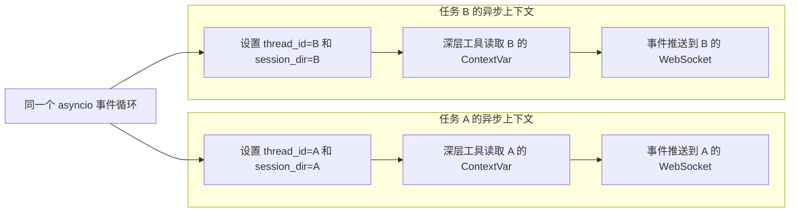

# 9 - 深度研搜：基础模块与模型配置

---

**本章课程目标：**

- 准备 `.env`，把模型、搜索、数据库、RAGFlow 等配置从代码里拆出来。
- 理解 `ContextVar` 如何保存当前任务的 `thread_id` 和 `session_dir`，避免多用户请求串台。
- 理解 `monitor.py` 如何把工具调用、助手调用和任务结果推送给前端。
- 熟悉 `path_utils.py`、`word_converter.py` 这两个普通工具模块的职责，其中 `word_converter.py` 使用 ReportLab 生成 PDF。
- 完成 `agent/llm.py`、`prompt/prompts.yml`、`agent/prompts.py` 这组模型与提示词配置。

**学习建议：** 这一章看的是项目底座，不是零散工具函数。可以顺着“配置入口 -> 请求上下文 -> 实时进度 -> 文件工具 -> 模型与提示词”追一遍，边读边问：这个模块被谁创建、被谁调用、出了问题会影响哪条链路。把这些基础模块的位置看清，后面主智能体代码会轻很多。

**对应代码分支：** `09-deepsearch-core-config`

---

上一章已经完成「深度研搜」项目的整体认识：项目要解决什么问题、主智能体和子智能体如何配合、前后端为什么需要 `thread_id` 和实时进度，以及仓库目录和依赖如何准备。

本章继续往下走，但不急着写网络搜索、数据库查询或 RAGFlow 工具。我们先把这些工具会依赖的基础模块准备好：

| 模块                      | 解决什么问题                                       |
| ------------------------- | -------------------------------------------------- |
| `.env`                    | 把模型、搜索、数据库、RAGFlow 等配置集中管理       |
| `api/context.py`          | 在一次请求链路中保存当前任务身份和会话目录         |
| `api/monitor.py`          | 把工具调用、助手调用和最终结果推送给前端           |
| `utils/path_utils.py`     | 统一解析模型、工具和用户传入的文件路径             |
| `utils/word_converter.py` | 基于 ReportLab 提供 Markdown 转 PDF 的底层转换能力 |
| `agent/llm.py`            | 统一创建大模型对象                                 |
| `prompt/prompts.yml`      | 用 YAML 管理主智能体和子智能体提示词               |
| `agent/prompts.py`        | 从 YAML 中读取提示词配置，供智能体组装时使用       |

可以把本章看成“业务工具之前的地基”。这些模块写清楚以后，后面新增工具、子智能体和接口时，就不用在每个文件里重复处理配置、路径、上下文和模型初始化。

---

## 1、配置入口：.env

### 1.1 .env 配置

项目对应文件路径：`deepsearch-agents/.env`。你需要将 `deepsearch-agents/.env.example` 复制一份，命名为 `.env`，再把占位值改成你的实际配置。

```dotenv
# LLM 配置
OPENAI_BASE_URL=https://dashscope.aliyuncs.com/compatible-mode/v1
OPENAI_API_KEY=你的大模型_API_KEY
LLM_QWEN_MAX=qwen-max

# Tavily 配置
# 在 https://app.tavily.com/ 注册账号，然后创建API KEY
TAVILY_API_KEY=你的_TAVILY_API_KEY

# RAGFlow 配置
RAGFLOW_API_URL=http://your-ragflow-host
RAGFLOW_API_KEY=ragflow-your-api-key

# MySQL 配置
MYSQL_USER=root
MYSQL_PASSWORD=root
MYSQL_DATABASE=pharma_db
MYSQL_HOST=localhost
MYSQL_PORT=3306
```

当前阶段最先要保证可用的是模型配置。MySQL、RAGFlow 可以先占位，等后续写对应工具时再补成真实值。

---

## 2、请求上下文：api/context.py

### 2.1 它解决什么问题

项目是异步 Web 服务，同一时间可能有多个用户请求在执行。如果用全局变量保存当前用户的 `thread_id` 或会话目录，就可能出现数据覆盖。

典型问题是：

```text
用户 A 的任务还没结束
用户 B 的任务进来了
全局变量被 B 覆盖
用户 A 的进度被推送给 B
```

这里还要注意一个细节：FastAPI 这类异步 Web 服务通常基于 `asyncio` 并发处理请求。多个用户请求不一定对应多个线程，它们很可能是在同一个线程里的多个 `asyncio Task` 中交替执行。

如果你以前没接触过“协程”，可以先把它理解成：**一段可以中途暂停、等别人干完活、然后再接着执行的代码任务**。

举个更贴近实际使用的例子。假设你正在豆包里提问：

```text
帮我总结一篇文章。
```

后端大概会经历这样的过程：

```text
收到你的问题
  -> 记录你的会话 ID
  -> 调用大模型
  -> 等模型返回
  -> 整理结果
  -> 返回给你
```

这里的“调用大模型”通常需要等一会儿。服务器不会一直傻等，它会先把你的这次请求暂停一下，转头处理另一个用户的问题。等模型结果返回后，再切回来继续处理你的任务。

所以真实情况可能更像这样：

```text
同一个服务器线程里：

任务 A：你向豆包提问
  -> 调用模型，等待中，先暂停

任务 B：另一个用户也向豆包提问
  -> 开始处理
  -> 调用模型，等待中，也暂停

任务 A：模型返回了
  -> 继续处理你的结果

任务 B：模型返回了
  -> 继续处理另一个用户的结果
```

这里的“任务 A / 任务 B”，就可以近似理解成两个异步任务。它们可能在同一个线程里交替执行，但每个任务都必须记住自己的身份：任务 A 要记住你的 `thread_id` 和 `session_dir`，任务 B 要记住另一个用户的 `thread_id` 和 `session_dir`。

所以这里不能简单依赖“线程隔离”来保存请求数据：

| 方案              | 为什么不合适或适合                                    |
| ----------------- | ----------------------------------------------------- |
| 全局变量          | 所有请求共用一份值，后来的请求会覆盖前面的请求        |
| `threading.local` | 只能隔离线程，不能隔离同一线程里的多个 `asyncio Task` |
| `ContextVar`      | 隔离当前异步上下文，适合保存每个请求自己的上下文数据  |

`ContextVar` 是 Python 3.7+ 为异步编程设计的上下文变量。可以先把它理解成“当前异步任务上下文里的本地变量（协程级别的本地变量）”：同一个请求链路里，深层函数可以拿到前面设置的值；另一个请求进来时，拿到的是自己那份值。

核心代码如下。真实项目里除了保存值，还会保留 `set()` 返回的 token，方便任务结束后把上下文恢复干净：

```python
"""
请求上下文管理模块

负责在异步请求链路中保存当前任务的 thread_id 和 session_dir
工具、智能体和监控模块可以在深层调用中读取这些值，而不需要层层传参
"""

from contextvars import ContextVar, Token
from typing import Optional

# ContextVar 是协程级上下文变量，适合 FastAPI 这类异步 Web 服务
# 它可以避免多个并发请求共用全局变量时出现 thread_id 或 session_dir 串台
_session_dir_ctx: ContextVar[Optional[str]] = ContextVar(
    "session_dir",
    default=None,
)
_thread_id_ctx: ContextVar[Optional[str]] = ContextVar(
    "thread_id",
    default=None,
)
```

这两个变量分别保存：

| 上下文        | 作用                                    |
| ------------- | --------------------------------------- |
| `session_dir` | 当前任务生成文件的会话目录              |
| `thread_id`   | 当前任务对应的前端连接和 Agent 执行线程 |

常用函数是：

```python
def set_session_context(path: str) -> Token[Optional[str]]:
    """
    设置当前请求链路的会话目录

    :param path: 当前任务的工作目录
    :return: reset 时需要使用的上下文 token
    """
    return _session_dir_ctx.set(path)


def get_session_context() -> Optional[str]:
    """
    获取当前请求链路的会话目录

    :return: 当前任务工作目录；未设置时返回 None
    """
    return _session_dir_ctx.get()


def set_thread_context(thread_id: str) -> Token[Optional[str]]:
    """
    设置当前请求链路的线程 ID

    :param thread_id: 前端连接和 Agent 执行共用的任务 ID
    :return: reset 时需要使用的上下文 token
    """
    return _thread_id_ctx.set(thread_id)


def get_thread_context() -> Optional[str]:
    """
    获取当前请求链路的线程 ID

    :return: 当前任务 ID；未设置时返回 None
    """
    return _thread_id_ctx.get()


def reset_session_context(
    session_token: Token[Optional[str]],
    thread_token: Optional[Token[Optional[str]]] = None,
) -> None:
    """
    恢复请求上下文，避免本次任务信息残留到后续请求

    :param session_token: set_session_context 返回的 token
    :param thread_token: set_thread_context 返回的 token
    """
    _session_dir_ctx.reset(session_token)
    if thread_token is not None:
        _thread_id_ctx.reset(thread_token)
```

这里的 `set` 会返回一个 token。任务结束时用 token `reset`，可以把上下文恢复到进入任务前的状态。这个动作很重要，因为 Web 服务会持续运行，不能让上一个请求的上下文残留到下一个请求。

用并发视角看，`ContextVar` 的作用是让任务 A 和任务 B 各自带着自己的上下文往下走：



---

## 3、实时进度：api/monitor.py

### 3.1 monitor.py 负责什么

`monitor.py` 负责把 Agent 执行过程中的事件统一包装，再推送给前端。

常见事件包括：

| 方法                 | 作用                     |
| -------------------- | ------------------------ |
| `report_tool`        | 报告开始执行某个工具     |
| `report_assistant`   | 报告正在调用某个子智能体 |
| `report_task_result` | 报告任务最终结果         |
| `report_session_dir` | 报告当前会话输出目录     |

内部会先构造统一消息，再根据当前上下文里的 `thread_id` 定向推送。这样工具函数不需要知道前端连接对象，只要调用 `monitor.report_tool(...)` 之类的方法即可：

```python
def _emit(
    self,
    event_type: str,
    message: str,
    data: Optional[dict[str, Any]] = None,
) -> None:
    """
    构造统一监控事件，并尝试推送到当前 thread_id 对应的前端连接

    :param event_type: 事件类型，例如 tool_start、assistant_call
    :param message: 面向前端展示的事件说明
    :param data: 附加结构化数据
    """
    payload = {
        "type": "monitor_event",
        "event": event_type,
        "message": message,
        "data": data or {},
        "timestamp": datetime.datetime.now().isoformat(),
    }

    if self.websocket_manager:
        try:
            # thread_id 来自 ContextVar，确保事件只推给当前任务对应的前端连接
            thread_id = get_thread_context()
            manager_loop = self.websocket_manager.loop

            if manager_loop and thread_id:
                self._send_to_websocket(payload, thread_id, manager_loop)
        except Exception as e:
            print(f"[Monitor] WebSocket send failed: {e}")

    # DeepAgents 脚本调试时，如果运行时暴露了 stream_writer，也同步写入流式输出
    if hasattr(builtins, "runtime") and hasattr(builtins.runtime, "stream_writer"):
        try:
            builtins.runtime.stream_writer(payload)
        except Exception:
            pass

    # 控制台保底输出，便于无前端场景下观察执行过程
    print(f"\n[Monitor:{event_type}] {message}")
```

这里还有一个容易忽略的点：Agent 运行逻辑和 WebSocket 管理器不一定在同一个事件循环里。真实代码里会判断当前事件循环，如果跨线程或跨 loop，就用 `asyncio.run_coroutine_threadsafe` 把发送任务投递回 WebSocket 所在的 loop：

```python
def _send_to_websocket(
    self,
    payload: dict[str, Any],
    thread_id: str,
    manager_loop: asyncio.AbstractEventLoop,
) -> None:
    """
    将监控事件投递到 WebSocket 所在事件循环

    FastAPI 的 WebSocket 必须在创建它的事件循环中发送消息
    如果当前代码已经在同一个循环里，直接 create_task；否则使用线程安全投递
    """
    try:
        current_loop = asyncio.get_running_loop()
    except RuntimeError:
        current_loop = None

    coroutine = self.websocket_manager.send_to_thread(payload, thread_id)
    if current_loop and current_loop == manager_loop:
        # 已经在 WebSocket 所属事件循环中，直接创建异步任务即可
        current_loop.create_task(coroutine)
    else:
        # 不在同一个事件循环中时，线程安全地投递到 manager_loop
        asyncio.run_coroutine_threadsafe(coroutine, manager_loop)
```

最后由 `ConnectionManager` 保存前端连接。它用 `thread_id` 作为字典 key，所以同一时刻多个任务并发执行时，也能把事件发回各自页面：

```python
class ConnectionManager:
    """
    WebSocket 连接管理器

    active_connections 使用 thread_id 作为 key，保证监控事件只推送给对应任务的前端连接
    """

    def __init__(self) -> None:
        self.active_connections: dict[str, WebSocket] = {}
        # WebSocket 发送必须回到创建连接的事件循环，因此启动时需要显式绑定 loop
        self.loop: Optional[asyncio.AbstractEventLoop] = None

    def set_loop(self, loop: asyncio.AbstractEventLoop) -> None:
        """记录 FastAPI/WebSocket 所在的事件循环，供后台线程安全投递消息"""
        self.loop = loop

    async def connect(self, websocket: WebSocket, thread_id: str) -> None:
        """接受 WebSocket 连接，并按 thread_id 保存"""
        await websocket.accept()
        self.active_connections[thread_id] = websocket

    async def send_to_thread(self, message: dict[str, Any], thread_id: str) -> None:
        """向指定 thread_id 对应的前端连接发送 JSON 消息"""
        if thread_id in self.active_connections:
            websocket = self.active_connections[thread_id]
            await websocket.send_json(message)
```

这里的 `set_loop()` 很重要。智能体任务可能被放到后台线程里执行，而 WebSocket 连接属于 FastAPI 的事件循环。后台线程不能直接 `await websocket.send_json(...)`，所以监控模块会先拿到 `manager.loop`，再用 `asyncio.run_coroutine_threadsafe(...)` 把发送动作投递回正确的事件循环。

这就是 `context.py` 和 `monitor.py` 的配合方式：前者提供当前任务身份，后者根据身份把消息发回正确的前端页面。

---

## 4、文件基础工具：utils/

本章还会熟悉两个 `utils` 文件。

### 4.1 path_utils.py：统一路径解析

在智能体项目里，模型可能会返回各种路径：

```text
/workspace/report.md
/mnt/data/report.md
output/report.md
session_xxx/report.md
updated/upload/file.pdf
```

这些路径不一定能直接在当前机器上使用，所以需要统一解析。`path_utils.py` 主要负责清洗虚拟路径、识别上传目录、拼接当前会话目录，并避免文件写到不该写的位置。

`resolve_path(filename, session_dir)` 的两个参数可以这样理解：

| 参数          | 含义                                                 |
| ------------- | ---------------------------------------------------- |
| `filename`    | 模型、工具或用户传入的文件名 / 路径                  |
| `session_dir` | 当前任务的会话目录，用来隔离不同任务生成和读取的文件 |

核心功能可以概括成四件事：

1. 清洗模型常见的虚拟路径前缀，例如 `/workspace`、`/mnt/data`、`/home/user`。
2. 识别 `updated/` 上传目录，并优先按项目根目录下的真实上传路径解析。
3. 结合 `session_dir` 处理相对路径和绝对路径，让普通任务产物尽量落在当前会话目录里。
4. 防止路径重复嵌套，例如 `session_123/session_123/report.md`。

下面用一组场景把它讲透。假设当前环境是 Windows，项目根目录是 `D:/Project`，当前会话目录是 `D:/Project/output/session_123`：

| 场景                   | 输入 `filename`                                       | 核心处理                                                 | 解析结果                                          |
| ---------------------- | ----------------------------------------------------- | -------------------------------------------------------- | ------------------------------------------------- |
| 虚拟路径清洗           | `/workspace/report.md`                                | 剥离 `/workspace`，再拼到会话目录                        | `D:/Project/output/session_123/report.md`         |
| 上传目录处理           | `abc/updated/upload/file.pdf`                         | 提取 `updated/` 之后的路径，按项目根目录解析             | `D:/Project/updated/upload/file.pdf`              |
| 无会话目录             | `sub/test.md`                                         | 没有 `session_dir`，直接按当前工作目录解析               | `D:/Project/sub/test.md`                          |
| 会话内绝对路径         | `D:/Project/output/session_123/sub/report.md`         | 确认在会话目录内，检查是否嵌套后返回                     | `D:/Project/output/session_123/sub/report.md`     |
| 会话外绝对路径         | `D:/OtherDir/file.md`                                 | 不在会话目录内，保留真实绝对路径                         | `D:/OtherDir/file.md`                             |
| Windows Unix 风格路径  | `/sub/test.md`                                        | Windows 下 `/sub/test.md` 没有盘符，按会话内相对路径处理 | `D:/Project/output/session_123/sub/test.md`       |
| 路径嵌套防护           | `D:/Project/output/session_123/session_123/report.md` | 检测连续 `session_123`，修正为会话目录下文件             | `D:/Project/output/session_123/report.md`         |
| 相对路径含会话名       | `session_123/report.md`                               | 避免重复拼接会话目录，只保留文件名                       | `D:/Project/output/session_123/report.md`         |
| 相对路径含 output 前缀 | `output/report.md`                                    | 避免把 `output` 再嵌进会话目录，只保留文件名             | `D:/Project/output/session_123/report.md`         |
| 普通相对路径           | `sub1/sub2/test.md`                                   | 直接拼到当前会话目录                                     | `D:/Project/output/session_123/sub1/sub2/test.md` |
| 虚拟路径加上传目录     | `/mnt/data/updated/doc.md`                            | 先剥离 `/mnt/data`，再触发 `updated/` 处理               | `D:/Project/updated/doc.md`                       |

如果运行在 Linux 上，`/home/user/test.md` 会先被剥离 `/home/user`，再拼到 Linux 的会话目录里，例如 `/data/session_123/test.md`。所以这里不是简单地判断“是不是 `/` 开头”，而是要结合操作系统、虚拟路径前缀和 `session_dir` 一起看。

核心代码可以抓住四步：先清洗模型可能生成的虚拟前缀，再优先识别上传目录，然后处理绝对路径，最后把普通相对路径收敛到当前会话目录里：

```python
import os
from pathlib import Path
from typing import Optional


def resolve_path(filename: str, session_dir: Optional[str] = None) -> str:
    """
    解析文件路径，并尽量把任务产物限制在当前会话目录中

    :param filename: 模型、工具或用户传入的文件名/路径
    :param session_dir: 当前任务的会话目录
    :return: 解析后的绝对路径
    """
    path = Path(filename)
    path_str = filename.replace("\\", "/")

    # 大模型常返回 /workspace、/mnt/data 这类沙箱路径，本地项目需要先剥离虚拟前缀
    for prefix in ["/workspace", "/mnt/data", "/home/user"]:
        if path_str.startswith(prefix):
            cleaned = path_str[len(prefix) :].lstrip("/")
            path = Path(cleaned)
            path_str = str(path).replace("\\", "/")
            break

    # updated/ 用于存放用户上传文件，应优先按项目根目录下的真实上传路径解析
    if "updated/" in path_str:
        idx = path_str.find("updated/")
        relative_part = path_str[idx:]
        return str(Path(relative_part).resolve())

    # 未传入会话目录时，只做普通路径解析，适合脚本调试场景
    if not session_dir:
        return str(path.resolve())

    session_path = Path(session_dir).resolve()
    session_name = session_path.name
    is_unix_abs = path_str.startswith("/")

    if path.is_absolute() or (os.name == "nt" and is_unix_abs):
        # Windows 下 "/xxx" 没有盘符，按会话目录内的相对路径处理
        if os.name == "nt" and is_unix_abs and not path.drive:
            full_path = session_path / path_str.lstrip("/")
        else:
            full_path = path.resolve()

        try:
            if session_path in full_path.parents or full_path == session_path:
                return _fix_nested_session_path(full_path, session_path, session_name)
        except Exception:
            pass

        # 真实绝对路径且不在 session_dir 中时保持原样，避免误改外部资源路径
        return str(full_path)

    parts = path.parts

    # 避免模型把 session 名或 output 前缀重复拼到当前会话目录里
    if session_name in parts:
        return str(session_path / path.name)

    if parts and parts[0] == "output":
        return str(session_path / path.name)

    return str(session_path / path)


def _fix_nested_session_path(
    full_path: Path,
    session_path: Path,
    session_name: str,
) -> str:
    """
    修正 session_xxx/session_xxx/file.md 这类重复嵌套路径
    """
    parts = full_path.parts
    for index in range(len(parts) - 1):
        if parts[index] == session_name and parts[index + 1] == session_name:
            return str(session_path / full_path.name)
    return str(full_path)
```

### 4.2 word_converter.py：Markdown 转 PDF

这个文件负责把 Markdown 转成 PDF。当前代码没有再依赖本机 Microsoft Word，而是使用 `ReportLab` 直接生成 PDF，因此在 macOS、Linux、Windows 上都更容易运行。

核心思路可以这样理解：

```text
读取 Markdown
  -> 解析标题、列表、表格、代码块等常见 Markdown 结构
  -> 转成 ReportLab 的 Paragraph、Table、Spacer 等 story 元素
  -> 注册中文字体，避免中文乱码
  -> 生成 PDF 文件
```

真实代码把 `reportlab` 做成可选导入：如果环境里没有安装依赖，导入模块本身不会立刻失败，只有真正调用转换函数时才会返回提示。

```python
import html
import logging
import re
from pathlib import Path

try:
    from reportlab.lib import colors
    from reportlab.lib.enums import TA_CENTER, TA_LEFT
    from reportlab.lib.pagesizes import A4
    from reportlab.lib.styles import ParagraphStyle, getSampleStyleSheet
    from reportlab.lib.units import cm
    from reportlab.pdfbase import pdfmetrics
    from reportlab.pdfbase.cidfonts import UnicodeCIDFont
    from reportlab.platypus import (
        Paragraph,
        Preformatted,
        SimpleDocTemplate,
        Spacer,
        Table,
        TableStyle,
    )
except ImportError:
    # 缺少 reportlab 时仍允许模块被导入，方便其它代码正常启动
    SimpleDocTemplate = None


logger = logging.getLogger(__name__)


def convert_md_to_pdf(md_abs_path: Path, pdf_abs_path: Path) -> str:
    """
    将 Markdown 文件转换为 PDF

    :param md_abs_path: Markdown 文件绝对路径
    :param pdf_abs_path: 输出 PDF 文件绝对路径
    :return: 转换结果说明
    """
    if SimpleDocTemplate is None:
        return "缺少依赖库，请安装 reportlab"

    # 读取智能体生成的 Markdown 报告
    with open(md_abs_path, "r", encoding="utf-8") as f:
        md_content = f.read()

    # 确保输出目录存在，避免 doc.build 写文件时报路径不存在
    pdf_abs_path.parent.mkdir(parents=True, exist_ok=True)

    try:
        _register_fonts()
        doc = SimpleDocTemplate(
            str(pdf_abs_path),
            pagesize=A4,
            rightMargin=2 * cm,
            leftMargin=2 * cm,
            topMargin=2 * cm,
            bottomMargin=2 * cm,
        )
        styles = _build_styles()
        story = _markdown_to_story(md_content, styles)
        doc.build(story)
        return f"成功将 Markdown 转换为 PDF: {pdf_abs_path}"
    except Exception as e:
        logger.exception("Markdown 转 PDF 失败")
        return f"Markdown 转 PDF 失败: {str(e)}"
```

这里最关键的不是每一个 ReportLab 参数，而是两层保护：

1. `SimpleDocTemplate is None`：缺少依赖时返回可读提示，不让整个服务启动失败。
2. `pdf_abs_path.parent.mkdir(...)`：先创建输出目录，再生成 PDF，避免会话目录不存在导致转换失败。

底层解析函数可以先看名字，不必一次吃透：

```python
def _register_fonts() -> None:
    """注册中文 CID 字体，优先保证中文内容能正常显示"""
    pdfmetrics.registerFont(UnicodeCIDFont("STSong-Light"))


def _markdown_to_story(md_content: str, styles: dict[str, ParagraphStyle]) -> list:
    """
    把 Markdown 文本解析成 ReportLab story 元素

    story 可以理解成 PDF 页面里的内容队列：
    标题、正文、代码块、表格都会被依次放进去，最后交给 doc.build 生成 PDF。
    """
    ...


def _format_inline(text: str) -> str:
    """处理行内加粗、代码等简单 Markdown 样式，并做 HTML 转义"""
    ...
```

所以这个工具文件的职责非常明确：它不关心智能体如何生成报告，也不关心前端如何下载文件，只负责把一个已经存在的 `.md` 文件转换成 `.pdf`。

---

## 5、模型与提示词配置

### 5.1 agent/llm.py：统一创建模型对象

项目对应文件路径：`deepsearch-agents/app/agent/llm.py`

核心代码如下：

```python
"""
大模型初始化模块

负责从 .env 中读取模型配置，并创建项目统一复用的模型对象
后续主智能体和子智能体都从这里导入 model，避免在多个文件里重复加载环境变量
"""

import os

from dotenv import find_dotenv, load_dotenv
from langchain.chat_models import init_chat_model

# find_dotenv 会从当前目录向上查找 .env，适合脚本和 Web 服务从不同入口启动的场景
load_dotenv(find_dotenv())

# 使用 OpenAI 兼容协议接入模型；具体模型名由 .env 中的 LLM_QWEN_MAX 控制
model = init_chat_model(
    model=os.getenv("LLM_QWEN_MAX"),
    model_provider="openai",
)
```

这里有两个点需要理解：

- `find_dotenv()` 会从当前路径向上查找 `.env`，比只在当前目录找更稳。
- `model_provider="openai"` 表示使用 OpenAI 兼容协议，不等于只能调用 OpenAI 官方模型。

后续创建主智能体或子智能体时，可以直接复用：

```python
from app.agent.llm import model
```

这样模型配置就集中在一个地方维护，不需要每个文件都重新读一遍 `.env`。

### 5.2 prompt/prompts.yml：把提示词从代码里拿出来

主智能体和子智能体都需要提示词。如果全部写在 Python 文件里，后面会很难维护。

所以本项目把下面几类内容放到 YAML 里：

- 主智能体的系统提示词；
- 子智能体的名称；
- 子智能体的描述；
- 子智能体自己的系统提示词。

初始结构如下：

```yaml
# 主智能体配置：负责理解用户任务、规划步骤、调度子智能体并汇总最终结果
main_agent:
  system_prompt: |
    你是沃华医药公司的智能团队负责人，负责协调三个专家助手完成复杂研究任务
    当前章节先保留基础占位提示词，后续会随着工具和子智能体实现逐步完善

# 子智能体配置：description 给主智能体判断是否调用，system_prompt 给子智能体约束执行方式
sub_agents:
  tavily:
    name: "网络搜索助手"
    description: |
      当任务需要查询互联网公开资料、最新信息、政策新闻或外部网页内容时使用
    system_prompt: |
      你是一个专业的网络信息查询助手，负责基于用户目标检索公开网络资料

  db:
    name: "数据库查询助手"
    description: |
      当任务需要查询业务数据库、读取表结构、查看样例数据或执行 SQL 时使用
    system_prompt: |
      你是一个专业的数据库查询助手，负责安全、准确地查询业务数据库

  ragflow:
    name: "RAGFlow 助手"
    description: |
      当任务需要查询企业内部知识库、制度文档、产品资料或私有知识内容时使用
    system_prompt: |
      你是一个专业的 RAGFlow 知识库助手，负责从企业知识库中检索相关信息
```

这里主智能体的提示词还保留基础占位，但子智能体的 `description` 已经尽量写成“什么时候使用”。这比简单写“负责网络搜索”“负责数据库查询”更适合让主智能体做路由判断。

### 5.3 name、description、system_prompt 的区别

子智能体配置里这三个字段不要混：

| 字段            | 给谁看             | 作用                     |
| --------------- | ------------------ | ------------------------ |
| `name`          | 框架和主智能体     | 子智能体名称             |
| `description`   | 主智能体           | 判断什么时候调用这个助手 |
| `system_prompt` | 子智能体自己的模型 | 约束这个助手如何完成任务 |

`description` 尤其重要。它不是随便写一句“这是一个助手”，而是告诉主智能体什么时候应该调用它。

更清楚的写法应该接近：

```text
当用户问题需要联网查询最新公开资料时，调用网络搜索助手。
当用户问题需要查询药品数据库、表结构或执行 SQL 时，调用数据库查询助手。
当用户问题需要查询企业内部知识库或制度文档时，调用 RAGFlow 助手。
```

主智能体能不能选对助手，和这些描述写得清不清楚有很大关系。

### 5.4 agent/prompts.py：读取 YAML 配置

项目对应文件路径：`deepsearch-agents/app/agent/prompts.py`

先写一个加载函数：

```python
"""
提示词配置加载模块

负责读取 app/prompt/prompts.yml 中的主智能体和子智能体配置
后续组装 DeepAgent 时，可以直接复用 main_agent_content 和 sub_agents_content
"""

from pathlib import Path
from typing import Any

import yaml


def load_yaml(file_path: Path) -> dict[str, Any]:
    """
    加载 YAML 配置文件

    :param file_path: YAML 文件路径
    :return: YAML 解析后的字典
    """
    with open(file_path, "r", encoding="utf-8") as f:
        # safe_load 只按数据解析 YAML，避免 yaml.load 可能触发的对象构造风险
        return yaml.safe_load(f)
```

这里使用 `yaml.safe_load()`，而不是 `yaml.load()`。简单理解：`safe_load()` 只按数据读取 YAML，不执行里面可能藏着的 Python 对象构造逻辑，更适合读取配置文件。

再找到项目根路径和 YAML 文件：

```python
# 当前文件位于 app/agent/prompts.py，parents[1] 即 app 目录
app_root_path = Path(__file__).parents[1]
yaml_file_path = app_root_path / "prompt" / "prompts.yml"
```

如果当前文件是：`deepsearch-agents/app/agent/prompts.py`

那么：

```python
Path(__file__).parents[0]  # deepsearch-agents/app/agent
Path(__file__).parents[1]  # deepsearch-agents/app
Path(__file__).parents[2]  # deepsearch-agents
```

所以这里用 `parents[1]` 拿到 `app/` 目录，再拼出 `app/prompt/prompts.yml`。`.env`、`pyproject.toml`、`examples/` 这些仍在 `deepsearch-agents` 根目录下，和 `app/` 同级。

最后拆出主智能体和子智能体配置：

```python
prompt_yaml_content = load_yaml(yaml_file_path)

# 主智能体提示词配置
main_agent_content = prompt_yaml_content["main_agent"]

# 子智能体配置集合，包含 name、description 和 system_prompt
sub_agents_content = prompt_yaml_content["sub_agents"]

# 当前学习阶段可以临时打印，确认 YAML 是否被正确读取；生产代码中可以去掉
print(sub_agents_content)
```

在 `deepsearch-agents` 根目录运行这个模块：

```bash
uv run python -m app.agent.prompts
```

终端会打印出 YAML 中的 `sub_agents` 配置。为了方便阅读，下面按字典结构换行展示；字段内容和实际输出一致：

```text
{
  'tavily': {
    'name': '网络搜索助手',
    'description': '当任务需要查询互联网公开资料、最新信息、政策新闻或外部网页内容时使用\n',
    'system_prompt': '你是一个专业的网络信息查询助手，负责基于用户目标检索公开网络资料\n'
  },
  'db': {
    'name': '数据库查询助手',
    'description': '当任务需要查询业务数据库、读取表结构、查看样例数据或执行 SQL 时使用\n',
    'system_prompt': '你是一个专业的数据库查询助手，负责安全、准确地查询业务数据库\n'
  },
  'ragflow': {
    'name': 'RAGFlow 助手',
    'description': '当任务需要查询企业内部知识库、制度文档、产品资料或私有知识内容时使用\n',
    'system_prompt': '你是一个专业的 RAGFlow 知识库助手，负责从企业知识库中检索相关信息\n'
  }
}
```

这说明 `prompts.py` 已经成功读到了 `app/prompt/prompts.yml`，并且把子智能体配置拆成了 Python 字典。

后续创建主智能体时，可以用：

```python
main_agent_content["system_prompt"]
```

创建子智能体时，可以用：

```python
sub_agents_content["tavily"]["name"]
sub_agents_content["tavily"]["description"]
sub_agents_content["tavily"]["system_prompt"]
```

这样提示词和代码就分开了。改提示词时，只改 YAML；改智能体组装逻辑时，只改 Python。

### 5.5 YAML 中的 | 和 > 怎么看

提示词经常是多行文本，所以 YAML 里会看到 `|`：

```yaml
system_prompt: |
  第一行提示词
  第二行提示词
  - 可以保留列表结构
```

`|` 会保留换行，适合写系统提示词、步骤、列表。

还有一种写法是 `>`：

```yaml
description: >
  第一行描述
  第二行描述
```

`>` 通常会把多数换行折叠成空格，更适合普通段落描述。写 `system_prompt` 时，如果希望保留分段和格式，优先使用 `|`。

---

## 6、基础验证命令

这一章的代码还没有接入完整接口，但可以先用几个轻量命令确认基础模块没问题。

在 `deepsearch-agents` 根目录执行：

```bash
uv run python -m py_compile app/agent/llm.py app/agent/prompts.py app/api/context.py app/api/monitor.py app/utils/path_utils.py app/utils/word_converter.py
```

验证 YAML 是否能被读取：

```bash
uv run python -c "import yaml; yaml.safe_load(open('app/prompt/prompts.yml', encoding='utf-8')); print('yaml ok')"
```

验证提示词加载：

```bash
uv run python -m app.agent.prompts
```

验证 `ContextVar` 基础行为：

```bash
uv run python -c "from app.api.context import set_session_context, get_session_context, set_thread_context, get_thread_context, reset_session_context; s=set_session_context('/tmp/session-a'); t=set_thread_context('thread-a'); assert get_session_context() == '/tmp/session-a'; assert get_thread_context() == 'thread-a'; reset_session_context(s, t); assert get_session_context() is None; assert get_thread_context() is None; print('context ok')"
```

验证 Markdown 转 PDF：

```bash
uv run python -c "from pathlib import Path; from app.utils.word_converter import convert_md_to_pdf; md=Path('/tmp/test.md'); pdf=Path('/tmp/test.pdf'); md.write_text('# 测试标题\n\n这是中文内容\n\n| 名称 | 值 |\n| --- | --- |\n| A | 100 |\n', encoding='utf-8'); print(convert_md_to_pdf(md, pdf))"
```

这些命令能证明语法、配置读取、上下文变量、基础 PDF 生成链路没有明显问题。真正的 Agent 调度、数据库查询、网络搜索和 RAGFlow 调用，会在后续章节写完对应工具后再做集成验证。

---

**本章小结：**

到这里，基础模块和模型配置已经准备好了。可以用这份清单回顾本章路线：

```text
1. 准备 .env，集中管理模型、搜索、数据库和 RAGFlow 配置
2. 使用 ContextVar 保存 thread_id 和 session_dir
3. 使用 monitor.py 把工具和助手执行过程推送给前端
4. 使用 path_utils.py 统一解析上传文件、输出文件和会话目录路径
5. 使用 word_converter.py 把 Markdown 报告转换成 PDF
6. 使用 agent/llm.py 统一创建模型对象
7. 使用 prompts.yml 和 prompts.py 管理主智能体与子智能体提示词
```

下一章会开始补真正的业务能力：网络搜索子智能体和 Tavily 工具。
